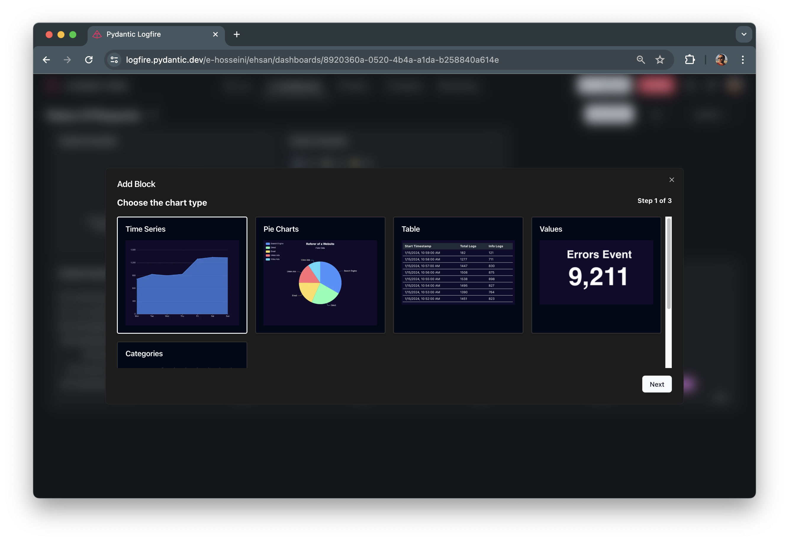
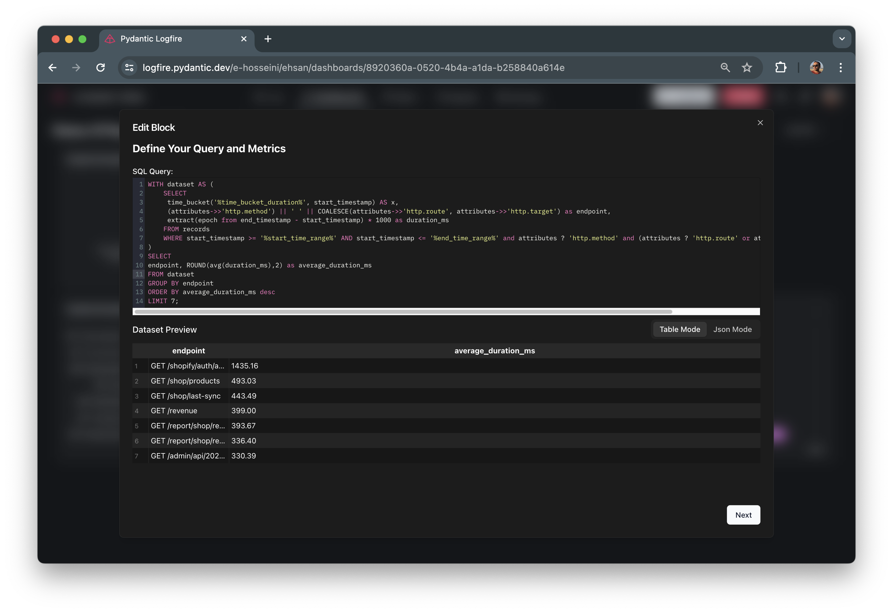

# Dashboards

This guide illustrates how to create and customize dashboards within the **Logfire UI**, thereby enabling effective
monitoring of services and system metrics.

## Get started

**Logfire** provides several pre-built dashboards as a convenient starting point.

## Web Service Dashboard
This dashboard offers a high-level view of your web services' well-being. It likely displays key metrics like:

* **Requests:** Total number of requests received by your web service.
* **Exceptions:** Number of exceptions encountered during request processing.
* **Trend Routes:** Visualize the most frequently accessed routes or APIs over time.
* **Percent of 2XX Requests:** Percentage of requests that resulted in successful responses (status codes in the 200 range).
* **Percent of 5XX Requests:** Percentage of requests that resulted in server errors (status codes in the 500 range).
* **Log Type Ratio**: Breakdown of the different log types generated by your web service (e.g., info, warning, error).

## System Metrics

This dashboard focuses on system resource utilization, potentially including:

* **CPU Usage:** Percentage of processing power utilized by the system.
* **Memory Usage:** Amount of memory currently in use by the system.
* **Number of Processes:** Total number of running processes on the system.
* **Swap Usage:** Amount of swap space currently in use by the system.

## Custom Dashboards

To create a custom dashboard, follow these steps:

1. From the dashboard page, click on the "Start From Scratch" button.
3. Once your dashboard is created, you can start rename it and adding charts and blocks to it.
4. To add a chart, click on the "Add Chart" button.
5. Choose the type of block you want to add.
6. Configure the block by providing the necessary data and settings (check the next section).
7. Repeat steps 4-6 to add more blocks to your dashboard.
8. To rearrange the blocks, enable the "Edit Mode" in the dashboard setting and simply drag and drop them to the desired position.

Feel free to experiment with different block types and configurations to create a dashboard that suits your monitoring needs.

## Choosing and Configuring Dashboard's Charts

When creating a custom dashboard or modifying them in Logfire, you can choose from different chart types to visualize your data.

### Define Your Query
In the second step of creating a chart, you need to input your SQL query. The Logfire dashboard's charts grab data based on this query. You can see the live result of the query on the table behind your query input. You can use the full power of PostgreSQL to retrieve your records.

### Chart Preview and configuration

Based on your need and query, you need to configure the chart to visualize and display your data:

#### Time Series Chart

A time series chart displays data points over a specific time period.

#### Pie Chart

A pie chart represents data as slices of a circle, where each slice represents a category or value.

#### Table

A table displays data in rows and columns, allowing you to present tabular data.

#### Values

A values chart displays a single value or multiple values as a card or panel.

#### Categories

A categories chart represents data as categories or groups, allowing you to compare different groups.

## Tips and Tricks

### Enhanced Viewing with Synchronized Tooltips and Zoom

For dashboards containing multiple time-series charts, consider enabling "Sync Tooltip and Zoom." This powerful feature provides a more cohesive viewing experience:

**Hover in Sync:** When you hover over a data point on any time-series chart, corresponding data points on all synchronized charts will be highlighted simultaneously. This allows you to easily compare values across different metrics at the same time point.
**Zooming Together:** Zooming in or out on a single chart will automatically apply the same zoom level to all synchronized charts. This helps you maintain focus on a specific time range across all metrics, ensuring a consistent analysis.
Activating Sync

To enable synchronized tooltips and zoom for your dashboard:

* Open your dashboard in Logfire.
* Click on Dashboard Setting
* activate "Sync Tooltip and Zoom" option.

### Customizing Your Charts

**Logfire** empowers you to personalize the appearance and behavior of your charts to better suit your needs.
Here's an overview of the available options:

* **Rename Chart:** Assign a clear and descriptive title to your chart for improved readability.
* **Edit Chart**: Change the chart query to better represent your data.
* **Duplicate Chart:** Quickly create a copy of an existing chart for further modifications, saving you time and effort.
* **Delete Chart:** Remove a chart from your dashboard if it's no longer relevant.
