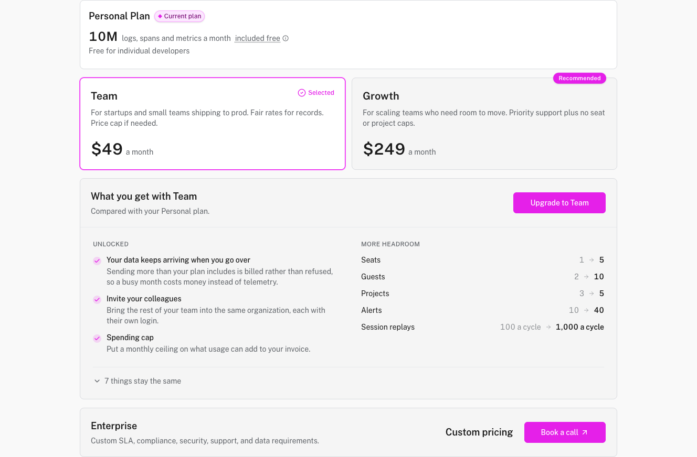
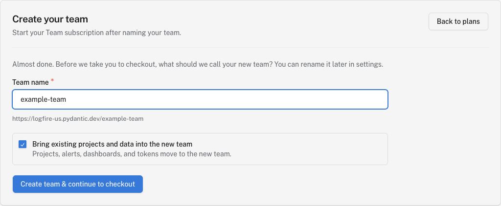
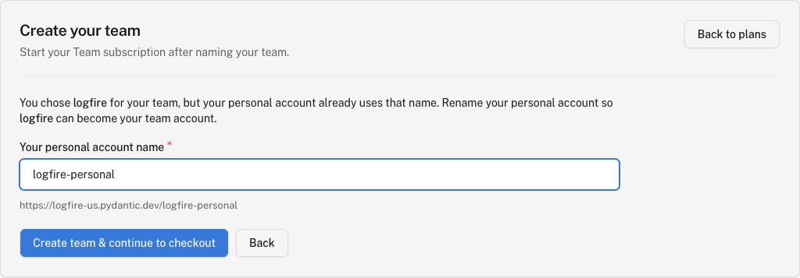

# Create a team from a personal account

Create a team from your personal Logfire account so colleagues can share projects, data, alerts, and dashboards. Your personal account remains available, and you can choose whether to move its existing projects and data into the new team.

You need permission to manage billing for the personal account. You will choose a paid plan before naming the team, then finish the purchase in checkout.

## Choose the team's plan

1. Open **Org settings**.
2. Select **Billing & usage**, then open the **Plan** tab.
3. Select **Team** or **Growth** to compare what it adds to your Personal plan.
4. Select **Upgrade to Team** or **Upgrade to Growth**.

## Name the team

Enter the name you want to use for the team. This name also appears in the team's Logfire URLs, and you can change it later in settings.

Leave **Bring existing projects and data into the new team** selected to move the personal account's projects, data, alerts, dashboards, and write tokens. Existing write tokens continue to work after the move.

Clear the option if you want an empty team instead. Your personal account and everything in it will remain unchanged.

## Free the current account name

You only see this step when both of these are true:

- The team name matches your personal account's current name.
- You chose to move the existing projects and data.

Enter a new name for the personal account. For example, if your personal account is `bill` and you keep `bill` as the team name, you could rename the personal account to `bill-personal`. The team keeps the original `bill` URLs.

If the team name is different from your personal account's name, Logfire keeps the personal account's current name and skips this step.

## Create the team and complete checkout

Select **Create team & continue to checkout**. Logfire creates the team, moves the selected content, and sends you to checkout for the plan you chose.

!!! warning "The team is created before checkout"
    If checkout is interrupted, the team still exists. Open that team's **Org settings → Billing & usage → Plan** page, choose Team or Growth again, and start a new checkout.

Complete checkout to activate the Team or Growth subscription.

## Verify the conversion

Return to **Org settings → Billing & usage → Plan** in the team. The plan card should show Team or Growth as the current plan.

If you moved existing projects and data, open one of those projects and confirm that its data, alerts, dashboards, and write tokens are still available.

## Troubleshooting

### The team name is unavailable

Another account or team already uses that URL name. Choose a different team name.

### You do not want to rename the personal account

Go back and use a different team name. You can also clear **Bring existing projects and data into the new team** to create an empty team without changing the personal account.

### Checkout did not finish

Open the new team, then go to **Org settings → Billing & usage → Plan**, choose Team or Growth again, and start a new checkout.

## Next steps

- [Invite colleagues and assign roles](../guides/web-ui/organizations-and-projects.md).
- [Review your usage and costs](../logfire-costs.md).
