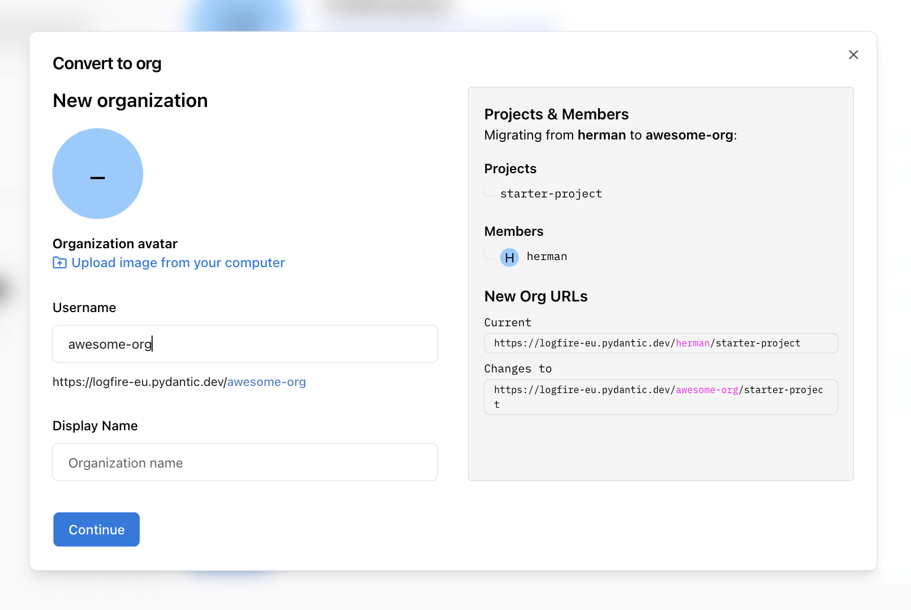

# How to Convert a Personal Account to an Organization

Logfire allows you to convert your personal account into an organization, making it easier to collaborate with a team and manage projects at scale. This is also handy for users upgrading to Pro, who might want to move projects under a corporate organization name. 

This guide walks you through the conversion process step by step.

---

## 1. Open Account Settings

Navigate to your account settings. In the sidebar, you'll see an option to **Convert to organization**.

---

## 2. Start the Conversion

Click **Convert to org**. A modal will appear, outlining the main points of the conversion:

- All existing **projects, members, alerts, dashboards, and settings** will be moved to the new organization.
- **Write tokens** will continue to work; you do not need to change any ingest URLs.
- You'll define your new organization's **username** and **display name**.
- You can optionally edit the username and display name for your new personal account.

Click **Acknowledge & continue** to proceed.

---

## 3. Set Up Your Organization

In the next modal, you can:

- Upload an **organization avatar**.
- Specify the **organization username** (used in URLs).
- Set the **organization display name**.

On the right, you'll see a summary of the migration:

- All your projects and members will be moved to the new organization.
- The project URLs will change from:
  `https://logfire-eu.pydantic.dev/your-username/project-name`
  to
  `https://logfire-eu.pydantic.dev/your-org-username/project-name`.

---

## 4. Confirm New Personal Account

After setting up the organization, you'll be prompted to create a new (empty) personal account with the same name as before. You can confirm and complete the conversion, or go back if you wish to make changes.

---

## 5. Complete the Conversion

Click **Confirm & convert**. The conversion process will complete, and you'll be redirected to your new organization's projects page.

---

## Summary

- All your data, projects, and settings are preserved during the migration.
- Only the URL changes to reflect the new organization username.
- Your new personal account will be empty, ready for individual use if needed.

---

**See also:** [Organization Structure Reference](../reference/organization-structure.md)
