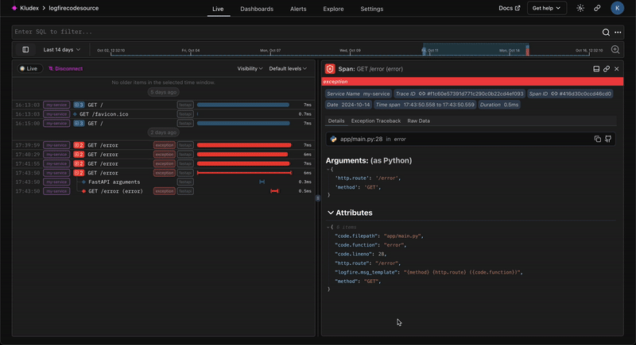

!!! warning "Experimental"
    This feature is experimental and may change in the future.

    If you have any feedback or suggestions, please [let us know][help].

We support linking to the source code on GitHub, GitLab, and any other VCS provider that uses the same URL format.



## Usage

Here's an example:

```python
import logfire

logfire.configure(
    code_source=logfire.CodeSource(
        repository='https://github.com/pydantic/logfire',  #(1)!
        revision='<hash of commit used on release>',  #(2)!
        root_path='/root/path',  #(3)!
    )
)
```

1. The URL of the repository e.g. `https://github.com/pydantic/logfire`.
2. The specific branch, tag, or commit hash to link to e.g. `main`.
3. The path to the root of the repository. If your code is in a subdirectory, you can specify it here.

You can learn more in our [`logfire.CodeSource`][logfire.CodeSource] API reference.

## Alternative Configuration

For other OpenTelemetry SDKs, you can configure these settings using resource attributes, e.g. by setting the
[`OTEL_RESOURCE_ATTRIBUTES`][otel-resource-attributes] environment variable:

```
OTEL_RESOURCE_ATTRIBUTES=vcs.repository.url.full=https://github.com/pydantic/platform
OTEL_RESOURCE_ATTRIBUTES=${OTEL_RESOURCE_ATTRIBUTES},vcs.repository.ref.revision=main
OTEL_RESOURCE_ATTRIBUTES=${OTEL_RESOURCE_ATTRIBUTES},vcs.root.path=.
```

[help]: ../help.md
[otel-resource-attributes]: https://opentelemetry.io/docs/specs/otel/configuration/sdk-environment-variables/#general-sdk-configuration
