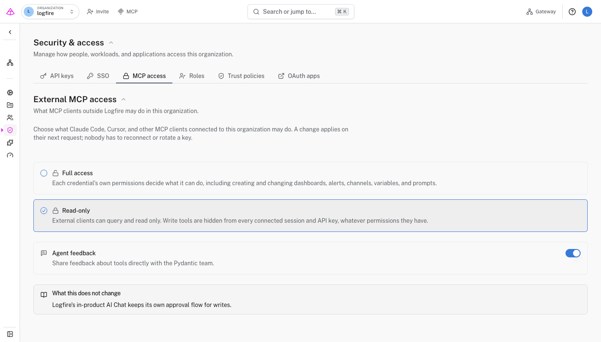

# Control external MCP access

Limit external Model Context Protocol (MCP) clients to reading and querying Logfire data, without changing each connection or credential.

The policy belongs to an organization and applies across all of its projects. Use it when coding agents and other MCP clients should investigate Logfire data but should not create or change dashboards, alerts, notification channels, variables, or prompts. Logfire's in-product AI Chat keeps its own approval flow and is not affected.

External MCP access controls are available on the [Enterprise plan](../enterprise.md), including self-hosted deployments. Personal, Team, and Growth organizations keep normal credential-scoped MCP access, but cannot set an organization-wide read-only policy or use the `agent-feedback` tool.

!!! info "Experimental"
    In **Settings → Early access**, select the flask icon next to the **Early access** heading to show experimental features. Enable **External MCP access** in the browser where you will configure it.

## Before you start

You need:

- An organization on the Enterprise plan, or a self-hosted Logfire deployment.
- An organization admin role. Other organization members can view the policy but cannot change it.
- A client connected to the [Logfire MCP server](mcp-server.md) if you want to verify the result from a client.

## Choose what external clients can do

1. Select the organization you want to configure.
2. Open **Org settings → Security & access → MCP access**.
3. Choose an access mode:
    - **Full access**: each credential's permissions decide which tools the client can use. This setting does not grant permissions that the credential does not already have.
    - **Read-only**: clients can query and read data. Logfire hides and refuses write tools even when the connected session or API key has write permissions.
4. Choose whether to allow **Agent feedback**. This is on by default and is independent of the access mode.

Changes save immediately and apply on the client's next request. Clients do not need to reconnect, sign in again, or rotate an API key.

## Decide whether agents can share feedback

When **Agent feedback** is on, external clients can use the `agent-feedback` tool to report a confusing or broken tool, an unhelpful error, a missing capability, or something that worked well. The feedback goes to Pydantic and is not written to your Logfire project.

The tool remains available in either access mode because it does not read or change organization or project resources. Use the separate **Agent feedback** switch to control whether clients may send it.

!!! warning "Do not include user or customer data"
    Feedback must not contain personal information, secrets, tokens, prompts, source code, SQL, logs, traces, query results, customer names, or project data. The tool description gives connected agents the same instruction.

Turn **Agent feedback** off if your organization does not allow agents to send product feedback to Pydantic. Logfire removes the tool from the client's tool list and refuses calls to it on the next request.

## Verify the policy

Refresh the tool list in a connected MCP client.

- With **Read-only** selected, read tools such as `query_run` remain available, while write tools such as `dashboard_create` are absent.
- With **Agent feedback** off, `agent-feedback` is absent.

The server enforces the current policy on every request. A client with a cached tool list cannot bypass it.

## Troubleshooting

### The MCP access tab is missing

Open **Settings → Early access**, reveal the experimental features with the flask icon, and enable **External MCP access**.

### The page asks you to upgrade

Organization-wide MCP access controls and the `agent-feedback` tool require the Enterprise plan. Upgrade the organization, or use them in a self-hosted deployment.

### You can see the policy but cannot change it

Only organization admins can change these settings. Ask an admin for help or for the appropriate organization role.

### A write tool still appears after you select Read-only

The client has cached an older tool list. Refresh its MCP tools or start a new client session. The server already refuses the write call under the current organization policy.

### AI Chat still offers write actions

This policy covers MCP clients outside Logfire. Logfire's in-product AI Chat uses a separate approval flow for write actions.

## Next steps

- [Connect a coding agent or other MCP client](mcp-server.md).
- [Create an API key for a sandboxed client](../reference/advanced/use-api-keys.md).
