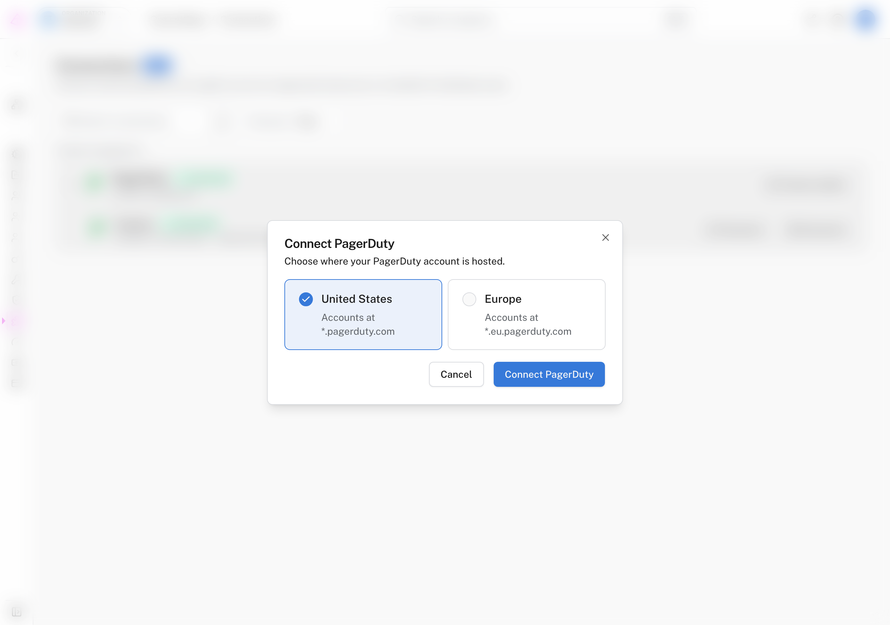
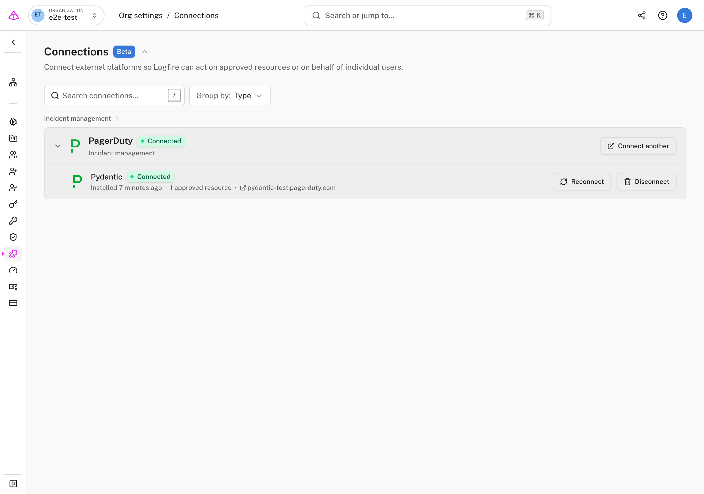
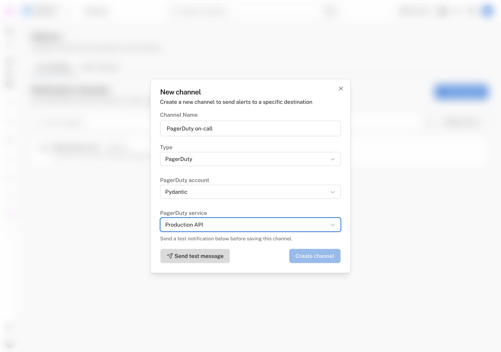

# Send Logfire alerts to PagerDuty

Page the right on-call team when a [Logfire alert](../guides/web-ui/alerts.md) fires, then resolve the PagerDuty incident automatically when the alert clears.

!!! info "Experimental"
    The PagerDuty integration is experimental and available to selected Logfire organizations. Email [engineering@pydantic.dev](mailto:engineering@pydantic.dev) if you want to try it.

You connect a PagerDuty account once at the organization level. Notification channels also belong to the organization. Every project in that organization can reuse them to route alerts to the approved PagerDuty services.

## What the integration does

- Opens a PagerDuty incident when a Logfire alert fires.
- Resolves the same incident when the alert stops matching.
- Routes each notification channel to one PagerDuty service.
- Includes the alert name, severity, timestamp, Logfire organization and project, and a link back to Logfire. Notifications can also include the alert description, query results, or delivery errors.
- Supports PagerDuty accounts hosted in the United States and Europe.

## Before you start

You need:

- **In Logfire:** permission to change organization settings, usually as an organization owner or admin.
- **In PagerDuty:** permission to add integrations to each service you want Logfire to use.
- **A PagerDuty service:** use a test service with a quiet escalation policy while you verify the connection.

The connection belongs to the Logfire organization. You can reuse it across every project in that organization.

## Connect PagerDuty

1. Open your organization's **Settings**, then **Connections**.
2. Find **PagerDuty** and click **Connect**.
3. Choose the region where your PagerDuty account is hosted, then click **Connect PagerDuty**.

    

4. PagerDuty opens the Logfire app installation page. Select the services that Logfire may notify, then approve the installation.
5. PagerDuty returns you to the **Connections** page. Expand **PagerDuty** and confirm that the account shows **Connected** and the expected number of approved services.

    

For each service you approve, Logfire receives a key that lets it send alerts and resolve incidents for that service. Logfire encrypts these keys at rest. It does not request access to read or manage other PagerDuty data.

## Create a PagerDuty notification channel

A notification channel is an organization-level destination that you attach to one or more alerts.

1. From your project's sidebar, open **Delivery**, then **Channels**.
2. Click **New channel**.
3. Enter a name that explains who receives the page, such as `PagerDuty on-call`.
4. Select **PagerDuty** as the type.
5. Select the connected PagerDuty account and service.

    

6. Click **Send test message**.
7. Confirm that the test incident appears on the selected PagerDuty service, then resolve it in PagerDuty.
8. Return to Logfire and click **Create channel**.

!!! warning "A test message opens a real incident"
    PagerDuty may notify the service's on-call responders. Use a test service or temporarily choose low-urgency notifications before you send the message.

Logfire requires a successful test before it creates the channel. This catches removed service integrations and invalid credentials before a production alert needs them.

## Send an alert to PagerDuty

1. Open **Alerts** from your project's sidebar.
2. Create a new alert or edit an existing alert.
3. Under **Send notifications to**, select the PagerDuty channel.
4. Save the alert.

One notification channel can serve alerts across projects in the same organization. One alert can also notify several channels.

## Verify the incident lifecycle

Trigger the alert with test data and check both systems:

1. PagerDuty opens one incident on the selected service.
2. The incident title matches the Logfire alert name and includes a link back to Logfire.
3. The Logfire alert run history records a successful delivery.
4. When the alert stops matching, a later clean run resolves the same PagerDuty incident.

Logfire uses PagerDuty Events API v2 with a stable deduplication key. This lets a firing notification and its recovery update the same incident instead of creating unrelated incidents.

## Add or replace approved services

Return to **Settings** > **Connections**, expand **PagerDuty**, and click **Reconnect**. Select the complete set of services that Logfire should use.

Existing channels keep their current service reference. If you remove a service from the PagerDuty app installation, update or delete every Logfire channel that uses it.

## Remove the integration

1. Resolve any open PagerDuty incidents created by Logfire.
2. Delete the Logfire notification channels that use the connection.
3. Open your organization's **Settings** > **Connections**.
4. Expand **PagerDuty** and click **Disconnect**.
5. In PagerDuty, open each approved service and remove the Logfire integration if you no longer need it.

Disconnecting removes the encrypted service keys and approved service references from Logfire. It does not delete the service integration in PagerDuty.

## Troubleshooting

**The PagerDuty account is not available when I create a channel.** Connections are organization-specific. Confirm that you connected PagerDuty to the same organization that owns the project, then reopen the channel form.

**A PagerDuty service is missing.** Reconnect PagerDuty under **Settings** > **Connections** and approve the service. Confirm that you selected the region that matches the account's PagerDuty domain.

**The test message fails.** The service integration may have been removed or its key may no longer be valid. Reconnect the account, select the service again, and retry the test.

**Disconnect is blocked.** Resolve open incidents and delete every Logfire notification channel that uses the connection, then disconnect again.

For more help, see [Getting help with Pydantic Logfire](../help.md) or email [engineering@pydantic.dev](mailto:engineering@pydantic.dev).
