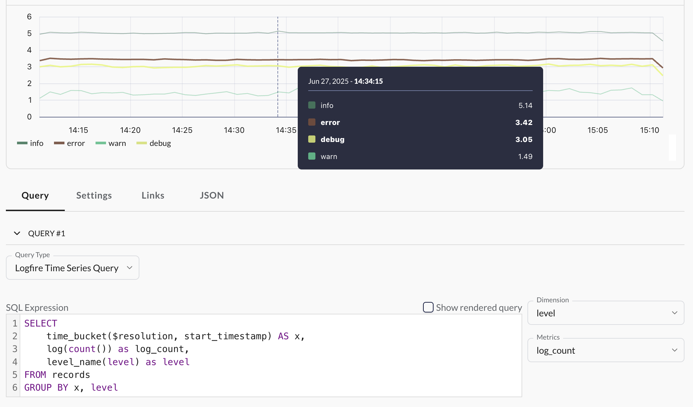

# Writing SQL Queries for Dashboards

This guide provides practical recipes and patterns for writing useful SQL queries in **Logfire**. We'll focus on querying the [`records`](../reference/sql.md#records-columns) table, which contains your logs and spans. The goal is to help you create useful dashboards, but we recommend using the Explore view to learn and experiment.

For a complete list of available tables and columns, please see the [SQL Reference](../reference/sql.md).

## Finding common cases

### Simple examples

Here are two quick useful examples to try out immediately in the Explore view.

To find the most common operations based on [`span_name`](../reference/sql.md#span_name):

```sql
SELECT
    COUNT() AS count,
    span_name
FROM records
GROUP BY span_name
ORDER BY count DESC
```

Similarly, to find the most common [`exception_type`](../reference/sql.md#exception_type)s:

```sql
SELECT
    COUNT() AS count,
    exception_type
FROM records
WHERE is_exception
GROUP BY exception_type
ORDER BY count DESC
```

Finally, to find the biggest traces, which may be a sign of an operation doing too many things:

```sql
SELECT
    COUNT() AS count,
    trace_id
FROM records
GROUP BY trace_id
ORDER BY count DESC
```

### The general pattern

The basic template is:

```sql
SELECT
    COUNT() AS count,
    <columns_to_group_by>
FROM records
WHERE <filter_conditions>
GROUP BY <columns_to_group_by>
ORDER BY count DESC
LIMIT 10
```

- The alias `AS count` allows us to refer to the count in the `ORDER BY` clause.
- `ORDER BY count DESC` sorts the results to show the most common groups first.
- `WHERE <filter_conditions>` is optional and depends on your specific use case.
- `LIMIT 10` isn't usually needed in the Explore view, but is helpful when creating charts.
- `<columns_to_group_by>` can be one or more columns and should be the same in the `SELECT` and `GROUP BY` clauses.

### Useful things to group by

- [`span_name`](../reference/sql.md#span_name): this is nice and generic and shouldn't have too much variability, creating decently sized meaningful groups. It's especially good for HTTP server request spans, where it typically contains the HTTP method and route (the path template) without the specific parameters. To focus on such spans, trying filtering by the appropriate [`otel_scope_name`](../reference/sql.md#otel_scope_name), e.g. `WHERE otel_scope_name = 'opentelemetry.instrumentation.fastapi'` if you're using [`logfire.instrument_fastapi()`](../integrations/web-frameworks/fastapi.md).
- [`exception_type`](../reference/sql.md#exception_type)
- [`http_response_status_code`](../reference/sql.md#http_response_status_code)
- [`attributes->>'...'`](../reference/sql.md#attributes): this will depend on your specific data. Try taking a look at some relevant spans in the Live view first to see what attributes are available.
    - If you have a [custom attribute](../guides/onboarding-checklist/add-manual-tracing.md#attributes) like `attributes->>'user_id'`, you can group by that to see which users are most active or have the most errors.
    - If you're using [`logfire.instrument_fastapi()`](../integrations/web-frameworks/fastapi.md), there's often useful values inside the `fastapi.arguments.values` attribute, e.g. `attributes->'fastapi.arguments.values'->>'user_id'`.
    - All web frameworks also typically capture several other potentially useful HTTP attributes. In particular if you [capture headers](../integrations/web-frameworks/index.md#capturing-http-server-request-and-response-headers) (e.g. with `logfire.instrument_django(capture_headers=True)`) then you can try e.g. `attributes->>'http.request.header.host'`.
    - For database query spans, try `attributes->>'db.statement'`, `attributes->>'db.query.text'`, or `attributes->>'db.query.summary'`.
- [`message`](../reference/sql.md#message) - this is often very variable which may make it less useful depending on your data. But if you're using a SQL instrumentation with the Python **Logfire** SDK, then this contains a rough summary of the SQL query, helping to group similar queries together if `attributes->>'db.statement'` or `attributes->>'db.query.text'` is too granular. In this case you probably want a filter such as `otel_scope_name = 'opentelemetry.instrumentation.sqlalchemy'` to focus on SQL queries.
- [`service_name`](../reference/sql.md#service_name) if you've configured multiple services. This can easily be combined with any other column.
- [`deployment_environment`](../reference/sql.md#deployment_environment) if you've configured multiple [environments](environments.md) (e.g. `production` and `staging`, `development`) and have more than one selected in the UI at the moment. Like `service_name`, this is good for combining with other columns.

### Useful `WHERE` clauses

- [`is_exception`](../reference/sql.md#is_exception)
- [`level >= 'error'`](../reference/sql.md#level) - maybe combined with the above with either `AND` or `OR`, since you can have non-error exceptions and non-exception errors.
- [`level > 'info'`](../reference/sql.md#level) to also find warnings and other notable records, not just errors.
- [`http_response_status_code >= 400`](../reference/sql.md#http_response_status_code) or `500` to find HTTP requests that didn't go well.
- [`service_name = '...'`](../reference/sql.md#service_name) can help a lot to make queries faster.
- [`otel_scope_name = '...'`](../reference/sql.md#otel_scope_name) to focus on a specific (instrumentation) library, e.g. `opentelemetry.instrumentation.fastapi`, `logfire.openai`, or `pydantic-ai`.
- [`duration > 2`](../reference/sql.md#duration) to find slow spans. Replace `2` with your desired number of seconds.
- [`parent_span_id IS NULL`](../reference/sql.md#parent_span_id) to find top-level spans, i.e. the root of a trace.

### Using in Dashboards

For starters:

1. Create a panel in a [new or existing custom (not standard) dashboard](../../guides/web-ui/dashboards/#creating-custom-dashboards).
2. Click the **Type** dropdown and select **Table**.
3. Paste your query into the SQL editor.
4. Give your panel a name.
5. Click **Apply** to save it.

Tables are easy and flexible. They can handle any number of `GROUP BY` columns, and don't really need a `LIMIT` to be practical. But they're not very pretty. Try making a bar chart instead:

1. Click the pencil icon to edit your panel.
2. Change the **Type** to **Bar Chart**.
3. Add `LIMIT 10` or so at the end of your query if there are too many bars.
4. If you have multiple `GROUP BY` columns, you will need to convert them to one expression by concatenating strings. Replace each `,` in the `GROUP BY` clause with `|| ' - ' ||` to create a single string with dashes between the values, e.g. replace `service_name, span_name` with `service_name || ' -  ' || span_name`. Do this in both the `SELECT` and `GROUP BY` clauses. You can optionally add an `AS` alias to the concatenated string in the `SELECT` clause, like `service_name || ' - ' || span_name AS service_and_span`, and then use that alias in the `GROUP BY` clause instead of repeating the concatenation.
5. If your grouping column happens to be a number, add `::text` to it to convert it to a string so that it's recognized as a category by the chart.
6. Bar charts generally put the first rows in the query result at the bottom. If you want the most common items at the top, wrap the whole query in `SELECT * FROM (<original query>) ORDER BY count ASC` to flip the order. Now the inner `ORDER BY count DESC` ensures that we have the most common items (before the limit is applied) and the outer `ORDER BY count ASC` is for appearance.

For a complete example, you can replace this:

```sql
SELECT
    COUNT() AS count,
    service_name,
    span_name
FROM records
GROUP BY service_name, span_name
ORDER BY count DESC
```

with:

```sql
SELECT * FROM (
    SELECT
        COUNT() AS count,
        service_name || ' - ' || span_name AS service_and_span
    FROM records
    GROUP BY service_and_span
    ORDER BY count DESC
    LIMIT 10
) ORDER BY count ASC
```

Finally, check the **Settings** tab in the panel editor to tweak the appearance of your chart.

## Aggregating Numerical Data

Instead of just counting rows, you can perform calculations on numerical expressions. [`duration`](../reference/sql.md#duration) is a particularly useful column for performance analysis. Tweaking our first example:

```sql
SELECT
    SUM(duration) AS total_duration_seconds,
    span_name
FROM records
WHERE duration IS NOT NULL -- Ignore logs, which have no duration
GROUP BY span_name
ORDER BY total_duration_seconds DESC
```

This will show you which operations take the most time overall, whether it's because they run frequently or take a long time each time.

Alternatively you could use `AVG(duration)` (for the mean) or `MEDIAN(duration)` to find which operations are slow on average, or `MAX(duration)` to find the worst case scenarios. See the [Datafusion documentation](https://datafusion.apache.org/user-guide/sql/aggregate_functions.html) for the full list of available aggregation functions.

Other numerical values can typically be found inside `attributes` and will depend on your data. LLM spans often have `attributes->'gen_ai.usage.input_tokens'` and `attributes->'gen_ai.usage.output_tokens'` which you can use to monitor costs.

!!! warning
    `SUM(attributes->'...')` and other numerical aggregations will typically return an error because the database doesn't know the type of the JSON value inside `attributes`, so use `SUM((attributes->'...')::numeric)` to convert it to a number.

### Percentiles

A slightly more advanced aggregation is to calculate percentiles. For example, the 95th percentile means the value below which 95% of the data falls. This is typically referred to as P95, and tells you a more 'typical' worst-case scenario while ignoring the extreme outliers found by using `MAX()`. P90 and P99 are also commonly used.

To calculate this requires a bit of extra syntax:

```sql
SELECT
    approx_percentile_cont(0.95) WITHIN GROUP (ORDER BY duration) as P95,
    span_name
FROM records
WHERE duration IS NOT NULL
GROUP BY span_name
ORDER BY P95 DESC
```

This query calculates the 95th percentile of the `duration` for each `span_name`. The general pattern is `approx_percentile_cont(<percentile>) WITHIN GROUP (ORDER BY <column>)` where `<percentile>` is a number between 0 and 1.

## Time series

Create a new panel in a dashboard, and by default it will have the type **Time Series Chart** with a query like this:

```sql
SELECT
    time_bucket($resolution, start_timestamp) AS x,
    count() as count
FROM records
GROUP BY x
```

Here the `time_bucket($resolution, start_timestamp)` is essential. [`$resolution` is a special variable that exists in all dashboards](../../guides/web-ui/dashboards#resolution-variable) and adjusts automatically based on the time range. You can adjust it while viewing the dashboard using the dropdown in the top left corner. It doesn't exist in the Explore view, so you have to use a concrete interval like `time_bucket('1 hour', start_timestamp)` there. Tick **Show rendered query** in the panel editor to fill in the resolution and other variables so that you can copy the query to the Explore view.

!!! warning
    If you're querying `metrics`, use `recorded_timestamp` instead of `start_timestamp`.

You can give the time bucket expression any name (`x` in the example above), but it must be the same in both the `SELECT` and `GROUP BY` clauses. The chart will detect that the type is a timestamp and use it as the x-axis.

You can replace the `count()` with any aggregation(s) you want. For example, you can show multiple levels of percentiles:

```sql
SELECT
    time_bucket($resolution, start_timestamp) AS x,
    approx_percentile_cont(0.80) WITHIN GROUP (ORDER BY duration) AS p80,
    approx_percentile_cont(0.90) WITHIN GROUP (ORDER BY duration) AS p90,
    approx_percentile_cont(0.95) WITHIN GROUP (ORDER BY duration) AS p95
FROM records
GROUP BY x
```

### Grouping by Dimension

You can make time series charts with multiple lines (series) for the same numerical metric by grouping by a dimension. This means adding a column to the `SELECT` and `GROUP BY` clauses and then selecting it from the 'Dimension' dropdown next to the SQL editor.

#### Low cardinality dimensions

For a simple example, paste this into the SQL editor:

```sql
SELECT
    time_bucket($resolution, start_timestamp) AS x,
    log(count()) as log_count,
    level_name(level) as level
FROM records
GROUP BY x, level
```

Then set the **Dimension** dropdown to `level` and the **Metrics** dropdown to `log_count`. This will create a time series chart with multiple lines, one for each log level (e.g. 'info', 'warning', 'error'). Here's what the configuration and result would look like:



!!! note
    You can only set one dimension, but you can set multiple metrics.

Here we use `log(count())` instead of just `count()` because you probably have way more 'info' records than 'error' records, making it hard to notice any spikes in the number of errors. This compresses the y-axis into a logarithmic scale to make it more visually useful, but the numbers are harder to interpret. The `level_name(level)` function converts the numeric [`level`](../reference/sql.md#level) value to a human-readable string.

You can replace `level` with [other useful things to group by](#useful-things-to-group-by), but they need to be very low cardinality (i.e. not too many unique values) for this simple query to work well in a time series chart. Good examples are:

- `service_name`
- `deployment_environment`
- `exception_type`
- `http_response_status_code`
- `attributes->>'http.method'` (or `attributes->>'http.request.method'` for newer OpenTelemetry instrumentations)

#### Multiple dimensions

Because time series charts can only have one dimension, if you want to group by multiple columns, you need to concatenate them into a single string, e.g. instead of:

```sql
SELECT
    time_bucket($resolution, start_timestamp) AS x,
    log(count()) as log_count,
    service_name,
    level_name(level) as level
FROM records
GROUP BY x, service_name, level
```

You would do:

```sql
SELECT
    time_bucket($resolution, start_timestamp) AS x,
    log(count()) as log_count,
    service_name || ' - ' || level_name(level) AS service_and_level
FROM records
GROUP BY x, service_and_level
```

Then set the 'Dimension' dropdown to `service_and_level`. This will create a time series chart with a line for each combination of `service_name` and `level`. Of course this increases the cardinality quickly, making the next section more relevant.

#### High cardinality dimensions

If you try grouping by something with more than a few unique values, you'll end up with a cluttered chart with too many lines. For example, this will look like a mess unless your data is very simple:

```sql
SELECT
    time_bucket($resolution, start_timestamp) AS x,
    count() as count,
    span_name
FROM records
GROUP BY x, span_name
```

The quick and dirty solution is to add these lines at the end:

```sql
ORDER BY count DESC
LIMIT 200
```

This will give you a point for the 200 most common _combinations of `x` and `span_name`_. This will often work reasonably well, but the limit will need to be tuned based on the data, and the number of points at each time bucket will vary. Here's the better version:

```sql
WITH original AS (
    SELECT
        time_bucket($resolution, start_timestamp) AS x,
        count() as count,
        span_name
    FROM records
    GROUP BY x, span_name
),
ranked AS (
    SELECT
        x,
        count,
        span_name,
        ROW_NUMBER() OVER (PARTITION BY x ORDER BY count DESC) AS row_num
    FROM original
)
SELECT
    x,
    count,
    span_name
FROM ranked
WHERE row_num <= 5
ORDER BY x
```

This selects the top 5 `span_name`s for each time bucket, and will usually work perfectly. It may look intimidating, but constructing a query like this can be done very mechanically. Start with a basic query in this form:

```sql
SELECT
    time_bucket($resolution, start_timestamp) AS x,
    <aggregation_expression> AS metric,
    <dimension_expression> as dimension
FROM records
GROUP BY x, dimension
```

Fill in `<aggregation_expression>` with your desired aggregation (e.g. `count()`, `SUM(duration)`, etc.) and `<dimension_expression>` with the column(s) you want to group by (e.g. `span_name`). Set the 'Dimension' dropdown to `dimension` and the 'Metrics' dropdown to `metric`. That should give you a working (but probably cluttered) time series chart. Then simply paste it into `<original_query>` in the following template:

```sql
WITH original AS (
    <original_query>
),
ranked AS (
    SELECT
        x,
        metric,
        dimension,
        ROW_NUMBER() OVER (PARTITION BY x ORDER BY metric DESC) AS row_num
    FROM original
)
SELECT
    x,
    metric,
    dimension
FROM ranked
WHERE row_num <= 5
ORDER BY x
```
