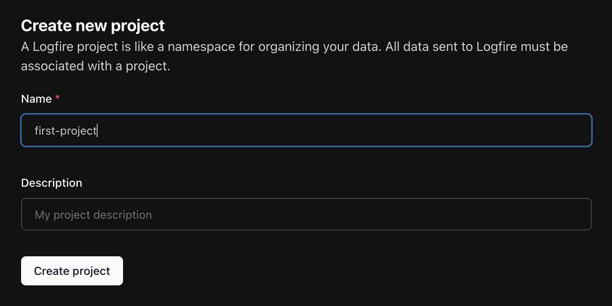

# Pydantic Logfire

From the team behind Pydantic, Logfire is a new type of observability platform built on the same belief as our open source library — that the most powerful tools can be easy to use.

Logfire is built on OpenTelemetry, and supports monitoring your application from any language, with particularly great support for Python! [Read more](why-logfire/index.md).

## Getting Started

This page is a quick walk-through for setting up a Python app:

1. [Set up Logfire](#logfire)
2. [Install the SDK](#sdk)
3. [Instrument your project](#instrument)


## Set up Logfire {#logfire}
1. [Log into Logfire :material-open-in-new:](https://logfire.pydantic.dev/login){:target="_blank"}
2. Follow the prompts to create your account
3. From your Organisation, click **New project** to create your first project



!!! info ""
    The first time you use **Logfire** in a new environment, you'll need to set up a project. A **Logfire** project is a namespace for organizing your data. All data sent to **Logfire** must be associated with a project.

??? tip "You can also create a project via CLI..."
    Check the [SDK CLI documentation](reference/cli.md#create-projects-new) for more information on how to create a project via CLI.

## Install the SDK {#sdk}

1. In the terminal, install the **Logfire** SDK (Software Developer Kit):

{{ install_logfire() }}

2. Once installed, try it out!

```bash
logfire -h
```

3. Next, authenticate your local environment:

```bash
logfire auth
```

!!! info ""
    Upon successful authentication, credentials are stored in `~/.logfire/default.toml`.

## Instrument your project {#instrument}
=== ":material-cog-outline: Development"
    !!! tip "Development setup"
        During development, we recommend using the CLI to configure Logfire. You can also use a write token.

    1. Set your project

    ```bash title="in thet terminal:"
    logfire projects use <first-project>
    ```

    !!! info ""
        Run this command from the root directory of your app, e.g. `~/projects/first-project`

    2. Write some basic logs in your Python app

    ```py title="hello-world.py"
    import logfire

    logfire.configure()  # (1)!
    logfire.info('Hello, {name}!', name='world')  # (2)!
    ```

    1. The `configure()` method should be called once before logging to initialize **Logfire**.
    2. This will log `Hello world!` with `info` level.

    !!! info ""
        Other [log levels][logfire.Logfire] are also available to use, including `trace`, `debug`, `notice`, `warn`,
        `error`, and `fatal`.


    3. See your logs in the **Live** view

    


=== ":material-cloud-outline: Production"
    !!! tip "Production setup"
        In production, we recommend you provide your write token to the Logfire SDK via environment variables.

    1. Generate a new write token in the **Logfire** platform

        - Go to Project :material-chevron-right: Settings :material-chevron-right: Write Tokens
        - Follow the prompts to create a new token


    2. Configure your **Logfire** environment

    ```bash title="in the terminal:"
    LOGFIRE_TOKEN=<your-write-token>
    ```

    !!! info ""
        Running this command stores a Write Token used by the SDK to send data to a file in the current directory, at `.logfire/logfire_credentials.json`

    3. Write some basic logs in your Python app

    ```py title="hello-world.py"
    import logfire

    logfire.configure()  # (1)!
    logfire.info('Hello, {name}!', name='world')  # (2)!
    ```

    1. The `configure()` method should be called once before logging to initialize **Logfire**.
    2. This will log `Hello world!` with `info` level.

    !!! info ""
        Other [log levels][logfire.Logfire] are also available to use, including `trace`, `debug`, `notice`, `warn`,
        `error`, and `fatal`.

    4. See your logs in the **Live** view

    

---

## Next steps

Ready to keep going?

- Read about [Tracing with Spans](get-started/traces.md)
- Complete the [Onboarding Checklist](guides/onboarding_checklist/index.md)

More topics to explore

- Logfire's real power comes from [integrations with many popular libraries](integrations/index.md)
- As well as spans, you can [use Logfire to record metrics](guides/onboarding_checklist/add_metrics.md)
- Logfire doesn't just work with Python, [read more about Language support](https://opentelemetry.io/docs/languages/){:target="_blank"}
