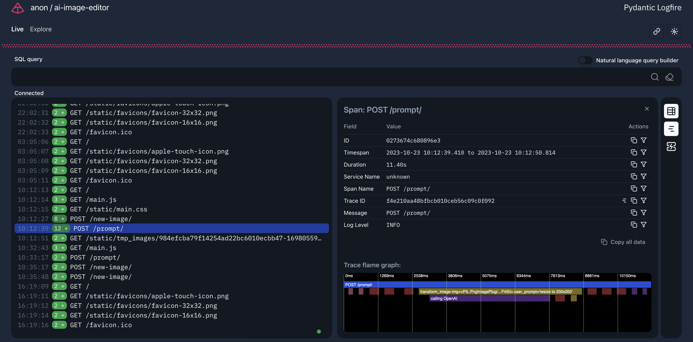

---
hide:
- navigation
- toc
---

# Pydantic Logfire Documentation

**Pydantic Logfire** is an observability platform focused on **developer experience**.

Starting with Python, we're building a platform to let developers understand their software in a
radically simpler and more enjoyable way. Below you'll find [our founding principles for **Pydantic Logfire**](#why-logfire).
<!--
Alternatively, watch our introduction from Pydantic team member [Marcelo](https://github.com/Kludex) showing you how to get started:

<div style="text-align:center">
    <iframe width="840" height="472" src="https://www.youtube.com/embed/C-aaHfYcCeo?si=Hc9GvsxBSap9ryk8" title="YouTube video player" frameborder="0" allow="accelerometer; autoplay; clipboard-write; encrypted-media; gyroscope; picture-in-picture; web-share" allowfullscreen></iframe>
</div> -->

## Why use Pydantic Logfire? {#why-logfire}

**Pydantic Logfire** is built to be the best observability platform for your Python application — from a ten-line script, to a large production application.

Here are some pillars we built **Pydantic Logfire** upon to fulfil that promise:

### Easy to get started! :rocket:

It's as simple as `pip install logfire`, and run...

```bash
$ logfire auth
```

Then in your code:

```py
import logfire

logfire.info('Hello world!')
```

### Python and Pydantic insights :snake:

From rich display of Python objects to event-loop telemetry and profiling Python code, Pydantic Logfire can give you a view into how your Python is running that you can’t get from any other observability tool.

Logfire also has an out-of-the-box Pydantic integration that lets you understand the data passing through your Pydantic models and get analytics on validations.

### Structured Data queried with SQL :abacus:

Query your data with pure, canonical Postgres SQL — all the control and (for many) nothing new to learn.
Using Postgres also means every existing tool that can connect to Postgres can query Logfire.

Just include your Python objects in **Logfire** calls (lists, dict, dataclasses, Pydantic models, dataframes, and more),
and it’ll end up as structured data in our platform ready to be queried.

### OpenTelemetry under the hood :telescope:

**Logfire** is built on [OpenTelemetry](https://opentelemetry.io/), meaning you can
use a wealth of existing tooling and infrastructure, including
[instrumentation for many common Python packages](https://opentelemetry-python-contrib.readthedocs.io/en/latest/index.html).


### The Dashboard is for everyone :busts_in_silhouette:

Logfire's dashboard is (and will remain) brutally simple, meaning your whole engineering team will
use it (not just one guy in the corner called Keith who's currently on holiday).



## Installation

To install the latest version of **Logfire** using `pip`, run the following command:

```bash
pip install logfire
```

For other installation methods, including using `poetry` or `requirements.txt`, see [Installation](guide/first_steps.md#installation).

## Usage

To use **Logfire**, it's simple as importing, and calling the desired function:

```py
import logfire

logfire.info('Hello, {name}!', name='world') # (1)!

logfire.debug('Payment details: {amount=}, {state=}', amount=100, state='OK') # (2)!
```

1. This will log `Hello world!` with `info` level.
2. This will log `Payment details: amount=100, state=OK` with `debug` level.

If you want to apply more advanced configuration, see the [Configuration](guide/configuration.md) section.

### Automatic instrumentation

**Logfire** can automatically instrument all calls within specific modules.

```py
import logfire

logfire.install_auto_tracing(modules=['app'])
```

You can read more about this on the [Auto Tracing](guide/auto_tracing.md) section.

### CLI

**Logfire** comes with a CLI that can help you with some tasks.

```bash
{{ logfire_help }}
```
