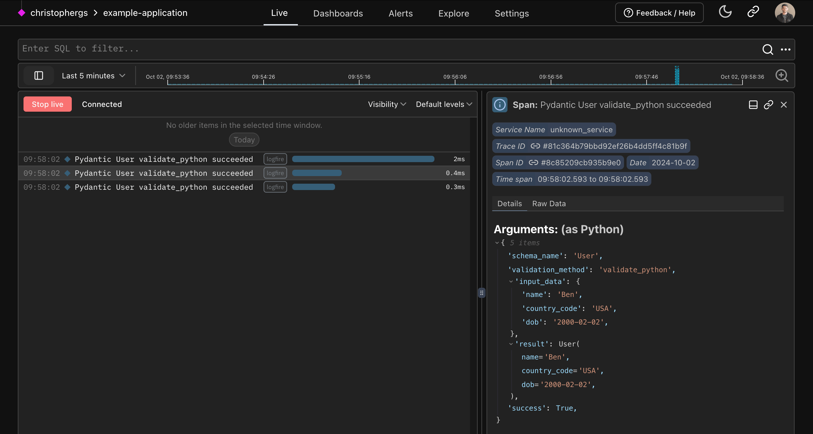
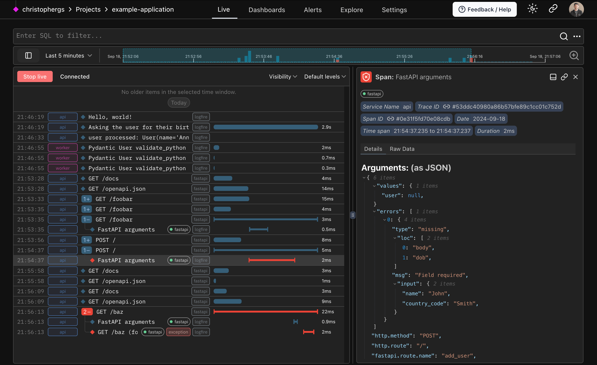
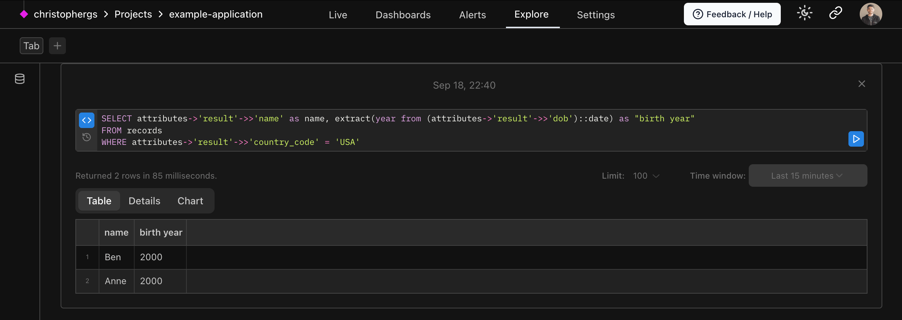

---
hide:
- navigation
---

# Welcome to Pydantic Logfire

**Pydantic Logfire** redefines observability for the Python ecosystem, transforming how developers understand and
interact with their code.

## The Pain

As a Python developer, you've likely encountered frustrating scenarios like these:

- **Sifting through endless `print` statements** to find that needle-in-the-haystack insight
- **Decoding cryptic portrayals** of Python objects in your logs
- **Guessing at the performance hit** from a specific function, or a mysterious slowdown of your app
- **Piecing together a user's journey** to an error, without clear breadcrumbs

Sound familiar? You're not alone. These aren't just annoyances — they're barriers to efficient, informed development.

## Enter Pydantic Logfire: Observability, tailored for Python


**Pydantic Logfire** is more than an observability platform. It's your window into the inner workings of your application,
designed with the Python developer's needs in mind:

- **Instant Clarity**: Transform garbled logs into clear, actionable insights.
- **Performance Insights**: Discover not just how long a function takes to run, but which queries slow down your app.
- **Comprehensive Visibility**: From request headers and bodies to the full trace of program execution, see your
application's behavior in high definition.
- **Data-Driven Decisions**: Turn your logs into visualizations, dashboards, and alerts that drive your development
forward.

Pydantic Logfire will empower you to quickly instrument your applications using best practices, less code, less time, better understanding.

We understand Python and its peculiarities. Pydantic Logfire was crafted by Python developers, for Python
developers, addressing the unique challenges and opportunities of the Python environment. It's not just about having
data; it's about having the *right* data, presented in ways that make sense for Python applications.

### In the Spirit of Python

- [**Simplicity and Power**](#simplicity): Emulating the Pydantic library's philosophy, Pydantic Logfire offers an
intuitive start for beginners while providing the depth experts desire. It's the same balance of ease, sophistication,
and productivity, reimagined for observability.
- **Born from Python and Pydantic**: As creators immersed in the Python open-source ecosystem, we've designed Pydantic
Logfire to deeply integrate with Python and Pydantic's nuances, delivering a more customized experience than generic
observability platforms.

### Elevating Data to Insights

- With [**deep Python integration**](#python), Pydantic Logfire automatically instruments your code for minimal manual
effort, provides exceptional insights into async code, offers detailed performance analytics, and displays Python
objects the same as the interpreter. For existing Pydantic users, it also delivers unparalleled insights into your usage
of Pydantic models.
- [**Structured Data and Direct SQL Access**](#sql) means you can use familiar tools like Pandas, SQLAlchemy, or `psql`
for querying, can integrate seamlessly with BI tools, and can even leverage AI for SQL generation, ensuring your Python
objects and structured data are query-ready. Using vanilla PostgreSQL as the querying language throughout the platform
ensures a consistent, powerful, and flexible querying experience.
- By [**harnessing OpenTelemetry**](#otel), Pydantic Logfire offers automatic instrumentation for popular Python packages,
enables cross-language data integration, and supports data export to any OpenTelemetry-compatible backend or proxy.

## Pydantic Logfire: The Observability Platform You Deserve

**Pydantic Logfire** isn't just another tool in the shed; it's the bespoke solution crafted by Python developers, for
Python developers, ensuring your development work is as smooth and efficient as Python itself.

From the smallest script to large-scale deployments, Pydantic Logfire is the observability solution you've been waiting
for.

---

### Simplicity and Power :rocket: {#simplicity}

**Pydantic Logfire** should be dead simple to start using, simply run:

```bash
pip install logfire # (1)!
logfire auth # (2)!
```

1. The **Pydantic Logfire** SDK can be installed from PyPI or Conda, [Learn more](guides/first_steps/index.md#install).
2. The SDK comes with a CLI for authentication and more, [Learn more](guides/reference/cli.md).

Then in your code:

```py
import logfire
from datetime import date

logfire.info('Hello, {name}!', name='world')  # (1)!

with logfire.span('Asking the user their {question}', question='age'):  # (2)!
    user_input = input('How old are you [YYYY-mm-dd]? ')
    dob = date.fromisoformat(user_input)  # (3)!
    logfire.debug('{dob=} {age=!r}', dob=dob, age=date.today() - dob)  # (4)!
```

1. This will log `Hello world!` with `info` level. The first time a `logfire` command is run, if no project is configured for the current directory, an interactive prompt will walk you through creating a project.
2. Spans allow you to nest other Logfire calls, and also to measure how long code takes to run. They are the fundamental building block of traces!
3. Attempt to extract a date from the user input. If any exception is raised, the outer span will include the details of the exception.
4. This will log for example `dob=2000-01-01 age=datetime.timedelta(days=8838)` with `debug` level.

This might look similar to simple logging, but it's much more powerful — you get:

- structured data from your logs
- nested logs / traces to contextualize what you're viewing
- a custom-built platform to view your data, with no configuration required
- and more, like pretty display of Python objects — see below

!!! note
    If you have an existing app to instrument, you'll get the most value out of [configuring OTel integrations](#otel), before you start adding `logfire.*` calls to your code.


### Python and Pydantic insights :snake: {#python}

From rich display of Python objects to event-loop telemetry and profiling Python code, Pydantic Logfire can give you a clearer view into how your Python is running than any other observability tool.

Logfire also has an out-of-the-box Pydantic integration that lets you understand the data passing through your Pydantic models and get analytics on validations.

We can record Pydantic models directly:

```py
from datetime import date
import logfire
from pydantic import BaseModel

class User(BaseModel):
    name: str
    country_code: str
    dob: date

user = User(name='Anne', country_code='USA', dob='2000-01-01')
logfire.info('user processed: {user!r}', user=user)  # (1)!
```

1. This will show `user processed: User(name='Anne', country_code='US', dob=datetime.date(2000, 1, 1))`, but also allow you to see a "pretty" view of the model within the Logfire Platform.


Or we can record information about validations automatically:

```py
from datetime import date
import logfire
from pydantic import BaseModel

logfire.configure(pydantic_plugin=logfire.PydanticPlugin(record='all'))  # (1)!

class User(BaseModel):
    name: str
    country_code: str
    dob: date

User(name='Anne', country_code='USA', dob='2000-01-01')  # (2)!
User(name='Ben', country_code='USA', dob='2000-02-02')
User(name='Charlie', country_code='GBR', dob='1990-03-03')
```

1. This configuration means details about all Pydantic model validations will be recorded. You can also record details about validation failures only, or just metrics; see the [pydantic plugin docs][logfire.PydanticPlugin].
2. Since we've enabled the Pydantic Plugin, all Pydantic validations will be recorded in Logfire.

Learn more about the [Pydantic Plugin here](guides/reference/integrations/pydantic.md).



### OpenTelemetry under the hood :telescope: {#otel}

Because **Pydantic Logfire** is built on [OpenTelemetry](https://opentelemetry.io/), you can
use a wealth of existing tooling and infrastructure, including
[instrumentation for many common Python packages](https://opentelemetry-python-contrib.readthedocs.io/en/latest/index.html).

For example, we can instrument a simple FastAPI app with just 2 lines of code:

```py title="fastapi_example.py" hl_lines="8 9 10"
from datetime import date
import logfire
from pydantic import BaseModel
from fastapi import FastAPI

app = FastAPI()

logfire.configure()
logfire.instrument_fastapi(app)  # (1)!
# next, instrument your database connector, http library etc. and add the logging handler (2)


class User(BaseModel):
    name: str
    country_code: str
    dob: date


@app.post('/')
async def add_user(user: User):
    # we would store the user here
    return {'message': f'{user.name} added'}
```

1. In addition to [configuring logfire](guides/reference/configuration.md) this line is generally all you need to instrument a FastAPI app with Logfire, the same applies to most other popular Python web frameworks.
2. The [integrations](guides/reference/integrations/index.md) page has more information on how to instrument other parts of your app.

We'll need the [FastAPI contrib package](guides/reference/integrations/fastapi.md), FastAPI itself and uvicorn installed to run this:

```bash
pip install 'logfire[fastapi]' fastapi uvicorn  # (1)!
uvicorn fastapi_example:app # (2)!
```

1. Install the `logfire` package with the `fastapi` extra, FastAPI, and uvicorn.
2. Run the FastAPI app with uvicorn.

This will give you information on the HTTP request, but also details of results from successful input validations:


And details of failed input validations:



### Structured Data and SQL :abacus: {#sql}

Query your data with pure, canonical Postgres SQL — all the control and (for many) nothing new to learn.
We even provide direct access to the underlying Postgres database, which means that you can query Logfire using any Postgres-compatible tools you like. This includes dashboard-building platforms like Superset, Grafana, and Google Looker Studio, but also **Pandas**, **SQLAlchemy**, or even `psql`.

One big advantage of using the most widely used SQL databases is that generative AI tools like ChatGPT are excellent at writing SQL for you.

Just include your Python objects in **Logfire** calls (lists, dict, dataclasses, Pydantic models, dataframes, and more),
and it'll end up as structured data in our platform ready to be queried.

For example, using data from the `User` model above, we could list users from the USA:

```sql
SELECT attributes->'result'->>'name' as name, age(attributes->'result'->>'dob') as age
FROM records
WHERE attributes->'result'->>'country_code' = 'USA'
```



You can also filter to show only traces related to users in the USA in the live view with

```SQL
attributes->'result'->>'country_code' = 'USA'
```


