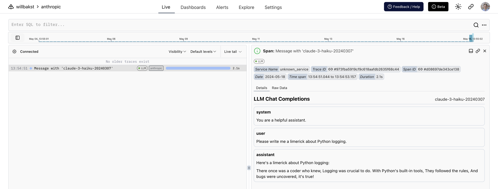
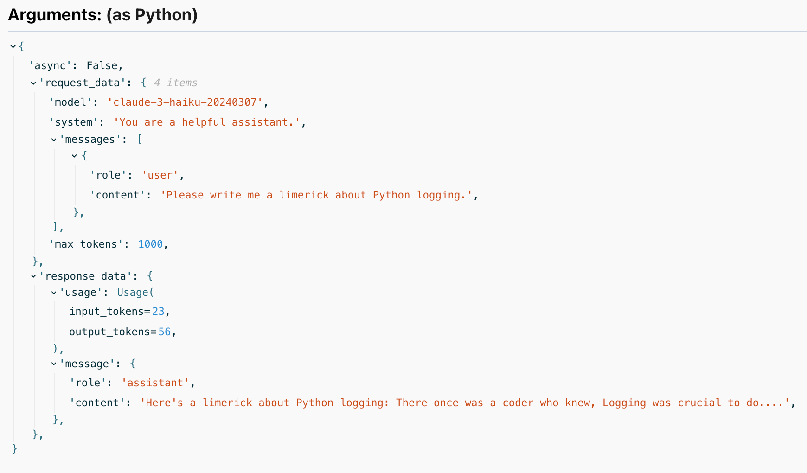
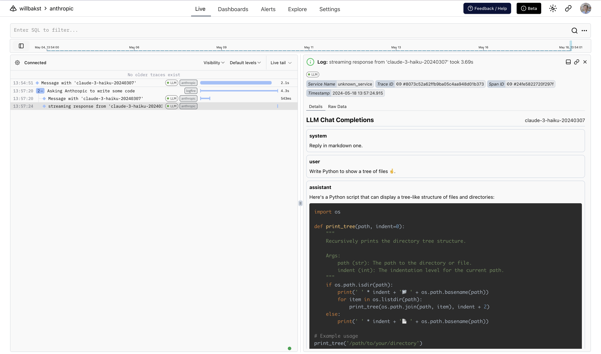

# Anthropic

See every call your app makes to Anthropic's Claude models: the full conversation, each tool call,
how many **tokens** (the units a model reads and bills by, a few characters of text each) it used,
how long it took, and any errors, as a **trace** (the full journey of one request, made of nested
**spans**, where each span is one unit of work with a name, a start, and a duration) in Logfire.

## What you'll capture

- Each model call as a span, with its duration and any exceptions
- The full conversation, rendered so you can read it like a transcript
- Response details, including the number of tokens used
- Streaming responses and tool calls, shown as spans in the trace

## Before you start

You'll need two things:

- **A Logfire project and its write token**, the credential your app uses to send data to Logfire.
  Create a project and copy its token from **Project → Settings → Write tokens** in the Logfire web
  app. New to Logfire? Start with [Getting Started](../../index.md).
- **An Anthropic API key**, from your [Anthropic console](https://console.anthropic.com/). The
  Anthropic SDK reads it from the `ANTHROPIC_API_KEY` environment variable.

## Installation

Install `logfire`:

{{ install_logfire() }}

This integration works with your existing `anthropic` package: nothing extra to install. If you
don't have it yet, `pip install anthropic`.

## Usage

Add two lines to your app: `logfire.configure()` to connect to your project, and
[`logfire.instrument_anthropic()`][logfire.Logfire.instrument_anthropic] to record every Anthropic
call.

```python hl_lines="7-8" skip-run="true" skip-reason="external-connection"
import anthropic

import logfire

client = anthropic.Anthropic()

logfire.configure()
logfire.instrument_anthropic()  # instrument all Anthropic clients globally
# or logfire.instrument_anthropic(client) to instrument a specific client instance

response = client.messages.create(
    max_tokens=1000,
    model='claude-3-haiku-20240307',
    system='You are a helpful assistant.',
    messages=[{'role': 'user', 'content': 'Please write me a limerick about Python logging.'}],
)
print(response.content[0].text)
```

With that you get:

* a span around the call to Anthropic which records duration and captures any exceptions that might occur
* human-readable display of the conversation with the model
* details of the response, including the number of tokens used

<figure markdown="span">
  { width="500" }
  <figcaption>Anthropic span and conversation</figcaption>
</figure>

<figure markdown="span">
  { width="500" }
  <figcaption>Span arguments including response details</figcaption>
</figure>

## Verify it worked

Run your program, then open your project in the
[Logfire web app](https://logfire.pydantic.dev/) and go to the **Live** view. Within a few seconds you
should see a span for the Anthropic call. Click it to read the conversation and see the token count and
duration.

<!-- TODO(app-verify): confirm the Live-view span name for a messages.create call and add a screenshot of the expanded conversation view -->

## Troubleshooting

Not seeing your model calls in Logfire? Check these first:

- **`logfire.configure()` runs before `logfire.instrument_anthropic()`.** Configure the connection
  first, then instrument.
- **You instrument the client you actually call.** `instrument_anthropic()` with no argument covers
  all clients; if you pass a specific client, make sure it's the one making the request.
- **Your Logfire write token is set.** In local development, run `logfire projects use <your-project>`;
  in production, set the `LOGFIRE_TOKEN` environment variable. See [Getting Started](../../index.md).
- **Your Anthropic call succeeded.** If the call itself fails (for example, a missing or invalid
  `ANTHROPIC_API_KEY`), check the span for the recorded exception.

## Advanced

### Methods covered

!!! note
    This is separate from [Claude Agent SDK instrumentation](../llms/claude-agent-sdk.md). The Claude Agent SDK doesn't actually use the `anthropic` package under the hood.

The following Anthropic methods are covered:

- [`client.messages.create`](https://docs.anthropic.com/en/api/messages)
- [`client.messages.stream`](https://docs.anthropic.com/en/api/messages-streaming)
- [`client.beta.tools.messages.create`](https://docs.anthropic.com/en/docs/tool-use)

All methods are covered with both `anthropic.Anthropic` and `anthropic.AsyncAnthropic`.

### Streaming responses

When instrumenting streaming responses, Logfire creates two spans: one around the initial request and
one around the streamed response.

Here we also use Rich's [`Live`][rich.live.Live] and [`Markdown`][rich.markdown.Markdown] types to
render the response in the terminal in real time.

```python skip-run="true" skip-reason="external-connection"
import anthropic
from rich.console import Console
from rich.live import Live
from rich.markdown import Markdown

import logfire

client = anthropic.AsyncAnthropic()
logfire.configure()
logfire.instrument_anthropic(client)


async def main():
    console = Console()
    with logfire.span('Asking Anthropic to write some code'):
        response = client.messages.stream(
            max_tokens=1000,
            model='claude-3-haiku-20240307',
            system='Reply in markdown one.',
            messages=[{'role': 'user', 'content': 'Write Python to show a tree of files.'}],
        )
        content = ''
        with Live('', refresh_per_second=15, console=console) as live:
            async with response as stream:
                async for chunk in stream:
                    if chunk.type == 'content_block_delta':
                        content += chunk.delta.text
                        live.update(Markdown(content))


if __name__ == '__main__':
    import asyncio

    asyncio.run(main())
```

Shows up like this in Logfire:

<figure markdown="span">
  { width="500" }
  <figcaption>Anthropic streaming response</figcaption>
</figure>

### Amazon Bedrock

You can also log Claude model calls made through Amazon Bedrock using the `AnthropicBedrock` and
`AsyncAnthropicBedrock` clients.

```python skip-run="true" skip-reason="external-connection"
import anthropic

import logfire

client = anthropic.AnthropicBedrock(
    aws_region='us-east-1',
    aws_access_key='access-key',
    aws_secret_key='secret-key',
)

logfire.configure()
logfire.instrument_anthropic(client)
```

## Reference

- API reference: [`logfire.instrument_anthropic()`][logfire.Logfire.instrument_anthropic]
