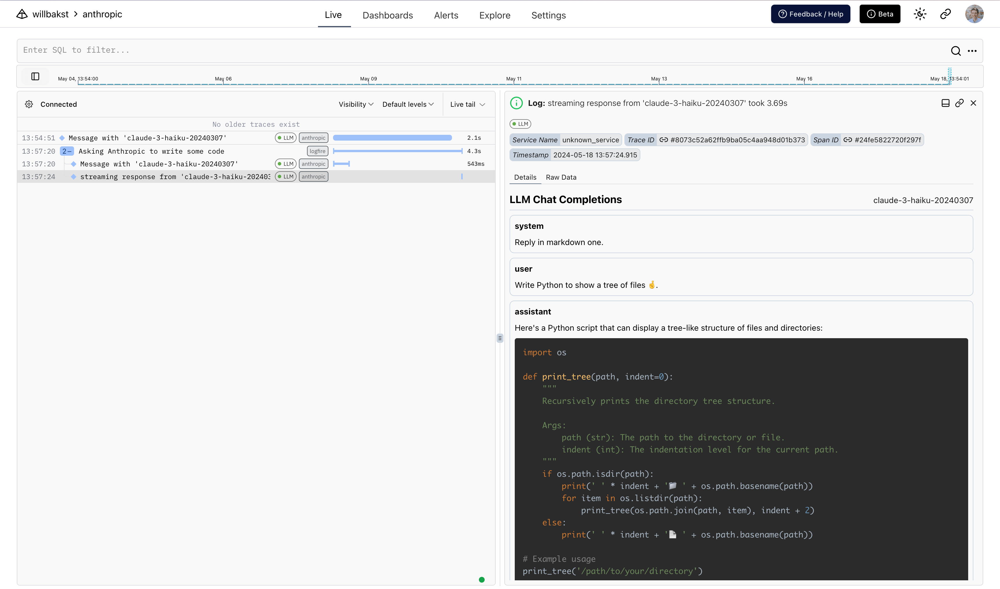

# Anthropic

**Logfire** supports instrumenting calls to [Anthropic](https://github.com/anthropics/anthropic-sdk-python)
with one extra line of code.

```python hl_lines="7"
import anthropic
import logfire

client = anthropic.Anthropic()

logfire.configure()
logfire.instrument_anthropic(client)  # (1)!

response = client.messages.create(
    max_tokens=1000,
    model='claude-3-haiku-20240307',
    system='You are a helpful assistant.',
    messages=[{'role': 'user', 'content': 'Please write me a limerick about Python logging.'}],
)
print(response.content[0].text)
```

1. If you don't have access to the client instance, you can pass a class (e.g. `logfire.instrument_anthropic(anthropic.Anthropic)`), or just pass no arguments (i.e. `logfire.instrument_anthropic()`) to instrument both the `anthropic.Anthropic` and `anthropic.AsyncAnthropic` classes.

_For more information, see the [`instrument_anthropic()` API reference][logfire.Logfire.instrument_anthropic]._

With that you get:

* a span around the call to Anthropic which records duration and captures any exceptions that might occur
* Human-readable display of the conversation with the agent
* details of the response, including the number of tokens used

<figure markdown="span">
  { width="500" }
  <figcaption>Anthropic span and conversation</figcaption>
</figure>

<figure markdown="span">
  { width="500" }
  <figcaption>Span arguments including response details</figcaption>
</figure>

## Methods covered

The following Anthropic methods are covered:

- [`client.messages.create`](https://docs.anthropic.com/en/api/messages)
- [`client.messages.stream`](https://docs.anthropic.com/en/api/messages-streaming)
- [`client.beta.tools.messages.create`](https://docs.anthropic.com/en/docs/tool-use)

All methods are covered with both `anthropic.Anthropic` and `anthropic.AsyncAnthropic`.

## Streaming Responses

When instrumenting streaming responses, Logfire creates two spans — one around the initial request and one
around the streamed response.

Here we also use Rich's [`Live`][rich.live.Live] and [`Markdown`][rich.markdown.Markdown] types to render the response in the terminal in real-time. :dancer:

```python
import anthropic
import logfire
from rich.console import Console
from rich.live import Live
from rich.markdown import Markdown

client = anthropic.AsyncAnthropic()
logfire.configure()
logfire.instrument_anthropic(client)


async def main():
    console = Console()
    with logfire.span('Asking Anthropic to write some code'):
        response = client.messages.stream(
            max_tokens=1000,
            model='claude-3-haiku-20240307',
            system='Reply in markdown one.',
            messages=[{'role': 'user', 'content': 'Write Python to show a tree of files 🤞.'}],
        )
        content = ''
        with Live('', refresh_per_second=15, console=console) as live:
            async with response as stream:
                async for chunk in stream:
                    if chunk.type == 'content_block_delta':
                        content += chunk.delta.text
                        live.update(Markdown(content))


if __name__ == '__main__':
    import asyncio

    asyncio.run(main())
```

Shows up like this in Logfire:

<figure markdown="span">
  { width="500" }
  <figcaption>Anthropic streaming response</figcaption>
</figure>

# Amazon Bedrock
You can also log Anthropic LLM calls to Amazon Bedrock using the `AmazonBedrock` and `AsyncAmazonBedrock` clients.

```
import anthropic
import logfire

client = anthropic.AnthropicBedrock()

logfire.configure()
logfire.instrument_anthropic(client)
```
