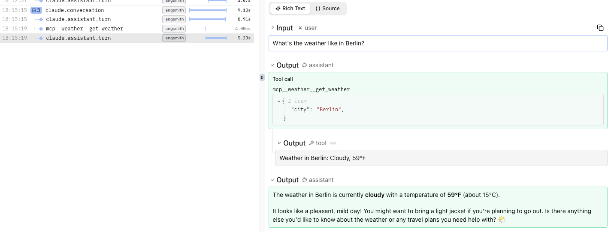

# Claude Agent SDK

You can instrument the Python [Claude Agent SDK](https://platform.claude.com/docs/en/agent-sdk/overview) using **Logfire** and [Langsmith](https://docs.langchain.com/langsmith/trace-claude-agent-sdk).

First, install dependencies:

```bash
pip install 'langsmith[claude-agent-sdk, otel]'
```

Here's an example script:

```python
from langsmith.integrations.claude_agent_sdk import configure_claude_agent_sdk
import logfire
import os
import asyncio
from claude_agent_sdk import (
    ClaudeAgentOptions,
    ClaudeSDKClient,
    tool,
    create_sdk_mcp_server,
)
from typing import Any

# These environment variables enable Langsmith OpenTelemetry tracing,
# instead of sending traces to Langsmith directly.
os.environ['LANGSMITH_OTEL_ENABLED'] = "true"
os.environ['LANGSMITH_OTEL_ONLY'] = "true"
os.environ['LANGSMITH_TRACING'] = "true"

# Ensure that OpenTelemetry traces are sent to Logfire
logfire.configure()

# Instrument the Claude Agent SDK with Langsmith
configure_claude_agent_sdk()

# Example of using a tool in the Claude Agent SDK:
@tool(
    "get_weather",
    "Gets the current weather for a given city",
    {
        "city": str,
    },
)
async def get_weather(args: dict[str, Any]) -> dict[str, Any]:
    """Simulated weather lookup tool"""
    city = args["city"]
    weather = "Cloudy, 59°F"
    return {"content": [{"type": "text", "text": f"Weather in {city}: {weather}"}]}


async def main():
    weather_server = create_sdk_mcp_server(
        name="weather",
        version="1.0.0",
        tools=[get_weather],
    )

    options = ClaudeAgentOptions(
        system_prompt="You are a friendly travel assistant who helps with weather information.",
        mcp_servers={"weather": weather_server},
        allowed_tools=["mcp__weather__get_weather"],
    )

    async with ClaudeSDKClient(options=options) as client:
        await client.query("What's the weather like in Berlin?")

        async for message in client.receive_response():
            print(message)


asyncio.run(main())
```

!!! warning
    Only the `ClaudeSDKClient` is instrumented, not the top-level `claude_agent_sdk.query()` function.

The resulting trace looks like this in Logfire:


