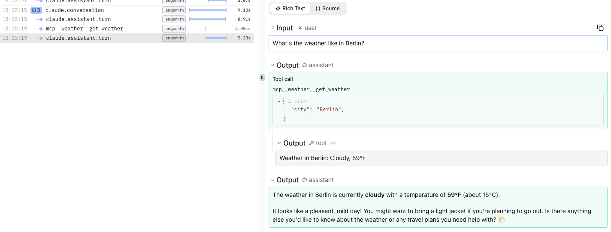

# Claude Agent SDK

You can instrument the Python [Claude Agent SDK](https://platform.claude.com/docs/en/agent-sdk/overview) using **Logfire**.

!!! note
    This is separate from the [`anthropic` integration](../llms/anthropic.md). The Claude Agent SDK doesn't actually use the `anthropic` package under the hood.

First, install dependencies:

```bash
pip install logfire claude-agent-sdk
```

Here's an example script:

```python skip-run="true" skip-reason="external-connection"
import asyncio
from typing import Any

from claude_agent_sdk import (
    ClaudeAgentOptions,
    ClaudeSDKClient,
    create_sdk_mcp_server,
    tool,
)

import logfire

logfire.configure()
logfire.instrument_claude_agent_sdk()


# Example of using a tool in the Claude Agent SDK:
@tool(
    'get_weather',
    'Gets the current weather for a given city',
    {
        'city': str,
    },
)
async def get_weather(args: dict[str, Any]) -> dict[str, Any]:
    """Simulated weather lookup tool"""
    city = args['city']
    weather = 'Cloudy, 59°F'
    return {'content': [{'type': 'text', 'text': f'Weather in {city}: {weather}'}]}


async def main():
    weather_server = create_sdk_mcp_server(
        name='weather',
        version='1.0.0',
        tools=[get_weather],
    )

    options = ClaudeAgentOptions(
        system_prompt='You are a friendly travel assistant who helps with weather information.',
        mcp_servers={'weather': weather_server},
        allowed_tools=['mcp__weather__get_weather'],
    )

    async with ClaudeSDKClient(options=options) as client:
        await client.query("What's the weather like in Berlin?")

        async for message in client.receive_response():
            print(message)


asyncio.run(main())
```

!!! warning
    Only the `ClaudeSDKClient` is instrumented, not the top-level `claude_agent_sdk.query()` function. Instances created **after** calling `logfire.instrument_claude_agent_sdk()` are fully instrumented. Existing instances will get conversation and turn spans but not tool call spans.

The resulting trace looks like this in Logfire:


