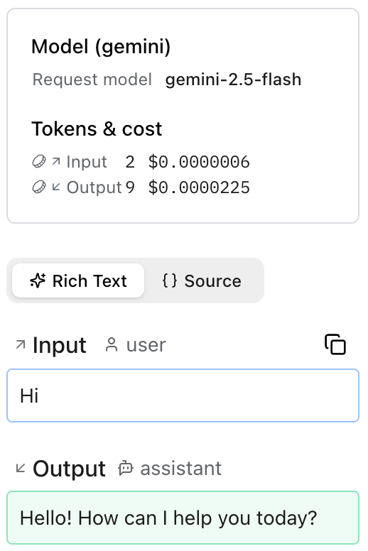

# Google Gen AI SDK

**Logfire** supports instrumenting calls to the [Google Gen AI SDK (`google-genai`)](https://googleapis.github.io/python-genai/) with the [`logfire.instrument_google_genai()`][logfire.Logfire.instrument_google_genai] method.

## Installation

Install `logfire` with the `google-genai` extra:

{{ install_logfire(extras=['google-genai']) }}

## Usage

```python hl_lines="8 11"
import os

from google.genai import Client

import logfire

# This is required for prompts and completions to be captured in the spans
os.environ['OTEL_INSTRUMENTATION_GENAI_CAPTURE_MESSAGE_CONTENT'] = 'true'

logfire.configure()
logfire.instrument_google_genai()

client = Client()
response = client.models.generate_content(model='gemini-2.5-flash', contents=['Hi'])
print(response.text)
# Hello! How can I help you today?
```

This creates a span which shows the conversation in the Logfire UI:

<figure markdown="span">
{ width="259" }
</figure>

!!! note
    If you don't set the environment variable `OTEL_INSTRUMENTATION_GENAI_CAPTURE_MESSAGE_CONTENT`
    to `true`, the spans will simply contain `<elided>` where the prompts and completions would be.

[`logfire.instrument_google_genai()`][logfire.Logfire.instrument_google_genai] uses the `GoogleGenAiSdkInstrumentor().instrument()` method of the [`opentelemetry-instrumentation-google-genai`](https://pypi.org/project/opentelemetry-instrumentation-google-genai/) package.
