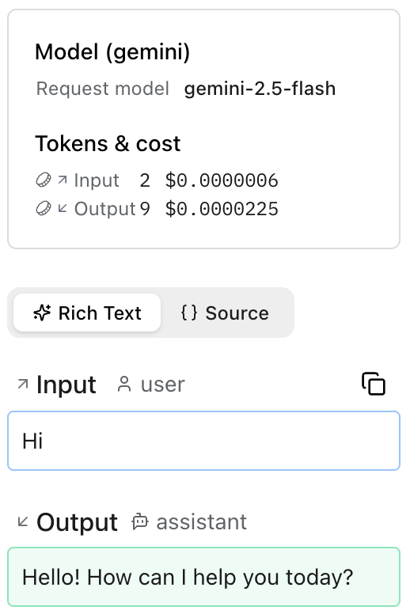

# Google Gen AI SDK

See every call your app makes to Google's Gemini models through the
[Google Gen AI SDK (`google-genai`)](https://googleapis.github.io/python-genai/): the full
conversation, how many **tokens** (the units a model reads and bills by, a few characters of text
each) it used, how long it took, and any errors, as a **trace** (the full journey of one request,
made of nested **spans**, where each span is one unit of work with a name, a start, and a duration)
in Logfire.

## What you'll capture

- Each model call as a span, with its duration and any exceptions
- The full conversation between your app and the model
- Response details, including the number of tokens used

{{ before_you_start() }}

You'll also need a **Google Gemini API key**, from [Google AI Studio](https://aistudio.google.com/apikey). The Google Gen AI SDK reads it from the `GEMINI_API_KEY` (or `GOOGLE_API_KEY`) environment variable.

## Installation

Install `logfire` with the `google-genai` extra:

{{ install_logfire(extras=['google-genai']) }}

## Usage

Add two lines to your app: `logfire.configure()` to connect to your project, and
[`logfire.instrument_google_genai()`][logfire.Logfire.instrument_google_genai] to record every
Gemini call.

By default, the prompts and completions are hidden: the spans show `<elided>` in their place. To
capture the actual message content (so you can read the conversation in Logfire), set the
`OTEL_INSTRUMENTATION_GENAI_CAPTURE_MESSAGE_CONTENT` environment variable to `true`. This sends the
prompt and response text to Logfire, so leave it off if that content is sensitive.

```python hl_lines="8 10-11" skip-run="true" skip-reason="external-connection"
import os

from google.genai import Client

import logfire

# Set this to true to capture the actual prompts and completions in the spans.
os.environ['OTEL_INSTRUMENTATION_GENAI_CAPTURE_MESSAGE_CONTENT'] = 'true'

logfire.configure()
logfire.instrument_google_genai()

client = Client()
response = client.models.generate_content(model='gemini-2.5-flash', contents=['Hi'])
print(response.text)
# Hello! How can I help you today?
```

This creates a span which shows the conversation in the Logfire UI:

<figure markdown="span">
{ width="259" }
</figure>

## Verify it worked

Run your program, then open your project in the
[Logfire web app](https://logfire.pydantic.dev/) and go to the **Live** view. Within a few seconds you
should see a span for the Gemini call. Click it to read the conversation and see the token count and
duration.

## Troubleshooting

Not seeing your model calls in Logfire? Check these first:

- **`logfire.configure()` runs before `logfire.instrument_google_genai()`.** Configure the connection
  first, then instrument.
- **You called `instrument_google_genai()` exactly once.**
- **Your Logfire write token is set.** In local development, run `logfire projects use <your-project>`;
  in production, set the `LOGFIRE_TOKEN` environment variable. See [Getting Started](../../index.md).
- **Prompts and completions show as `<elided>`?** Set
  `OTEL_INSTRUMENTATION_GENAI_CAPTURE_MESSAGE_CONTENT=true` before your app runs, as shown above.

## Reference

- API reference: [`logfire.instrument_google_genai()`][logfire.Logfire.instrument_google_genai]
- Underlying OpenTelemetry package:
  [`opentelemetry-instrumentation-google-genai`](https://pypi.org/project/opentelemetry-instrumentation-google-genai/)
