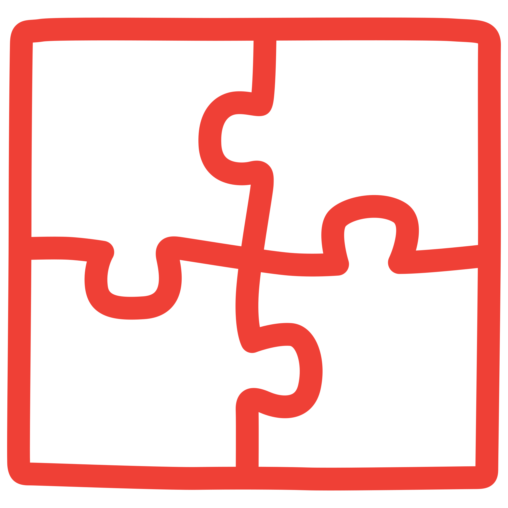
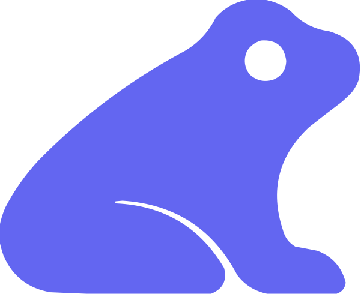

# AI & LLM integrations

Trace the model calls, agent steps, and tool calls in your AI app. Instrument the SDK or agent framework you already use with a few lines, and the resulting spans show up in Logfire, with prompts, tokens, cost, and latency where the integration captures them.

  <a class="integration-card" href="pydanticai/">
    
    Pydantic AI
  </a>
  <a class="integration-card" href="openai/">
    O
    OpenAI
  </a>
  <a class="integration-card" href="google-genai/">
    
    Google Gen AI
  </a>
  <a class="integration-card" href="anthropic/">
    
    Anthropic
  </a>
  <a class="integration-card" href="langchain/">
    
    LangChain
  </a>
  <a class="integration-card" href="litellm/">
    Li
    LiteLLM
  </a>
  <a class="integration-card" href="dspy/">
    
    DSPy
  </a>
  <a class="integration-card" href="mcp/">
    
    MCP
  </a>
  <a class="integration-card" href="claude-agent-sdk/">
    
    Claude Agent SDK
  </a>
  <a class="integration-card" href="llamaindex/">
    
    LlamaIndex
  </a>
  <a class="integration-card" href="mirascope/">
    
    Mirascope
  </a>
  <a class="integration-card" href="magentic/">
    Ma
    Magentic
  </a>

## Not listed?

Any OpenTelemetry-compatible LLM SDK can send to Logfire. See [Alternative clients](../../how-to-guides/alternative-clients.md) for the generic pattern.
