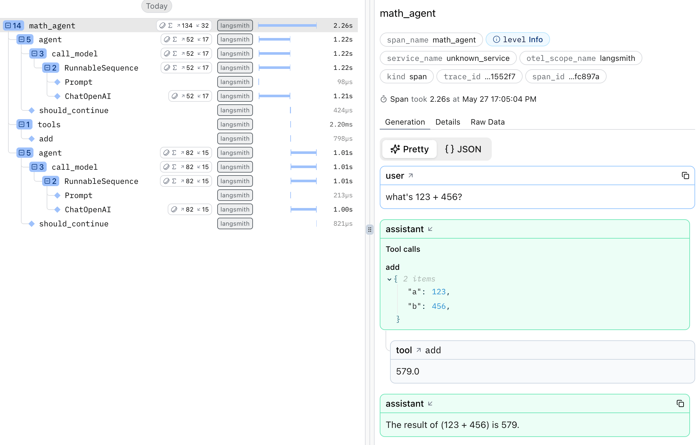

# LangChain

[LangChain](https://www.langchain.com/) (and thus [LangGraph](https://www.langchain.com/langgraph)) has [built-in OpenTelemetry tracing via Langsmith](https://docs.smith.langchain.com/observability/how_to_guides/trace_langchain_with_otel) which you can use with **Logfire**. It's enabled by these two environment variables:

```
LANGSMITH_OTEL_ENABLED=true
LANGSMITH_TRACING=true
```

Here's a complete example using LangGraph:

```python
import os

import logfire

# These environment variables need to be set before importing langchain or langgraph
os.environ['LANGSMITH_OTEL_ENABLED'] = 'true'
os.environ['LANGSMITH_TRACING'] = 'true'

from langgraph.prebuilt import create_react_agent

logfire.configure()


def add(a: float, b: float) -> float:
    """Add two numbers."""
    return a + b


math_agent = create_react_agent('openai:gpt-4o', tools=[add], name='math_agent')

result = math_agent.invoke({'messages': [{'role': 'user', 'content': "what's 123 + 456?"}]})
```

The resulting trace looks like this in Logfire:


