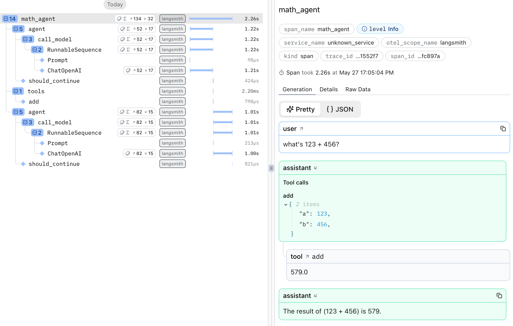

# LangChain

See every step your [LangChain](https://www.langchain.com/) chains and
[LangGraph](https://www.langchain.com/langgraph) agents take: the model calls, tool calls, how many
**tokens** (the units a model reads and bills by, a few characters of text each) they used, how long
they took, and any errors, as a **trace** (the full journey of one request, made of nested
**spans**, where each span is one unit of work with a name, a start, and a duration) in Logfire.

LangChain has built-in tracing through LangSmith that speaks OpenTelemetry (the open standard Logfire
receives data in), so there's no separate Logfire instrument call. You turn on that tracing with a few
environment variables, and Logfire receives the data.

## What you'll capture

- Each chain, agent, and tool step as a span, with its duration and any exceptions
- Model calls, with the conversation and the number of tokens used
- Nested steps of a chain or agent, shown as child spans in one trace

## Before you start

You'll need a Logfire project and its **write token**, the credential your app uses to send data to
Logfire. Create a project and copy its token from **Project → Settings → Write tokens** in the
Logfire web app. New to Logfire? Start with [Getting Started](../../index.md), which walks through
creating a project and linking your machine.

## Installation

Install `logfire`:

{{ install_logfire() }}

This works with your existing `langchain` (or `langgraph`) install: nothing extra to add.

## Usage

Set three environment variables to turn on LangSmith's OpenTelemetry tracing, call
`logfire.configure()` to connect to your project, and Logfire receives the data. The variables must be
set **before** you import `langchain` or `langgraph`.

```
LANGSMITH_OTEL_ENABLED=true
LANGSMITH_OTEL_ONLY=true
LANGSMITH_TRACING=true
```

The example below calls an OpenAI model, so it also needs your model provider's credential: set the
`OPENAI_API_KEY` environment variable to your OpenAI API key (swap in another provider's model and key
if you prefer).

Here's a complete example using LangGraph:

```python skip-run="true" skip-reason="external-connection"
import os

import logfire

# These environment variables need to be set before importing langchain or langgraph
os.environ['LANGSMITH_OTEL_ENABLED'] = 'true'
os.environ['LANGSMITH_OTEL_ONLY'] = 'true'
os.environ['LANGSMITH_TRACING'] = 'true'

from langchain.agents import create_agent

logfire.configure()


def add(a: float, b: float) -> float:
    """Add two numbers."""
    return a + b


math_agent = create_agent('openai:gpt-5-mini', tools=[add], name='math_agent')

result = math_agent.invoke({'messages': [{'role': 'user', 'content': "what's 123 + 456?"}]})
print(result['messages'][-1].content)
```

The resulting trace looks like this in Logfire:



## Verify it worked

Run your program, then open your project in the
[Logfire web app](https://logfire.pydantic.dev/) and go to the **Live** view. Within a few seconds you
should see a trace for the agent run, with a span for each step. Click into it to see the model calls
and tool calls.

<!-- TODO(app-verify): confirm the Live-view span names for a LangGraph agent run and add a screenshot of the nested trace -->

## Troubleshooting

Not seeing your LangChain steps in Logfire? Check these first:

- **The three `LANGSMITH_*` environment variables are set before importing `langchain` or
  `langgraph`.** Set them at the very top of your program, above the imports.
- **`logfire.configure()` runs at startup**, so the connection is ready when the first step runs.
- **Your Logfire write token is set.** In local development, run `logfire projects use <your-project>`;
  in production, set the `LOGFIRE_TOKEN` environment variable. See [Getting Started](../../index.md).

## Reference

- LangSmith tracing over OpenTelemetry:
  [Trace LangChain with OpenTelemetry](https://docs.smith.langchain.com/observability/how_to_guides/trace_langchain_with_otel)
