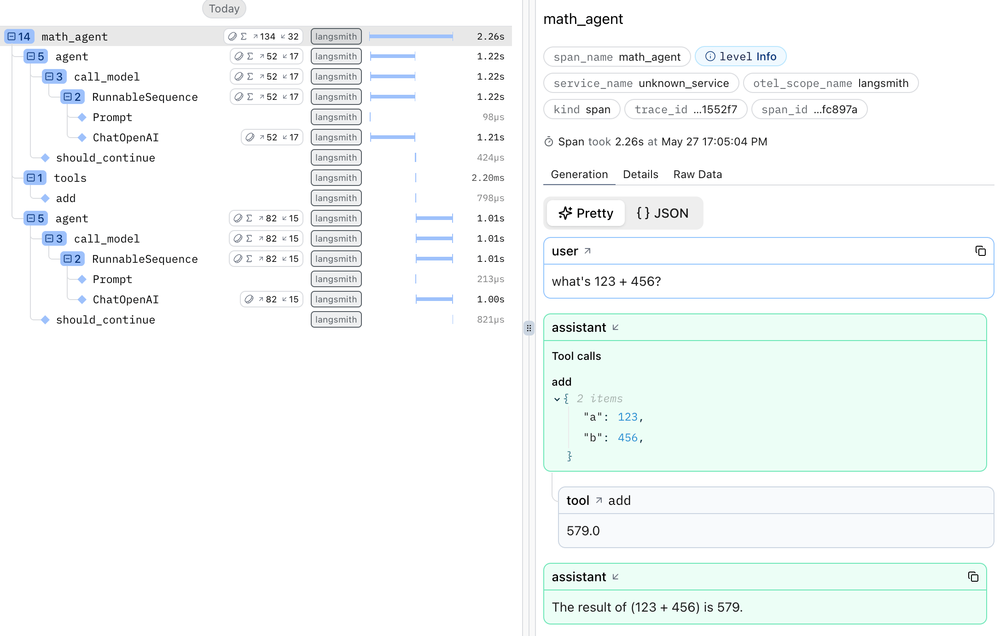

# LangChain

See every step your [LangChain](https://www.langchain.com/) chains and
[LangGraph](https://www.langchain.com/langgraph) agents take: the model calls, tool calls, how many
**tokens** (the units a model reads and bills by, a few characters of text each) they used, how long
they took, and any errors, as a **trace** (the full journey of one request or agent run, made of nested
**spans**, where each span is one unit of work with a name, a start, and a duration) in Logfire.

LangChain has built-in tracing through LangSmith that speaks OpenTelemetry (the open standard Logfire
receives data in), so there's no separate Logfire instrument call. You turn on that tracing with a few
environment variables, and Logfire receives the data.

## What you'll capture

- Each chain, agent, and tool step as a span, with its duration and any exceptions
- Model calls, with the conversation and the number of tokens used
- Nested steps of a chain or agent, shown as child spans in one trace

!!! note "For the Agents page, instrument with OpenInference"
    This LangSmith export shows your chains and agents in the [Live view](../../guides/web-ui/live.md), but it does not mark an agent root span, so your agents do not appear on the [Agents page](../../guides/web-ui/agents.md). To list them there, instrument with OpenInference instead: see [Show your agents on the Agents page](#show-your-agents-on-the-agents-page) below.

!!! note "Prompts and responses are sent to Logfire"
    Your prompts, the model's responses, and any tool inputs are recorded as span attributes and
    stored in Logfire, so they can include personal or proprietary data. Use
    [scrubbing](../../how-to-guides/scrubbing.md) to redact sensitive values before they leave your
    machine.

{{ before_you_start() }}

## Installation

Install `logfire`:

{{ install_logfire() }}

This works with your existing `langchain` (or `langgraph`) install: nothing extra to add.

## Usage

Set three environment variables to turn on LangSmith's OpenTelemetry tracing, call
`logfire.configure()` to connect to your project, and Logfire receives the data. The variables must be
set **before** you import `langchain` or `langgraph`.

```bash
LANGSMITH_OTEL_ENABLED=true
LANGSMITH_OTEL_ONLY=true
LANGSMITH_TRACING=true
```

The example below calls an OpenAI model, so it also needs your model provider's credential: set the
`OPENAI_API_KEY` environment variable to your OpenAI API key (swap in another provider's model and key
if you prefer).

Here's a complete example using LangGraph:

```python skip-run="true" skip-reason="external-connection"
import os

import logfire

# These environment variables need to be set before importing langchain or langgraph
os.environ['LANGSMITH_OTEL_ENABLED'] = 'true'
os.environ['LANGSMITH_OTEL_ONLY'] = 'true'
os.environ['LANGSMITH_TRACING'] = 'true'

from langchain.agents import create_agent

logfire.configure()


def add(a: float, b: float) -> float:
    """Add two numbers."""
    return a + b


math_agent = create_agent('openai:gpt-5-mini', tools=[add], name='math_agent')

result = math_agent.invoke({'messages': [{'role': 'user', 'content': "what's 123 + 456?"}]})
print(result['messages'][-1].content)
```

The resulting trace looks like this in Logfire:



## Verify it worked

Run your program, then open your project in the
[Logfire web app](https://logfire.pydantic.dev/) and go to the **Live** view. Within a few seconds you
should see a trace for the agent run, with a span for each step. Click into it to see the model calls
and tool calls.

## Show your agents on the Agents page

The LangSmith export above lands your traces in the [Live view](../../guides/web-ui/live.md), but it does not mark an agent root span, so your agents do not appear on the [Agents page](../../guides/web-ui/agents.md). If you want them there, instrument with [OpenInference](https://github.com/Arize-ai/openinference) instead of the LangSmith export:

```bash
pip install openinference-instrumentation-langchain
```

```python skip-run="true" skip-reason="external-connection"
from openinference.instrumentation.langchain import LangChainInstrumentor

import logfire

logfire.configure()
LangChainInstrumentor().instrument()
```

### Deep agents

A [deep agent](https://github.com/langchain-ai/deepagents) built with `create_deep_agent` runs as a LangGraph graph. OpenInference marks the graph's root span as the agent only when the agent has a name, so pass `name=`:

```python skip="true" skip-reason="incomplete"
from deepagents import create_deep_agent

agent = create_deep_agent(tools=[...], system_prompt='...', name='research_agent')
```

The deep agent then appears on the Agents page as `research_agent`. Without a name, its root span is a generic graph span, so it does not appear as its own row. Sub-agents run as nested graphs, so only the top-level deep agent appears; the sub-agent's own model and tool calls are still visible inside that agent's runs.

## Troubleshooting

Not seeing your LangChain steps in Logfire? Check these first:

- **The three `LANGSMITH_*` environment variables are set before importing `langchain` or
  `langgraph`.** Set them at the very top of your program, above the imports.
- **`logfire.configure()` runs at startup**, so the connection is ready when the first step runs.
- **Your Logfire write token is set.** In local development, run `logfire projects use <your-project>`;
  in production, set the `LOGFIRE_TOKEN` environment variable. See [Getting Started](../../index.md).

## Reference

- LangSmith tracing over OpenTelemetry:
  [Trace LangChain with OpenTelemetry](https://docs.smith.langchain.com/observability/how_to_guides/trace_langchain_with_otel)
