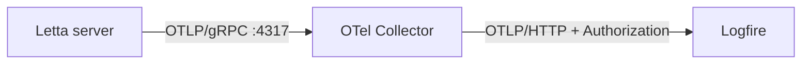

# Letta

[Letta](https://docs.letta.com/) (formerly **MemGPT**) is a framework and server for building stateful agents
with long-term memory. The Letta **server** has native OTLP export built in, but it speaks **OTLP/gRPC only**
and exposes a single endpoint env var with no way to set auth headers. **Logfire**'s direct ingest is
OTLP/HTTP, so the robust path is to run a small [OpenTelemetry Collector](../../how-to-guides/otel-collector/otel-collector-overview.md)
that receives Letta's gRPC traces and forwards them to **Logfire** over HTTP with your write token.



## Installation

```bash
# Letta server + Python client
pip install letta letta-client
# The collector runs as a container:
# docker pull otel/opentelemetry-collector-contrib
```

## Collector configuration

Create `otel-collector-config.yaml`:

```yaml
receivers:
  otlp:
    protocols:
      grpc:
        endpoint: 0.0.0.0:4317 # Letta exports here

exporters:
  otlphttp/logfire:
    endpoint: 'https://logfire-us.pydantic.dev' # use logfire-eu.pydantic.dev for the EU region
    headers:
      Authorization: '${LOGFIRE_WRITE_TOKEN}'

service:
  pipelines:
    traces:
      receivers: [otlp]
      exporters: [otlphttp/logfire]
```

## Running it

```bash
# 1. Start the collector (forwards to Logfire)
export LOGFIRE_WRITE_TOKEN="your-logfire-write-token"
docker run -p 4317:4317 \
  -v "$PWD/otel-collector-config.yaml:/etc/otelcol-contrib/config.yaml" \
  -e LOGFIRE_WRITE_TOKEN \
  otel/opentelemetry-collector-contrib

# 2. Start the Letta server pointed at the collector
export LETTA_OTEL_EXPORTER_OTLP_ENDPOINT="http://localhost:4317"
letta server
```

Then talk to the server with the client:

```python skip-run="true" skip-reason="external-connection"
from letta_client import Letta

client = Letta(base_url='http://localhost:8283')

agent = client.agents.create(
    model='openai/gpt-4o-mini',
    embedding='openai/text-embedding-3-small',
    memory_blocks=[
        {'label': 'human', 'value': "The user's name is Will."},
        {'label': 'persona', 'value': 'You are a helpful assistant.'},
    ],
)

response = client.agents.messages.create(
    agent_id=agent.id,
    messages=[{'role': 'user', 'content': 'Hello! Remember my name.'}],
)
for message in response.messages:
    print(message)
```

Each request to the Letta server now produces traces (including the underlying LLM provider requests) that flow
through the collector into **Logfire**.

!!! warning "Important details"
    - **Telemetry is server-side.** Tracing is emitted by the `letta server` process, not by `letta-client`.
      Set `LETTA_OTEL_EXPORTER_OTLP_ENDPOINT` where the server runs.
    - **gRPC only.** `LETTA_OTEL_EXPORTER_OTLP_ENDPOINT` must point at a gRPC OTLP receiver (port `4317`), not
      an HTTP `/v1/traces` URL. You can't point it directly at **Logfire** — hence the collector.
    - **Region.** Match `logfire-us.pydantic.dev` or `logfire-eu.pydantic.dev` to your project's region.

## Managed prompts

You can keep an agent's persona / system text in
[Prompt Management](../../reference/advanced/prompt-management/index.md) and fetch it with the Logfire SDK
before creating the agent:

```bash
pip install 'logfire[variables]'
```

```python skip="true"
from letta_client import Letta
from pydantic import BaseModel

import logfire

logfire.configure()


class PersonaInputs(BaseModel):
    tone: str


persona_var = logfire.template_var(
    name='prompt__letta_persona',
    type=str,
    default='You are a helpful assistant.',
    inputs_type=PersonaInputs,
)

with persona_var.get(PersonaInputs(tone='warm'), label='production') as resolved:
    persona = resolved.value

client = Letta(base_url='http://localhost:8283')
agent = client.agents.create(
    model='openai/gpt-4o-mini',
    embedding='openai/text-embedding-3-small',
    memory_blocks=[{'label': 'persona', 'value': persona}],
)
```

See [Use Prompts in Your Application](../../reference/advanced/prompt-management/application.md) for the full
workflow.
