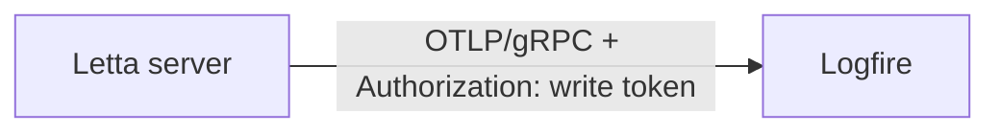

# Letta

[Letta](https://docs.letta.com/) (formerly **MemGPT**) is a framework and server for building stateful agents
with long-term memory. The Letta **server** has native OTLP export built in and speaks **OTLP/gRPC**, which
**Logfire** accepts, so the server can send traces straight to your project with no collector in between.

Letta exposes only an endpoint setting of its own, but the OpenTelemetry exporter underneath it still reads the
standard `OTEL_EXPORTER_OTLP_HEADERS` environment variable, which is how your write token gets attached.


```mermaid
flowchart LR
    L[Letta server] -->|"OTLP/gRPC + Authorization: write token"| LF[Logfire]
```

## Installation

```bash
pip install letta letta-client
```

## Running it

Create a [write token](../../how-to-guides/create-write-tokens.md) from **Project → Settings → Write tokens**,
then start the Letta server with both variables set:

```bash
# Where to send traces: your region's base URL, no path (gRPC addresses a method, not a path)
export LETTA_OTEL_EXPORTER_OTLP_ENDPOINT="https://logfire-us.pydantic.dev"
# How Logfire knows which project they belong to, read by the OTel exporter underneath Letta
export OTEL_EXPORTER_OTLP_HEADERS="Authorization=your-logfire-write-token"

letta server
```

Then talk to the server with the client:

```python skip-run="true" skip-reason="external-connection"
from letta_client import Letta

client = Letta(base_url='http://localhost:8283')

agent = client.agents.create(
    model='openai/gpt-4o-mini',
    embedding='openai/text-embedding-3-small',
    memory_blocks=[
        {'label': 'human', 'value': "The user's name is Will."},
        {'label': 'persona', 'value': 'You are a helpful assistant.'},
    ],
)

response = client.agents.messages.create(
    agent_id=agent.id,
    messages=[{'role': 'user', 'content': 'Hello! Remember my name.'}],
)
for message in response.messages:
    print(message)
```

## Verify

Open the [Live view](../../guides/web-ui/live.md) for your project. Spans start arriving as the server boots,
under the service name `letta-server`, so the [Services](../../guides/web-ui/services.md) view is another
quick way to confirm data is landing. Letta sends metrics to the same endpoint as well, so those appear
alongside the traces.

Letta instruments its own server work, so exercising the server through the client shown above produces spans
for the work each request does, including the underlying LLM provider calls.

If nothing arrives, the server logs the export failure. `Missing or invalid authorization header` means
`OTEL_EXPORTER_OTLP_HEADERS` did not reach the server process, and `Unknown token` means it did but the token
is wrong for this region.

!!! warning "Important details"
    - **Telemetry is server-side.** Tracing is emitted by the `letta server` process, not by `letta-client`,
      so both environment variables go where the server runs. In Docker or Kubernetes that means the Letta
      container, not your shell.
    - **gRPC, so no path.** `LETTA_OTEL_EXPORTER_OTLP_ENDPOINT` takes the bare base URL. A `/v1/traces` URL
      is an HTTP path and does not work over gRPC.
    - **The token rides on a standard variable.** Letta has no setting of its own for headers. It passes only
      the endpoint to the OpenTelemetry exporter, and the exporter reads `OTEL_EXPORTER_OTLP_HEADERS` itself.
      A tool that clears unrecognized environment variables will strip it.
    - **Setting the endpoint is what turns tracing on**, so there is no separate enable flag. There is a kill
      switch though: if `LETTA_DISABLE_TRACING` is set, the server skips tracing setup entirely and exports
      nothing, whatever else you configure.
    - **Region.** Match `logfire-us.pydantic.dev` or `logfire-eu.pydantic.dev` to your project's region, and
      use a write token from that same region.

## When you still want a collector

Sending direct needs nothing extra to run. Put an
[OpenTelemetry Collector](../../how-to-guides/otel-collector/otel-collector-overview.md) in between when you
want what a collector adds: batching or retry across several Letta servers, redacting attributes before they
leave your network, or fanning the same traces out to more than one backend. The configuration below is a
plain pass-through that forwards everything to Logfire, so it is the starting point you add those processors
and exporters to, not an example of them.

Point Letta at the collector (`LETTA_OTEL_EXPORTER_OTLP_ENDPOINT="http://localhost:4317"`, and no
`OTEL_EXPORTER_OTLP_HEADERS`, since the collector attaches the token instead), then save this as
`otel-collector-config.yaml` in the directory you run the container from:

```yaml
receivers:
  otlp:
    protocols:
      grpc:
        endpoint: 0.0.0.0:4317 # Letta exports here

exporters:
  otlphttp/logfire:
    endpoint: 'https://logfire-us.pydantic.dev' # use logfire-eu.pydantic.dev for the EU region
    headers:
      Authorization: '${LOGFIRE_WRITE_TOKEN}'

service:
  pipelines:
    traces:
      receivers: [otlp]
      exporters: [otlphttp/logfire]
    metrics: # Letta exports metrics too; without this pipeline the collector drops them
      receivers: [otlp]
      exporters: [otlphttp/logfire]
```

```bash
export LOGFIRE_WRITE_TOKEN="your-logfire-write-token"
docker run -p 127.0.0.1:4317:4317 \
  -v "$PWD/otel-collector-config.yaml:/etc/otelcol-contrib/config.yaml" \
  -e LOGFIRE_WRITE_TOKEN \
  otel/opentelemetry-collector-contrib
```

## Managed prompts

You can keep an agent's persona / system text in
[Prompt Management](../../reference/advanced/prompt-management/index.md) and fetch it with the Logfire SDK
before creating the agent:

```bash
pip install 'logfire[variables]'
```

```python skip="true"
from letta_client import Letta
from pydantic import BaseModel

import logfire

logfire.configure()


class PersonaInputs(BaseModel):
    tone: str


persona_var = logfire.template_var(
    name='prompt__letta_persona',
    type=str,
    default='You are a helpful assistant.',
    inputs_type=PersonaInputs,
)

with persona_var.get(PersonaInputs(tone='warm'), label='production') as resolved:
    persona = resolved.value

client = Letta(base_url='http://localhost:8283')
agent = client.agents.create(
    model='openai/gpt-4o-mini',
    embedding='openai/text-embedding-3-small',
    memory_blocks=[{'label': 'persona', 'value': persona}],
)
```

See [Use Prompts in Your Application](../../reference/advanced/prompt-management/application.md) for the full
workflow.
