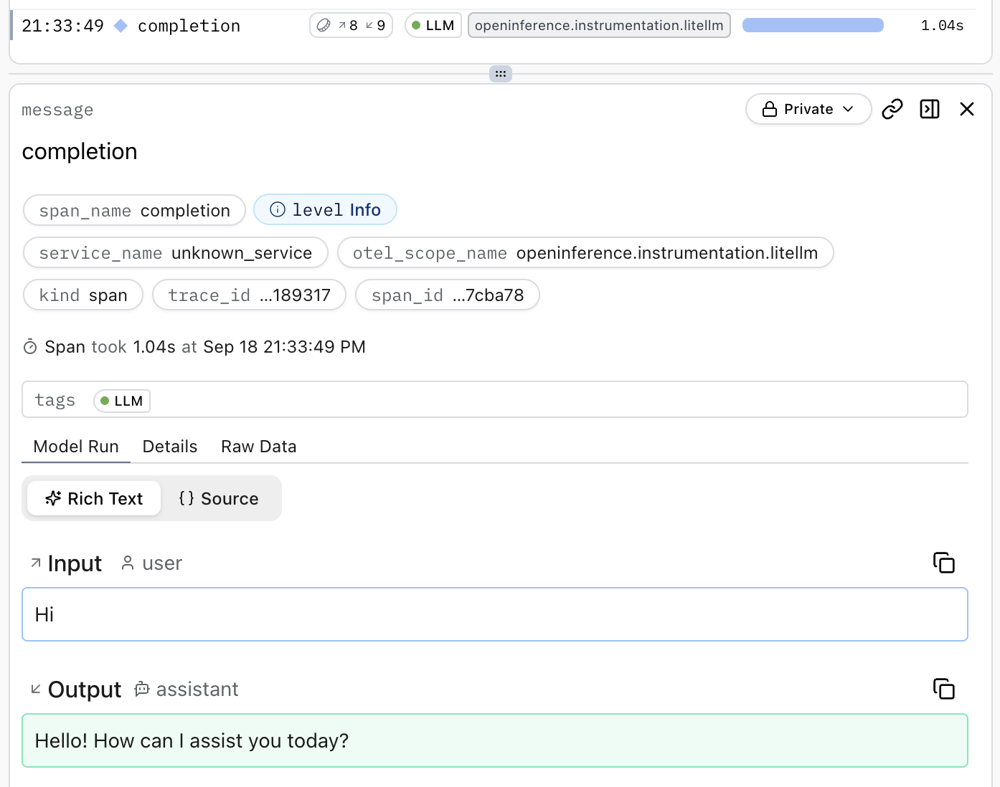

# LiteLLM

**Logfire** supports instrumenting calls to the [LiteLLM](https://docs.litellm.ai/) Python SDK with the [`logfire.instrument_litellm()`][logfire.Logfire.instrument_litellm] method.

## Installation

Install `logfire` with the `litellm` extra:

{{ install_logfire(extras=['litellm']) }}

## Usage

```python hl_lines="6"
import litellm

import logfire

logfire.configure()
logfire.instrument_litellm()

response = litellm.completion(
    model='gpt-4o-mini',
    messages=[{'role': 'user', 'content': 'Hi'}],
)
print(response.choices[0].message.content)
# > Hello! How can I assist you today?
```

!!! warning
    This currently works best if all arguments of instrumented methods are passed as keyword arguments,
    e.g. `litellm.completion(model=model, messages=messages)`.

This creates a span which shows the conversation in the Logfire UI:

<figure markdown="span">
{ width="697" }
</figure>

[`logfire.instrument_litellm()`][logfire.Logfire.instrument_litellm] uses the `LiteLLMInstrumentor().instrument()` method of the [`openinference-instrumentation-litellm`](https://pypi.org/project/openinference-instrumentation-litellm/) package.

!!! note
    [LiteLLM has its own integration with Logfire](https://docs.litellm.ai/docs/observability/logfire_integration), but we recommend using `logfire.instrument_litellm()` instead.
