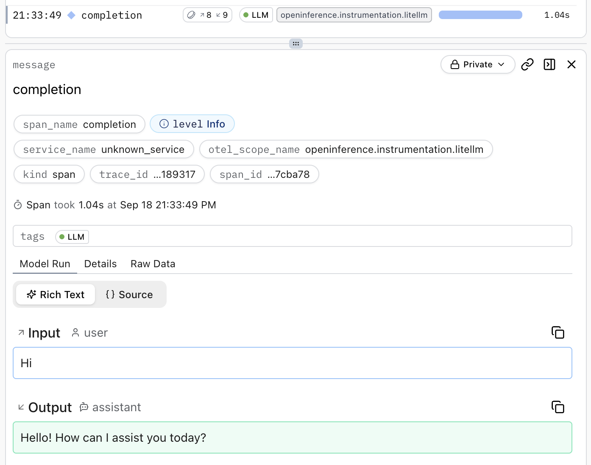

# LiteLLM

See every call your app makes through [LiteLLM](https://docs.litellm.ai/): the full conversation,
how many **tokens** (the units a model reads and bills by, a few characters of text each) it used,
how long it took, and any errors, as a **trace** (the full journey of one request, made of nested
**spans**, where each span is one unit of work with a name, a start, and a duration) in Logfire.
LiteLLM gives you one interface to many model providers, and this integration records every call
regardless of which provider handles it.

## What you'll capture

- Each model call as a span, with its duration and any exceptions
- The full conversation between your app and the model
- Response details, including the number of tokens used
- The provider and model behind each call

!!! note "Prompts and responses are sent to Logfire"
    Your prompts, the model's responses, and any tool inputs are recorded as span attributes and
    stored in Logfire, so they can include personal or proprietary data. Use
    [scrubbing](../../how-to-guides/scrubbing.md) to redact sensitive values before they leave your
    machine.

{{ before_you_start() }}

You'll also need an API key for whichever model provider you call (for example, `OPENAI_API_KEY` or `ANTHROPIC_API_KEY`). LiteLLM reads these from environment variables; see the [LiteLLM provider docs](https://docs.litellm.ai/docs/providers) for the variable each provider uses.

## Installation

Install `logfire` with the `litellm` extra:

{{ install_logfire(extras=['litellm']) }}

## Usage

Add two lines to your app: `logfire.configure()` to connect to your project, and
[`logfire.instrument_litellm()`][logfire.Logfire.instrument_litellm] to record every LiteLLM call.

```python hl_lines="5-6" skip-run="true" skip-reason="external-connection"
import litellm

import logfire

logfire.configure()
logfire.instrument_litellm()

response = litellm.completion(
    model='gpt-5-mini',
    messages=[{'role': 'user', 'content': 'Hi'}],
)
print(response.choices[0].message.content)
#> Hello! How can I assist you today?
```

!!! warning
    This currently works best if all arguments of instrumented methods are passed as keyword arguments,
    e.g. `litellm.completion(model=model, messages=messages)`.

This creates a span which shows the conversation in the Logfire UI:

<figure markdown="span">
{ width="697" }
</figure>

## Verify it worked

Run your program, then open your project in the
[Logfire web app](https://logfire.pydantic.dev/) and go to the **Live** view. Within a few seconds you
should see a span for the LiteLLM call. Click it to read the conversation and see the token count and
duration.

## Troubleshooting

Not seeing your model calls in Logfire? Check these first:

- **`logfire.configure()` runs before `logfire.instrument_litellm()`.** Configure the connection
  first, then instrument.
- **You called `instrument_litellm()` exactly once.**
- **You passed arguments as keywords**, as noted in the warning above.
- **Your Logfire write token is set.** In local development, run `logfire projects use <your-project>`;
  in production, set the `LOGFIRE_TOKEN` environment variable. See [Getting Started](../../index.md).

!!! note
    [LiteLLM has its own integration with Logfire](https://docs.litellm.ai/docs/observability/logfire_integration), but we recommend using `logfire.instrument_litellm()` instead.

## Reference

- API reference: [`logfire.instrument_litellm()`][logfire.Logfire.instrument_litellm]
- Underlying OpenTelemetry package:
  [`openinference-instrumentation-litellm`](https://pypi.org/project/openinference-instrumentation-litellm/)
