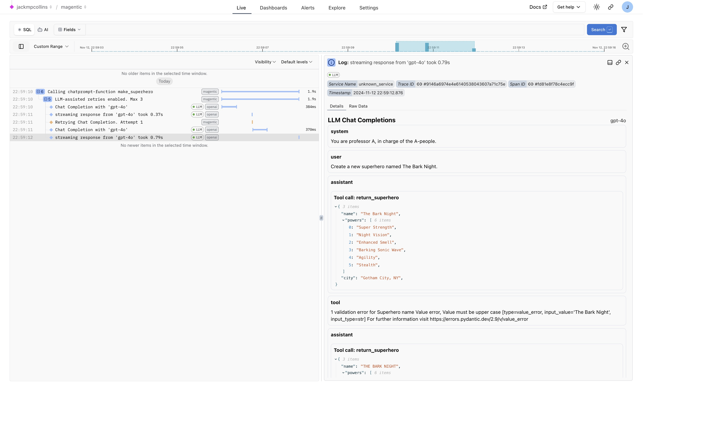

# Magentic

See what [Magentic](https://github.com/jackmpcollins/magentic) does when it turns a model's reply into structured output: the prompt it built, each retry it needed, and the tool or function calls it made, as a **trace** (the full journey of one request, made of nested **spans**, where each span is one unit of work with a name, a start, and a duration) in Logfire.

Magentic is a library for getting structured output from models, built around standard Python type annotations and Pydantic. It emits its own spans as soon as Logfire is configured; there's no separate Magentic instrument call.

## What you'll capture

- Each Magentic function call as a span, with the input arguments
- The prompt template and the messages sent to and from the model
- Retries, with a warning for each attempt that produced invalid output
- Tool and function calls the model made
- Token usage and any errors, once you also instrument the model provider (see below)

{{ before_you_start() }}

Magentic calls a model provider using your own API key, so each run costs money on that provider account.

## Installation

Install `logfire`:

{{ install_logfire() }}

This works with your existing Magentic install; there's no extra to add. If you don't have it yet, `pip install magentic`.

## Usage

Magentic needs no setup of its own; it starts emitting spans as soon as you call `logfire.configure()`. To also capture the underlying model calls (the full conversation and token usage), instrument the provider you use: [`logfire.instrument_openai()`][logfire.Logfire.instrument_openai] and/or [`logfire.instrument_anthropic()`][logfire.Logfire.instrument_anthropic].

```python hl_lines="11-12" skip-run="true" skip-reason="external-connection"
from __future__ import annotations

from typing import Annotated

from magentic import OpenaiChatModel, SystemMessage, UserMessage, chatprompt
from pydantic import BaseModel, Field
from pydantic.functional_validators import AfterValidator

import logfire

logfire.configure()
logfire.instrument_openai()


def assert_upper(value: str) -> str:
    if not value.isupper():
        raise ValueError('Value must be upper case')
    return value


class Superhero(BaseModel):
    name: Annotated[str, AfterValidator(assert_upper)]
    powers: list[str]
    city: Annotated[str, Field(examples=['New York, NY'])]


@chatprompt(
    SystemMessage('You are professor A, in charge of the A-people.'),
    UserMessage('Create a new superhero named {name}.'),
    model=OpenaiChatModel('gpt-4o'),
    max_retries=3,
)
def make_superhero(name: str) -> Superhero: ...


hero = make_superhero('The Bark Night')
print(hero)
```

## Verify it worked

Run your program, then open the [Live view](../../guides/web-ui/live.md). Within a few seconds you'll see a trace for the `make_superhero` call. Click it to see the input arguments, the messages to and from the model, and a warning for each retry that was needed to produce valid output.

The example above creates this in Logfire:

<figure markdown="span">
  { width="500" }
  <figcaption>Magentic chatprompt-function call span and conversation</figcaption>
</figure>

## Troubleshooting

Not seeing data? Check that `logfire.configure()` ran before your Magentic calls and that your write token is set. Missing the conversation and token counts? Instrument the model provider too (`instrument_openai()` and/or `instrument_anthropic()`), and call it exactly once.

## Reference

- [Magentic docs](https://magentic.dev) and [feature list](https://magentic.dev/#features)
- Model provider instrumentation: [OpenAI](../llms/openai.md) · [Anthropic](../llms/anthropic.md)
