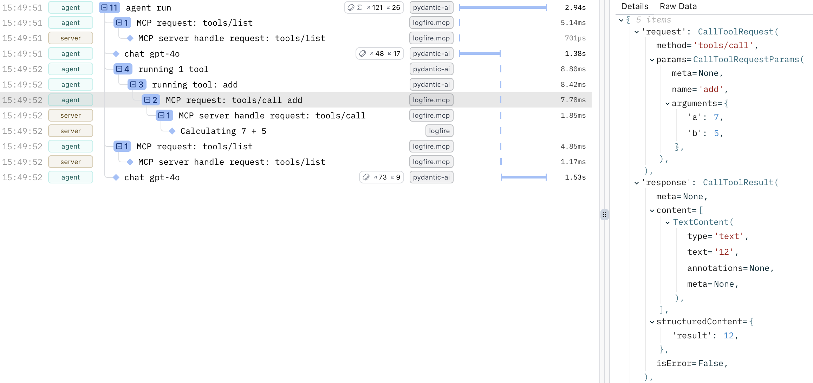

# Model Context Protocol (MCP)


**Logfire** supports instrumenting the [MCP Python SDK](https://github.com/modelcontextprotocol/python-sdk) with the [`logfire.instrument_mcp()`][logfire.Logfire.instrument_mcp] method. This works on both the client and server side. If possible, calling this in both the client and server processes is recommended for nice distributed traces.

Below is a simple example. For the client, we use [Pydantic AI](https://ai.pydantic.dev/mcp/client/) (though any MCP client will work) and OpenAI. To use a different LLM provider instead of OpenAI, replace `openai:gpt-4o` in the client script with a different model name supported by Pydantic AI.

First, install the required dependencies:

```bash
pip install mcp 'pydantic-ai-slim[openai]'
```

Next, run the server script below:

```python title="server.py" skip-run="true" skip-reason="external-connection"
from mcp.server.fastmcp import FastMCP

import logfire

logfire.configure(service_name='server')
logfire.instrument_mcp()

app = FastMCP()


@app.tool()
def add(a: int, b: int) -> int:
    logfire.info(f'Calculating {a} + {b}')
    return a + b


app.run(transport='streamable-http')
```

Then run this client script in another terminal:

```python title="agent.py" skip-run="true" skip-reason="external-connection"
from pydantic_ai import Agent
from pydantic_ai.mcp import MCPServerStreamableHTTP

import logfire

logfire.configure(service_name='agent')
logfire.instrument_pydantic_ai()  # (1)!
logfire.instrument_mcp()

server = MCPServerStreamableHTTP('http://localhost:8000/mcp')
agent = Agent('openai:gpt-4o', toolsets=[server])
result = agent.run_sync('What is 7 plus 5?')
print(result.output)
```

1. Instrumenting Pydantic AI is optional, but adds more context to the trace.

You should see a trace like this in Logfire:


