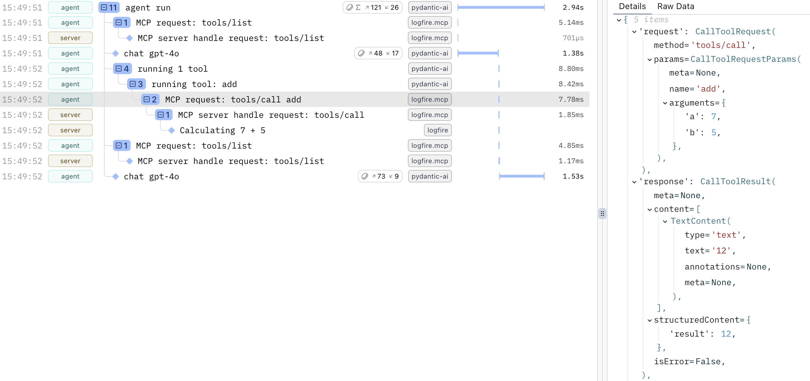

# Model Context Protocol (MCP)

See the calls flowing between your Model Context Protocol (MCP) client and server (the tool a client asked for, the arguments it sent, and the result the server returned) joined into one **trace** (the full journey of one request, made of nested **spans**, where each span is one unit of work with a name, a start, and a duration) in Logfire, even though the client and server run in separate processes.

The Model Context Protocol is a standard way for an AI application to call tools and fetch data from a separate server. Instrumenting both sides lets Logfire stitch their spans into a single distributed trace: one trace that spans more than one process.

## What you'll capture

- Each client request and each server response as spans, joined into one trace across both processes
- The tool the client called, with the arguments it sent and the result it got back
- The duration of each call and any errors raised on either side

{{ before_you_start() }}

The client example below calls OpenAI using your own API key, so running it costs money on that OpenAI account.

## Installation

Install `logfire`:

{{ install_logfire() }}

The example below also needs the MCP SDK and a client. Install them with:

```bash
pip install mcp 'pydantic-ai-slim[mcp,openai]'
```

## Usage

Call `logfire.configure()`, then [`logfire.instrument_mcp()`][logfire.Logfire.instrument_mcp]. This works on both the client and server side. Calling it in both processes is recommended, so the spans join into one distributed trace.

The example below uses [Pydantic AI](https://pydantic.dev/docs/ai/mcp/client/) as the client (any MCP client works) and OpenAI as the model. To use a different provider, replace `openai:gpt-4o` in the client script with another model name Pydantic AI supports.

First, run the server script:

```python title="server.py" skip-run="true" skip-reason="external-connection"
from mcp.server.fastmcp import FastMCP

import logfire

logfire.configure(service_name='server')
logfire.instrument_mcp()

app = FastMCP()


@app.tool()
def add(a: int, b: int) -> int:
    logfire.info(f'Calculating {a} + {b}')
    return a + b


app.run(transport='streamable-http')
```

Then run this client script in another terminal:

```python title="agent.py" skip-run="true" skip-reason="external-connection"
from pydantic_ai import Agent
from pydantic_ai.mcp import MCPToolset

import logfire

logfire.configure(service_name='agent')
logfire.instrument_pydantic_ai()  # (1)!
logfire.instrument_mcp()

mcp_toolset = MCPToolset('http://localhost:8000/mcp')
agent = Agent('openai:gpt-4o', toolsets=[mcp_toolset])
result = agent.run_sync('What is 7 plus 5?')
print(result.output)
```

1. Instrumenting Pydantic AI is optional, but adds more context to the trace.

## Verify it worked

With both scripts running, open the [Live view](../../guides/web-ui/live.md). Within a few seconds you'll see one trace covering the client request and the server's response to it. Click into it to see the `add` tool call, its arguments, and the result.



## Troubleshooting

Not seeing data? Check that `logfire.configure()` ran before `instrument_mcp()` in each process, that your write token is set, and that you called the instrument function exactly once per process. Only seeing one side of the trace? Make sure you instrumented both the client and the server.

## Reference

- API reference: [`logfire.instrument_mcp()`][logfire.Logfire.instrument_mcp]
- [MCP Python SDK](https://github.com/modelcontextprotocol/python-sdk)
