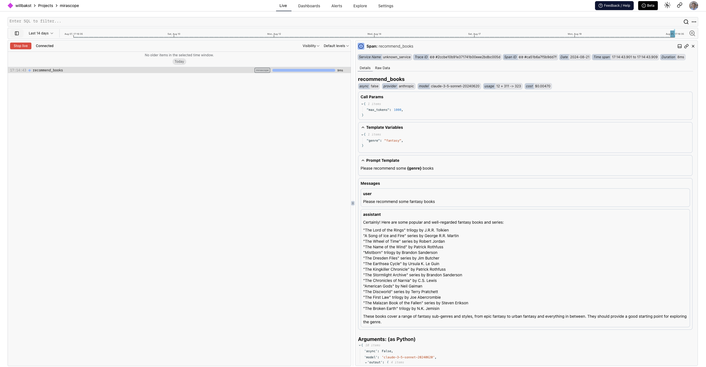
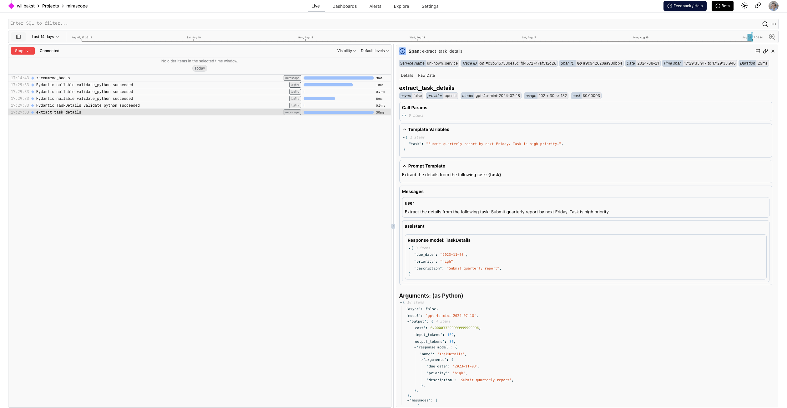

# Mirascope

See what your [Mirascope][mirascope-repo] functions do: the prompt template they built, the conversation with the model, and the tokens each call used, as a **trace** (the full journey of one request, made of nested **spans**, where each span is one unit of work with a name, a start, and a duration) in Logfire.

Mirascope is a library for building with models. It adds this instrumentation through its own [`@with_logfire`][mirascope-logfire] decorator, which works with every [model provider it supports][mirascope-supported-providers].

## What you'll capture

- Each decorated function call as a span, with its prompt template, template fields, and input/output attributes
- The conversation with the model, rendered so you can read it like a transcript, including tool calls
- Token usage for each model call and any errors raised
- Validation of Pydantic models, when you also instrument Pydantic (see below)

{{ before_you_start() }}

Mirascope calls a model provider using your own API key, so each call costs money on that provider account.

## Installation

Install `logfire`:

{{ install_logfire() }}

This works with your existing Mirascope install; there's no extra to add. If you don't have it yet, `pip install mirascope`.

## Usage

Call `logfire.configure()`, then add Mirascope's [`@with_logfire`][mirascope-logfire] decorator to each function you want to trace. It works with all of Mirascope's [supported providers][mirascope-supported-providers].

```py hl_lines="2 6 9" skip-run="true" skip-reason="external-connection"
from mirascope.core import anthropic, prompt_template
from mirascope.integrations.logfire import with_logfire

import logfire

logfire.configure()


@with_logfire()
@anthropic.call('claude-3-5-sonnet-20240620')
@prompt_template('Please recommend some {genre} books')
def recommend_books(genre: str): ...


response = recommend_books('fantasy')  # this will automatically get logged with logfire
print(response.content)
#> Certainly! Here are some popular and well-regarded fantasy books and series: ...
```

## Verify it worked

Run your program, then open the [Live view](../../guides/web-ui/live.md). Within a few seconds you'll see a span for the `recommend_books` call. Click it to read the conversation, and see the prompt template, template fields, and token count.

The example above shows up like this in Logfire:

<figure markdown="span">
  { width="500" }
  <figcaption>Mirascope call span and conversation</figcaption>
</figure>

## Advanced

### Track Pydantic model validation

Mirascope is built on [Pydantic][pydantic], so you can add [`logfire.instrument_pydantic()`][logfire.Logfire.instrument_pydantic] to also record model validation. This is useful when [extracting structured information][mirascope-extracting-structured-information] with a model:

```py hl_lines="4 9-10 19" skip-run="true" skip-reason="external-connection"
from typing import Literal

from mirascope.core import openai, prompt_template
from mirascope.integrations.logfire import with_logfire
from pydantic import BaseModel

import logfire

logfire.configure()
logfire.instrument_pydantic()


class TaskDetails(BaseModel):
    description: str
    due_date: str
    priority: Literal['low', 'normal', 'high']


@with_logfire()
@openai.call('gpt-4o-mini', response_model=TaskDetails)
@prompt_template('Extract the details from the following task: {task}')
def extract_task_details(task: str): ...


task = 'Submit quarterly report by next Friday. Task is high priority.'
task_details = extract_task_details(task)  # this will be logged automatically with logfire
assert isinstance(task_details, TaskDetails)
print(task_details)
#> description='Submit quarterly report' due_date='next Friday' priority='high'
```

This adds validation tracking for the `TaskDetails` model alongside the call span and conversation:

<figure markdown="span">
  { width="500" }
  <figcaption>Mirascope structured-extraction span, model span, and function call</figcaption>
</figure>

## Troubleshooting

Not seeing data? Check that `logfire.configure()` ran before the decorated function is called, that the function has the `@with_logfire()` decorator, and that your write token is set.

## Reference

- [Mirascope Logfire integration docs][mirascope-logfire]
- [Mirascope documentation][mirascope-documentation]
- [`logfire.instrument_pydantic()`][logfire.Logfire.instrument_pydantic]: for model-validation tracking

[mirascope-repo]: https://github.com/Mirascope/mirascope
[mirascope-documentation]: https://mirascope.io/docs
[mirascope-logfire]: https://mirascope.io/docs/latest/integrations/logfire/
[mirascope-supported-providers]: https://mirascope.io/docs/latest/learn/calls/#supported-providers
[mirascope-extracting-structured-information]: https://mirascope.io/docs/latest/learn/response_models/
[pydantic]: https://pydantic.dev/docs/validation/latest/get-started/
