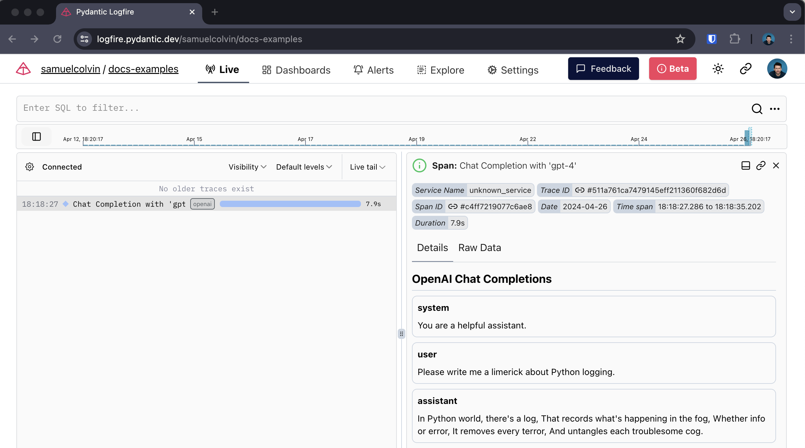
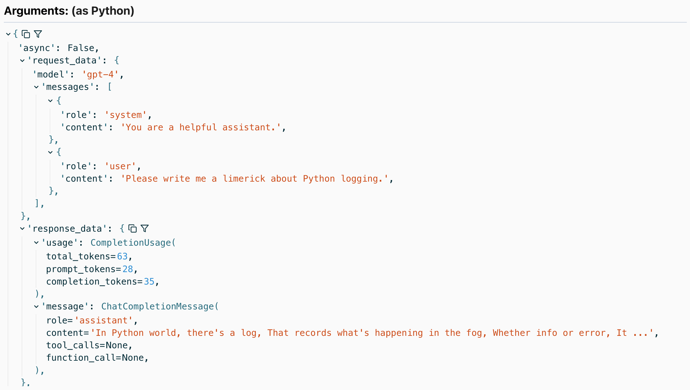
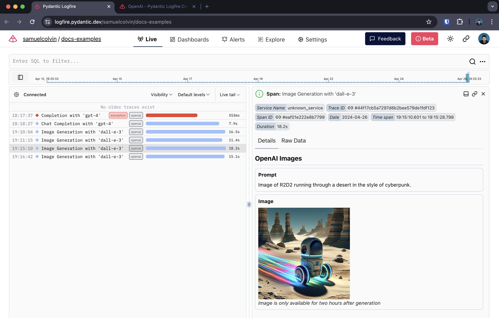
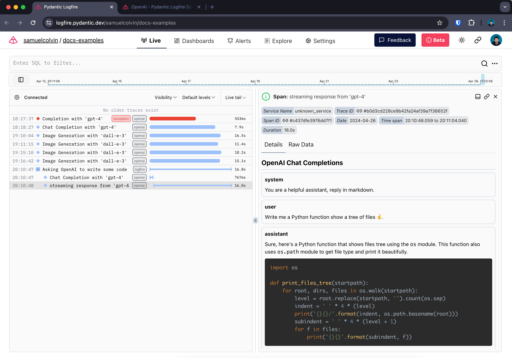
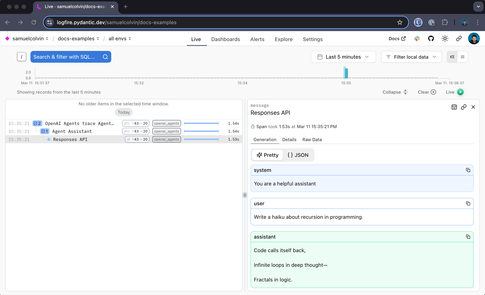
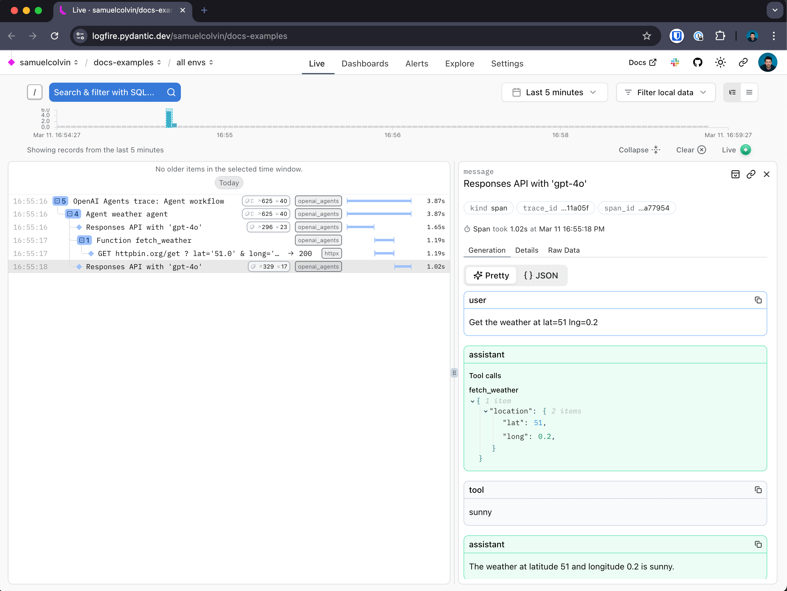

# OpenAI

See every call your app makes to OpenAI: the full conversation, each tool call, how many tokens it
used, how long it took, and any errors, as a **trace** (the full journey of one request, made of
nested **spans**, where each span is one unit of work with a name, a start, and a duration) in
Logfire.

This page covers both the [standard OpenAI SDK](https://github.com/openai/openai-python) and the
[OpenAI "agents"](https://github.com/openai/openai-agents-python) framework.

## What you'll capture

- Each model call as a span, with its duration and any exceptions
- The full conversation, rendered so you can read it like a transcript
- Response details, including the number of tokens used
- For agents: tool calls and nested work, shown as child spans in the trace

{{ before_you_start() }}

You'll also need an **OpenAI API key**, from your OpenAI dashboard at [platform.openai.com/api-keys](https://platform.openai.com/api-keys). The OpenAI SDK reads it from the `OPENAI_API_KEY` environment variable.

## Installation

Install `logfire`:

{{ install_logfire() }}

This integration works with your existing `openai` package: nothing extra to install. If you don't
have it yet, `pip install openai` (or add the `openai-agents` package to use the agents framework).

## OpenAI SDK

Add two lines to your app: `logfire.configure()` to connect to your project, and
[`logfire.instrument_openai()`][logfire.Logfire.instrument_openai] to record every OpenAI call.

```python hl_lines="7-8" skip-run="true" skip-reason="external-connection"
import openai

import logfire

client = openai.Client()

logfire.configure()
logfire.instrument_openai()  # instrument all OpenAI clients globally
# or logfire.instrument_openai(client) to instrument a specific client instance

response = client.chat.completions.create(
    model='gpt-5-mini',
    messages=[
        {'role': 'system', 'content': 'You are a helpful assistant.'},
        {'role': 'user', 'content': 'Please write me a limerick about Python logging.'},
    ],
)
print(response.choices[0].message)
```

Run this and the call shows up in Logfire as a span you can open to read the whole exchange:

<figure markdown="span">
  { width="500" }
  <figcaption>OpenAI span and conversation</figcaption>
</figure>

<figure markdown="span">
  { width="500" }
  <figcaption>Span arguments including response details</figcaption>
</figure>

## Verify it worked

Run your program, then open your project in the
[Logfire web app](https://logfire.pydantic.dev/) and go to the **Live** view. Within a few seconds you
should see a span for the OpenAI call. Click it to read the conversation and see the token count and
duration.

## Troubleshooting

Not seeing your model calls in Logfire? Check these first:

- **`logfire.configure()` runs before `logfire.instrument_openai()`.** Configure the connection
  first, then instrument.
- **You instrument the client you actually call.** `instrument_openai()` with no argument covers all
  clients; if you pass a specific client, make sure it's the one making the request.
- **Your Logfire write token is set.** In local development, run `logfire projects use <your-project>`;
  in production, set the `LOGFIRE_TOKEN` environment variable. See [Getting Started](../../index.md).
- **Your OpenAI call succeeded.** If the call itself fails (for example, a missing or invalid
  `OPENAI_API_KEY`), check the span for the recorded exception.

## Advanced

### Methods covered

The following OpenAI methods are covered:

- [`client.chat.completions.create`](https://platform.openai.com/docs/guides/text-generation/chat-completions-api): with and without `stream=True`
- [`client.completions.create`](https://platform.openai.com/docs/guides/text-generation/completions-api): with and without `stream=True`
- [`client.embeddings.create`](https://platform.openai.com/docs/guides/embeddings/how-to-get-embeddings)
- [`client.images.generate`](https://platform.openai.com/docs/guides/images/generations)
- [`client.responses.create`](https://platform.openai.com/docs/api-reference/responses)

All methods are covered with both `openai.Client` and `openai.AsyncClient`.

For example, here's instrumentation of an image generation call:

```python skip-run="true" skip-reason="external-connection"
import openai

import logfire


async def main():
    client = openai.AsyncClient()
    logfire.configure()
    logfire.instrument_openai(client)

    response = await client.images.generate(
        prompt='Image of R2D2 running through a desert in the style of cyberpunk.',
        model='dall-e-3',
    )
    url = response.data[0].url
    import webbrowser

    webbrowser.open(url)


if __name__ == '__main__':
    import asyncio

    asyncio.run(main())
```

Gives:

<figure markdown="span">
  { width="500" }
  <figcaption>OpenAI image generation span</figcaption>
</figure>

### Streaming responses

When instrumenting streaming responses, Logfire creates two spans: one around the initial request and
one around the streamed response.

Here we also use Rich's [`Live`][rich.live.Live] and [`Markdown`][rich.markdown.Markdown] types to
render the response in the terminal in real time.

```python skip-run="true" skip-reason="external-connection"
import openai
from rich.console import Console
from rich.live import Live
from rich.markdown import Markdown

import logfire

client = openai.AsyncClient()
logfire.configure()
logfire.instrument_openai(client)


async def main():
    console = Console()
    with logfire.span('Asking OpenAI to write some code'):
        response = await client.chat.completions.create(
            model='gpt-4',
            messages=[
                {'role': 'system', 'content': 'Reply in markdown one.'},
                {'role': 'user', 'content': 'Write Python to show a tree of files.'},
            ],
            stream=True,
        )
        content = ''
        with Live('', refresh_per_second=15, console=console) as live:
            async for chunk in response:
                if chunk.choices[0].delta.content is not None:
                    content += chunk.choices[0].delta.content
                    live.update(Markdown(content))


if __name__ == '__main__':
    import asyncio

    asyncio.run(main())
```

Shows up like this in Logfire:

<figure markdown="span">
  { width="500" }
  <figcaption>OpenAI streaming response</figcaption>
</figure>

### OpenAI Agents

Logfire also instruments the [OpenAI "agents"](https://github.com/openai/openai-agents-python)
framework, so you can see each step an agent takes and every tool it calls as nested spans in one
trace.

```python hl_lines="5-6" skip-run="true" skip-reason="external-connection"
from agents import Agent, Runner

import logfire

logfire.configure()
logfire.instrument_openai_agents()

agent = Agent(name='Assistant', instructions='You are a helpful assistant')

result = Runner.run_sync(agent, 'Write a haiku about recursion in programming.')
print(result.final_output)
```

_For more information, see the
[`instrument_openai_agents()` API reference][logfire.Logfire.instrument_openai_agents]._

Which shows up like this in Logfire:

<figure markdown="span">
  { width="500" }
  <figcaption>OpenAI Agents</figcaption>
</figure>

In this example we add a function tool to the agent:

```python skip-run="true" skip-reason="external-connection"
from agents import Agent, RunContextWrapper, Runner, function_tool
from httpx import AsyncClient
from typing_extensions import TypedDict

import logfire

logfire.configure()
logfire.instrument_openai_agents()


class Location(TypedDict):
    lat: float
    long: float


@function_tool
async def fetch_weather(ctx: RunContextWrapper[AsyncClient], location: Location) -> str:
    """Fetch the weather for a given location.

    Args:
        ctx: Run context object.
        location: The location to fetch the weather for.
    """
    r = await ctx.context.get('https://httpbin.org/get', params=location)
    return 'sunny' if r.status_code == 200 else 'rainy'


agent = Agent(name='weather agent', tools=[fetch_weather])


async def main():
    async with AsyncClient() as client:
        logfire.instrument_httpx(client)
        result = await Runner.run(agent, 'Get the weather at lat=51 lng=0.2', context=client)
    print(result.final_output)


if __name__ == '__main__':
    import asyncio

    asyncio.run(main())
```

We see spans from within the function call nested inside the agent spans:

<figure markdown="span">
  { width="500" }
  <figcaption>OpenAI Agents</figcaption>
</figure>

## Reference

- API reference: [`logfire.instrument_openai()`][logfire.Logfire.instrument_openai] ·
  [`logfire.instrument_openai_agents()`][logfire.Logfire.instrument_openai_agents]
