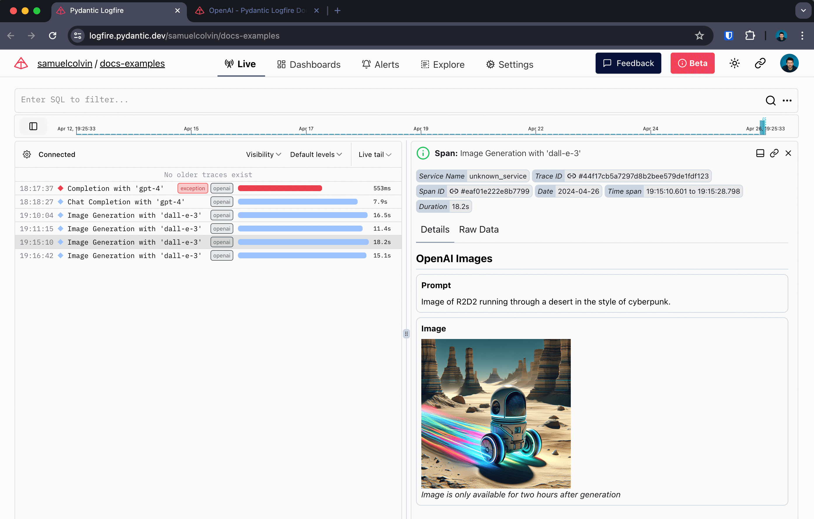

We support instrumenting both the [standard OpenAI SDK](https://github.com/openai/openai-python) package and [OpenAI "agents"](https://github.com/openai/openai-agents-python) framework.

## OpenAI SDK

Logfire supports instrumenting calls to OpenAI with one extra line of code, here's an example of instrumenting
the OpenAI SDK:

```python hl_lines="7"
import openai
import logfire

client = openai.Client()

logfire.configure()
logfire.instrument_openai(client)  # (1)!

response = client.chat.completions.create(
    model='gpt-4',
    messages=[
        {'role': 'system', 'content': 'You are a helpful assistant.'},
        {'role': 'user', 'content': 'Please write me a limerick about Python logging.'},
    ],
)
print(response.choices[0].message)
```

1. If you don't have access to the client instance, you can pass a class (e.g. `logfire.instrument_openai(openai.Client)`), or just pass no arguments (i.e. `logfire.instrument_openai()`) to instrument both the `openai.Client` and `openai.AsyncClient` classes.

_For more information, see the [`instrument_openai()` API reference][logfire.Logfire.instrument_openai]._

With that you get:

* a span around the call to OpenAI which records duration and captures any exceptions that might occur
* Human-readable display of the conversation with the agent
* details of the response, including the number of tokens used

<figure markdown="span">
  { width="500" }
  <figcaption>OpenAI span and conversation</figcaption>
</figure>

<figure markdown="span">
  { width="500" }
  <figcaption>Span arguments including response details</figcaption>
</figure>

### Methods covered

The following OpenAI methods are covered:

- [`client.chat.completions.create`](https://platform.openai.com/docs/guides/text-generation/chat-completions-api) — with and without `stream=True`
- [`client.completions.create`](https://platform.openai.com/docs/guides/text-generation/completions-api) — with and without `stream=True`
- [`client.embeddings.create`](https://platform.openai.com/docs/guides/embeddings/how-to-get-embeddings)
- [`client.images.generate`](https://platform.openai.com/docs/guides/images/generations)
- [`client.responses.create`](https://platform.openai.com/docs/api-reference/responses)

All methods are covered with both `openai.Client` and `openai.AsyncClient`.

For example, here's instrumentation of an image generation call:

```python
import openai
import logfire

async def main():
    client = openai.AsyncClient()
    logfire.configure()
    logfire.instrument_openai(client)

    response = await client.images.generate(
        prompt='Image of R2D2 running through a desert in the style of cyberpunk.',
        model='dall-e-3',
    )
    url = response.data[0].url
    import webbrowser
    webbrowser.open(url)

if __name__ == '__main__':
    import asyncio
    asyncio.run(main())
```

Gives:

<figure markdown="span">
  { width="500" }
  <figcaption>OpenAI image generation span</figcaption>
</figure>

### Streaming Responses

When instrumenting streaming responses, Logfire creates two spans — one around the initial request and one
around the streamed response.

Here we also use Rich's [`Live`][rich.live.Live] and [`Markdown`][rich.markdown.Markdown] types to render the response in the terminal in real-time. :dancer:

```python
import openai
import logfire
from rich.console import Console
from rich.live import Live
from rich.markdown import Markdown

client = openai.AsyncClient()
logfire.configure()
logfire.instrument_openai(client)

async def main():
    console = Console()
    with logfire.span('Asking OpenAI to write some code'):
        response = await client.chat.completions.create(
            model='gpt-4',
            messages=[
                {'role': 'system', 'content': 'Reply in markdown one.'},
                {'role': 'user', 'content': 'Write Python to show a tree of files 🤞.'},
            ],
            stream=True
        )
        content = ''
        with Live('', refresh_per_second=15, console=console) as live:
            async for chunk in response:
                if chunk.choices[0].delta.content is not None:
                    content += chunk.choices[0].delta.content
                    live.update(Markdown(content))

if __name__ == '__main__':
    import asyncio
    asyncio.run(main())
```

Shows up like this in Logfire:

<figure markdown="span">
  { width="500" }
  <figcaption>OpenAI streaming response</figcaption>
</figure>

## OpenAI Agents

We also support instrumenting the [OpenAI "agents"](https://github.com/openai/openai-agents-python) framework.

```python hl_lines="5"
import logfire
from agents import Agent, Runner

logfire.configure()
logfire.instrument_openai_agents()

agent = Agent(name="Assistant", instructions="You are a helpful assistant")

result = Runner.run_sync(agent, "Write a haiku about recursion in programming.")
print(result.final_output)
```

_For more information, see the [`instrument_openai_agents()` API reference][logfire.Logfire.instrument_openai_agents]._

Which shows up like this in Logfire:

<figure markdown="span">
  { width="500" }
  <figcaption>OpenAI Agents</figcaption>
</figure>

In this example we add a function tool to the agents:

```python
from typing_extensions import TypedDict

import logfire
from httpx import AsyncClient
from agents import RunContextWrapper, Agent, function_tool, Runner

logfire.configure()
logfire.instrument_openai_agents()


class Location(TypedDict):
    lat: float
    long: float


@function_tool
async def fetch_weather(ctx: RunContextWrapper[AsyncClient], location: Location) -> str:
    """Fetch the weather for a given location.

    Args:
        ctx: Run context object.
        location: The location to fetch the weather for.
    """
    r = await ctx.context.get('https://httpbin.org/get', params=location)
    return 'sunny' if r.status_code == 200 else 'rainy'


agent = Agent(name='weather agent', tools=[fetch_weather])


async def main():
    async with AsyncClient() as client:
        logfire.instrument_httpx(client)
        result = await Runner.run(agent, 'Get the weather at lat=51 lng=0.2', context=client)
    print(result.final_output)


if __name__ == '__main__':
    import asyncio
    asyncio.run(main())
```

We see spans from within the function call nested within the agent spans:

<figure markdown="span">
  { width="500" }
  <figcaption>OpenAI Agents</figcaption>
</figure>
