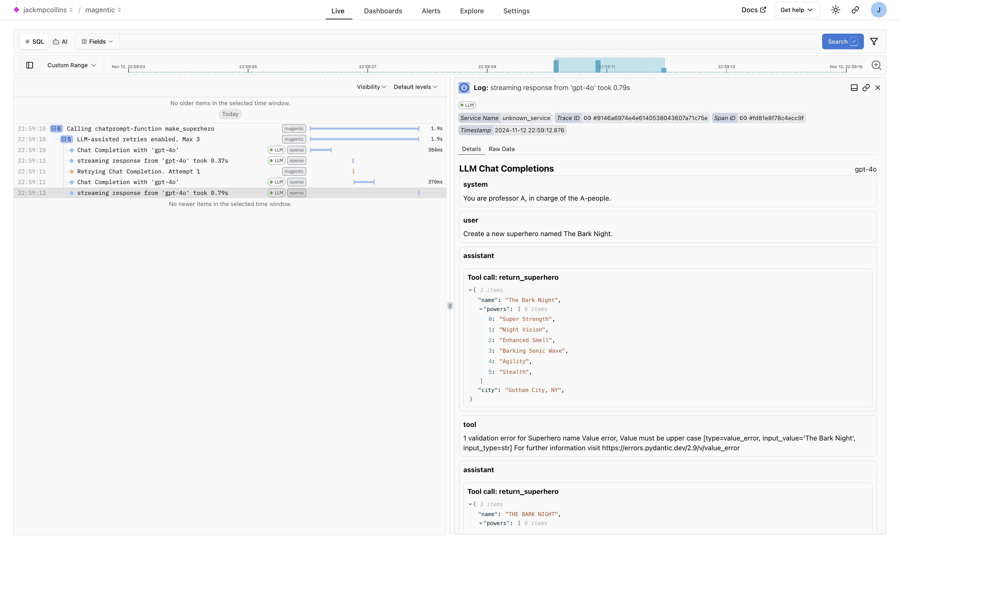

[Magentic](https://github.com/jackmpcollins/magentic) is a lightweight library for working with structured output from LLMs, built around standard python type annotations and Pydantic. It integrates with Logfire to provide observability into prompt-templating, retries, tool/function call execution, and other features.

Magentic instrumentation requires no additional setup beyond configuring logfire itself. You might also want to enable the [OpenAI](../openai.md) and/or [Anthropic](../anthropic.md) integrations.

```python hl_lines="3 8 9"
from typing import Annotated

import logfire
from magentic import chatprompt, OpenaiChatModel, SystemMessage, UserMessage
from pydantic import BaseModel, Field
from pydantic.functional_validators import AfterValidator

logfire.configure()
logfire.instrument_openai()


def assert_upper(value: str) -> str:
    if not value.isupper():
        raise ValueError('Value must be upper case')
    return value


class Superhero(BaseModel):
    name: Annotated[str, AfterValidator(assert_upper)]
    powers: list[str]
    city: Annotated[str, Field(examples=["New York, NY"])]


@chatprompt(
    SystemMessage('You are professor A, in charge of the A-people.'),
    UserMessage('Create a new superhero named {name}.'),
    model=OpenaiChatModel("gpt-4o"),
    max_retries=3,
)
def make_superhero(name: str) -> Superhero: ...


hero = make_superhero("The Bark Night")
print(hero)
```

This creates the following in Logfire

* A span for the call to `make_superhero` showing the input arguments
* A span showing that retries have been enabled for this query
* A warning for each retry that was needed in order to generate a valid output
* The chat messages to/from the LLM, including tool calls and invalid outputs that required retrying

<figure markdown="span">
  { width="500" }
  <figcaption>Magentic chatprompt-function call span and conversation</figcaption>
</figure>

To learn more about magentic, check out [magentic.dev](https://magentic.dev).
