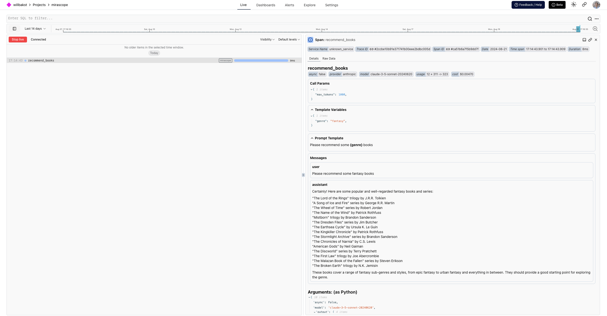

[Mirascope][mirascope-repo] is a developer tool for building with LLMs. Their library focuses on abstractions that aren't obstructions and integrates with Logfire to make observability and monitoring for LLMs easy and seamless.

You can enable it using their [`@with_logire`][mirascope-logfire] decorator, which will work with all of the [model providers that they support][mirascope-supported-providers] (e.g. OpenAI, Anthropic, Gemini, Mistral, Groq, and more).

```py hl_lines="1 3 5 8"
import logfire
from mirascope.core import anthropic, prompt_template
from mirascope.integrations.logfire import with_logfire

logfire.configure()


@with_logfire()
@anthropic.call("claude-3-5-sonnet-20240620")
@prompt_template("Please recommend some {genre} books")
def recommend_books(genre: str): ...


response = recommend_books("fantasy")  # this will automatically get logged with logfire
print(response.content)
# > Certainly! Here are some popular and well-regarded fantasy books and series: ...
```

This will give you:

* A span around the `recommend_books` that captures items like the prompt template, templating properties and fields, and input/output attributes
* Human-readable display of the conversation with the agent
* Details of the response, including the number of tokens used

<figure markdown="span">
  { width="500" }
  <figcaption>Mirascope Anthropic call span and Anthropic span and conversation</figcaption>
</figure>

Since Mirascope is built on top of [Pydantic][pydantic], you can use the [Pydantic plugin][pydantic-plugin] to track additional logs and metrics about model validation, which you can enable using the [`pydantic_plugin`][logfire.configure(pydantic_plugin)] configuration.

This can be particularly useful when [extracting structured information][mirascope-extracting-structured-information] using LLMs:

```py hl_lines="3 5 8 17"
from typing import Literal, Type

import logfire
from mirascope.core import openai, prompt_template
from mirascope.integrations.logfire import with_logfire
from pydantic import BaseModel

logfire.configure(pydantic_plugin=logfire.PydanticPlugin(record="all"))


class TaskDetails(BaseModel):
    description: str
    due_date: str
    priority: Literal["low", "normal", "high"]


@with_logfire()
@openai.call("gpt-4o-mini", response_model=TaskDetails)
@prompt_template("Extract the details from the following task: {task}")
def extract_task_details(task: str): ...


task = "Submit quarterly report by next Friday. Task is high priority."
task_details = extract_task_details(task)  # this will be logged automatically with logfire
assert isinstance(task_details, TaskDetails)
print(task_details)
# > description='Submit quarterly report' due_date='next Friday' priority='high'
```

This will give you:

* Tracking for validation of Pydantic models
* A span around the `extract_task_details` that captures items like the prompt template, templating properties and fields, and input/output attributes
* Human-readable display of the conversation with the agent including the function call
* Details of the response, including the number of tokens used

<figure markdown="span">
  { width="500" }
  <figcaption>Mirascope OpenAI Extractor span and OpenAI span and function call</figcaption>
</figure>

For more information on Mirascope and what you can do with it, check out their [documentation][mirascope-documentation].

[mirascope-repo]: https://github.com/Mirascope/mirascope
[mirascope-documentation]: https://mirascope.io/docs
[mirascope-logfire]: https://mirascope.io/docs/latest/integrations/logfire/
[mirascope-supported-providers]: https://mirascope.io/docs/latest/learn/calls/#supported-providers
[mirascope-extracting-structured-information]: https://mirascope.io/docs/latest/learn/response_models/
[pydantic]: https://docs.pydantic.dev/latest/
[pydantic-plugin]: https://docs.pydantic.dev/latest/concepts/plugins/
