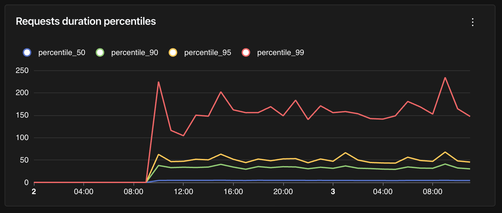

# Web Frameworks

Here are some tips for instrumenting your web applications.

## Integrations

If you're using one of the following libraries, check out the integration docs:

- [FastAPI](../fastapi.md)
- [Starlette](../starlette.md)
- [Django](../django.md)
- [Flask](../flask.md)

Otherwise, check if your server uses [WSGI](../wsgi.md) or [ASGI](../asgi.md) and check the corresponding integration.

## Capturing HTTP server request and response headers

Some methods (e.g. `logfire.instrument_fastapi()`) allow you to pass `capture_headers=True` to record all request and response headers in the spans,
and that's all you usually need.

If you want more control, there are three environment variables to tell the OpenTelemetry instrumentation libraries to capture request and response headers:

- `OTEL_INSTRUMENTATION_HTTP_CAPTURE_HEADERS_SERVER_REQUEST`
- `OTEL_INSTRUMENTATION_HTTP_CAPTURE_HEADERS_SERVER_RESPONSE`
- `OTEL_INSTRUMENTATION_HTTP_CAPTURE_HEADERS_SANITIZE_FIELDS`

Each accepts a comma-separated list of regexes which are checked case-insensitively against header names. The first two determine which request/response headers are captured and added to span attributes. The third determines which headers will have their values redacted.

For example, to capture _all_ headers, set the following:

```
OTEL_INSTRUMENTATION_HTTP_CAPTURE_HEADERS_SERVER_REQUEST=".*"
OTEL_INSTRUMENTATION_HTTP_CAPTURE_HEADERS_SERVER_RESPONSE=".*"
```

(this is what `capture_headers=True` does)

To specifically capture the `content-type` request header and request headers starting with `X-`:

```
OTEL_INSTRUMENTATION_HTTP_CAPTURE_HEADERS_SERVER_REQUEST="content-type,X-.*"
```

To replace the `Authorization` header value with `[REDACTED]` to avoid leaking user credentials:

```
OTEL_INSTRUMENTATION_HTTP_CAPTURE_HEADERS_SANITIZE_FIELDS="Authorization"
```

(although usually it's better to rely on **Logfire**'s [scrubbing](../../guides/advanced/scrubbing.md) feature)

## Query HTTP requests duration per percentile

It's usually interesting to visualize HTTP requests duration per percentile. Instead of having an average, which may be influenced by extreme values, percentiles allow us know the maximum duration for 50%, 90%, 95% or 99% of the requests.

Here is a sample query to compute those percentiles for HTTP requests duration:

```sql
WITH dataset AS (
  SELECT
    time_bucket('%time_bucket_duration%', start_timestamp) AS x,
    (extract(epoch from end_timestamp - start_timestamp) * 1000) as duration_ms
  FROM records
  WHERE attributes ? 'http.method'
)
SELECT
  x,
  percentile_cont(0.99) WITHIN GROUP (ORDER BY duration_ms) as percentile_99,
  percentile_cont(0.95) WITHIN GROUP (ORDER BY duration_ms) as percentile_95,
  percentile_cont(0.90) WITHIN GROUP (ORDER BY duration_ms) as percentile_90,
  percentile_cont(0.50) WITHIN GROUP (ORDER BY duration_ms) as percentile_50
FROM dataset
GROUP BY x
ORDER BY x DESC;
```

Notice how we filtered on records that have the `http.method` attributes set. It's a good starting point to retrieve traces that are relevant for HTTP requests, but depending on your setup, you might need to add more filters.

This query is a good candidate for a Time Series chart in a dashboard:




## Excluding URLs from instrumentation

If you want to exclude certain URLs from tracing, you can either use logfire's instrumentation methods or OpenTelemetry configuration.
You can specify said URLs using a string of comma-separated regexes which will be matched against the full request URL.

### Using Logfire

Some methods (e.g. `logfire.instrument_fastapi()`) allow you to pass the argument `excluded_urls` as a string of comma-separated regexes.

### Using OpenTelemetry

You can set one of two environment variables to exclude URLs from tracing:

- `OTEL_PYTHON_EXCLUDED_URLS`, which will also apply to all instrumentations for which excluded URLs apply).
- `OTEL_PYTHON_FASTAPI_EXCLUDED_URLS`, for example, which will only apply to FastAPI instrumentation. You can replace `FASTAPI` with the name of the framework you're using.

!!! example
    If you'd like to trace all URLs except the base `/` URL, you can use the following regex for `excluded_urls`: `^https?://[^/]+/$`

    Breaking it down:

    * `^` matches the start of the string
    * `https?` matches `http` or `https`
    * `://` matches `://`
    * `[^/]+` matches one or more characters that are not `/` (this will be the host part of the URL)
    * `/` matches `/`
    * `$` matches the end of the string

    So this regex will only match routes that have no path after the host.

    This instrumentation might look like:

    ```py
    from fastapi import FastAPI

    import logfire

    app = FastAPI()

    logfire.configure()
    logfire.instrument_fastapi(app, excluded_urls='^https?://[^/]+/$')

    if __name__ == '__main__':
        import uvicorn

        uvicorn.run(app)
    ```

    If you visit http://127.0.0.1:8000/, that matches the above regex, so no spans will be sent to Logfire.
    If you visit http://127.0.0.1:8000/hello/ (or any other endpoint that's not `/`, for that matter), a trace will be started and sent to Logfire.

    !!! note
        Under the hood, the `opentelemetry` library is using `re.search` (not `re.match` or `re.fullmatch`) to check for a match between the route and the `excluded_urls` regex, which is why we need to include the `^` at the start and `$` at the end of the regex.

!!! note
    Specifying excluded URLs for a given instrumentation only prevents that specific instrumentation from creating spans/metrics, it doesn't suppress other instrumentation within the excluded endpoints.
