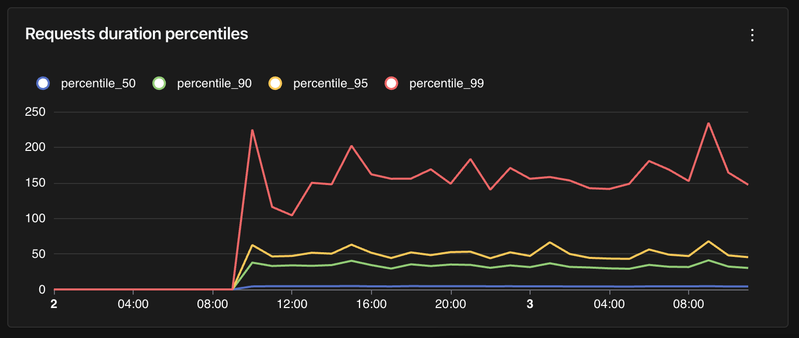

# Web Frameworks

Here are some tips for instrumenting your web applications.

## Integrations

If you're using one of the following libraries, check out the integration docs:

- [FastAPI](../fastapi.md)
- [Starlette](../starlette.md)
- [Django](../django.md)
- [Flask](../flask.md)

Otherwise, check if your server uses [WSGI](../wsgi.md) or [ASGI](../asgi.md) and check the corresponding integration.

## Capturing HTTP server request and response headers

There are three environment variables to tell the OpenTelemetry instrumentation libraries to capture request and response headers:

- `OTEL_INSTRUMENTATION_HTTP_CAPTURE_HEADERS_SERVER_REQUEST`
- `OTEL_INSTRUMENTATION_HTTP_CAPTURE_HEADERS_SERVER_RESPONSE`
- `OTEL_INSTRUMENTATION_HTTP_CAPTURE_HEADERS_SANITIZE_FIELDS`

Each accepts a comma-separated list of regexes which are checked case-insensitively against header names. The first two determine which request/response headers are captured and added to span attributes. The third determines which headers will have their values redacted.

For example, to capture _all_ headers, set the following:

```
OTEL_INSTRUMENTATION_HTTP_CAPTURE_HEADERS_SERVER_REQUEST=".*"
OTEL_INSTRUMENTATION_HTTP_CAPTURE_HEADERS_SERVER_RESPONSE=".*"
```

To specifically capture the `content-type` request header and request headers starting with `X-`:

```
OTEL_INSTRUMENTATION_HTTP_CAPTURE_HEADERS_SERVER_REQUEST="content-type,X-.*"
```

To replace the `Authorization` header value with `[REDACTED]` to avoid leaking user credentials:

```
OTEL_INSTRUMENTATION_HTTP_CAPTURE_HEADERS_SANITIZE_FIELDS="Authorization"
```

## Query HTTP requests duration per percentile

It's usually interesting to visualize HTTP requests duration per percentile. Instead of having an average, which may be influenced by extreme values, percentiles allow us know the maximum duration for 50%, 90%, 95% or 99% of the requests.

Here is a sample query to compute those percentiles for HTTP requests duration:

```sql
WITH dataset AS (
  SELECT
    time_bucket('%time_bucket_duration%', start_timestamp) AS x,
    (extract(epoch from end_timestamp - start_timestamp) * 1000) as duration_ms
  FROM records
  WHERE attributes ? 'http.method'
)
SELECT
  x,
  percentile_cont(0.99) WITHIN GROUP (ORDER BY duration_ms) as percentile_99,
  percentile_cont(0.95) WITHIN GROUP (ORDER BY duration_ms) as percentile_95,
  percentile_cont(0.90) WITHIN GROUP (ORDER BY duration_ms) as percentile_90,
  percentile_cont(0.50) WITHIN GROUP (ORDER BY duration_ms) as percentile_50
FROM dataset
GROUP BY x
ORDER BY x DESC;
```

Notice how we filtered on records that have the `http.method` attributes set. It's a good starting point to retrieve traces that are relevant for HTTP requests, but depending on your setup, you might need to add more filters.

This query is a good candidate for a Time Series chart in a dashboard:


