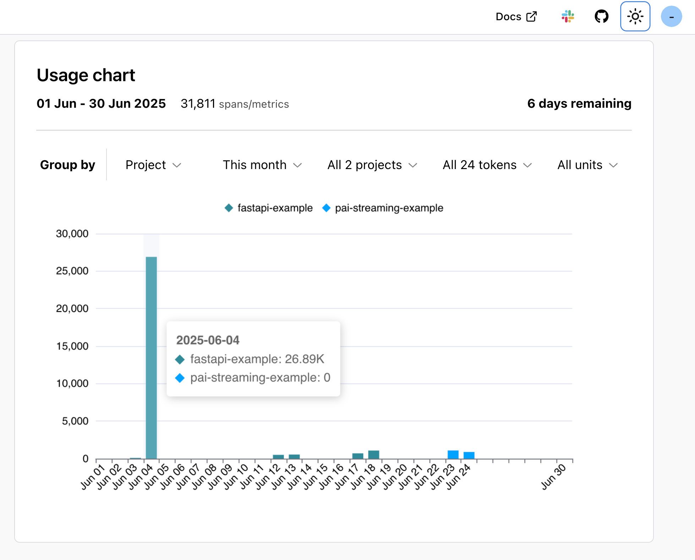

# Logfire Billing & Usage Guide

## Exactly how Logfire charges work

* **What we meter:** every span, log **or** metric you ship. If you're not sure what those are, check out
our [concepts page](concepts.md)
* **Free allowance**: Your org's first **10 million** units (equivalent to $20 of usage) each calendar month are free.
* **Pro rate:** anything above the allowance is billed at **$2 per million**. See our <a href="https://pydantic.dev/pricing" target="_blank">pricing calculator</a>.
* We average payload size over time; anything over the generous **5 KB per span/metric** budget might trigger a polite
  email, never a surprise fee.
* No hosts, seats, or projects are metered - just what you send.

## Where to see usage & cost in Logfire

* Navigate to your organization settings (not your project settings)
* In the left nav panel go to `Plan & Usage` (note you must be an [org admin](reference/organization-structure.md) to see this)

The month summary section will show you both your current spend and your estimated
spend for the rest of the month based on your current usage.

Below that, the `Usage Chart` allows you to view more details about your usage including:

* Record & metric breakdowns by day
* Breakdown by project
* Breakdown by write token
* Record vs. metrics split



---

## Standard usage dashboard

Go to `Dashboards -> Standard -> Usage Overview` and enable (if disabled) that pre-built dashboard. This
will then give you a detailed breakdown of:

* Which services are producing the most records (i.e. traces, spans, logs) and
metrics
* Records by `span_name`
* Metrics by `metric_name`

If you're feeling confused about what you are seeing on the usage page in Logfire, this dashboard
is the first thing we recommend looking at.

---

## How integrations generate metrics

Many integrations such as [httpx](integrations/http-clients/httpx.md), [sqlalchemy](integrations/databases/sqlalchemy.md), [FastAPI](integrations/web-frameworks/fastapi.md) etc.
emit **aggregate metrics** under the hood - typically counts, durations, and error-rates.

Each exported metric **counts exactly once**, no matter how many requests it summarises.
Disable metrics if you *only* need traces:

```python
logfire.configure(metrics=False)
```

Note that the web server metrics standard dashboard relies on metrics being emitted, so
that will stop working if you disable metrics.

---

## Turning off certain types of logs/spans to reduce costs

You may be only interested in certain types of records. For example, you may wish to:

* Ignore debug logs
* Only send traces where an exception occurred
* At high volumes, only send a certain percentage of your logs to Logfire
* Only send spans that took longer than normal to run

Tuning these factors is a trade-off between cost and granularity. The way you conduct this
tuning is via [sampling](how-to-guides/sampling.md).

---

## Export data via API for longer retention

Data older than **30 days** is pruned (except for customers on our [enterprise plans](enterprise.md)).
If you need longer retention we recommend writing to both Logfire and a long-term storage
such as AWS S3. We have a [guide on how to back up data to S3](how-to-guides/otel-collector/otel-collector-overview.md#back-up-data-in-aws-s3).
You can also use the Query API which allows you to run SQL queries
and treat Logfire as an analytical database. You're then free to save this data to a storage
of your choice (S3, GCS etc.)

See **[Query API docs](how-to-guides/query-api.md)** for Arrow/CSV examples, auth tokens, and tips.

Enterprise plans support native extended retention — email `sales@logfire.dev` if that's what you need.

---

## Requesting a billing cap

Worried about an accidental fire-hose? Email `hello@logfire.dev`. We’ll stop charging you once the cap is hit.
No overages, no drama. Note that your data is still stored for the retention period, so you can always increase
your cap and get access to it later.
