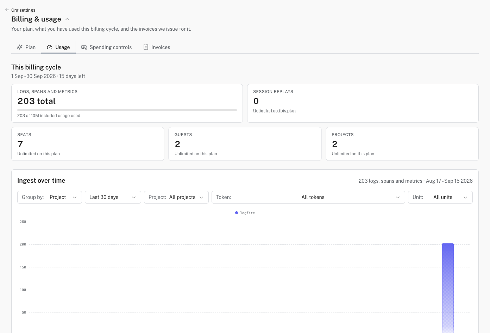

# Logfire Billing & Usage Guide

## Exactly how Logfire charges work

* **What we meter:** every span, log **or** metric you ship. If you're not sure what those are, check out
our [concepts page](concepts.md)
* **Included usage:** Personal, Team, and Growth include **10 million total** logs, spans, and metrics combined
  (equivalent to $20 of usage) each month. Enterprise usage follows its contract.
* **Paid rate:** on the Team and Growth plans, anything above the included amount is billed at **$2 per million**.
  See our <a href="https://pydantic.dev/pricing" target="_blank">pricing calculator</a>. Enterprise plans are
  billed against their contract. The Personal plan has no paid overage; see
  [What happens when a Personal org uses up its included usage](#what-happens-when-a-personal-org-uses-up-its-included-usage)
  below.
* We average payload size over time; anything over the generous **5 KB per span/metric** budget might trigger a polite
  email, never a surprise fee.
* Hosts, services, and projects do not add telemetry charges. Plans can still limit how many projects and seats you
  can have. Team includes five seats and charges $25 per additional seat, up to 12 total. Growth includes unlimited
  seats and projects.

## What happens when a Personal org uses up its included usage

The Personal plan is free and never bills you for overage, so instead of charging past the included amount
Logfire limits what the org can do. Two separate things happen, at two different points:

1. **As soon as you pass the included amount, some views are restricted.** Live View and the playground stop
   returning data, as does opening an individual trace or span to inspect its details. Your existing data is
   still there and still searchable: running queries, browsing logs, and viewing counts keep working. Logfire
   also *keeps accepting and storing what you send*, so you are not losing data at this point.
2. **Further past the allowance, new data stops being stored.** So a burst does not cost you everything the
   moment you cross the line, Logfire keeps ingesting for a while after the included usage runs out. Once that
   extra capacity is used up, new data is dropped rather than stored.

Both limits lift when the monthly included usage resets, or as soon as you upgrade to a paid plan.

If you want to keep an eye on this before you hit it, **Billing & usage** in your organization settings shows
your current usage and your reset date, and Logfire emails the organization as usage approaches the included amount.

## Where to see usage & cost in Logfire

Open your organization settings, then select **Billing & usage**. You need the
[necessary organization permissions](./guides/web-ui/organizations-and-projects.md) to see billing information.

The page is divided into these tabs:

* **Plan:** see your current plan, compare Team and Growth, start an upgrade, or contact us about Enterprise.
* **Usage:** see the logs, spans, metrics, session replays, seats, guests, and projects used in the current billing
  cycle. For eligible paid organizations, it also shows the estimated invoice.
* **Seats:** available on Team organizations. See the subscribed and used seat counts, then change the subscription's
  seat count.
* **Spending controls:** see whether a monthly spending cap is active, what this cycle has spent against it, and what
  happens when the cap is reached. Where a cap is already set, you can also change the amount here.
* **Invoices:** see the invoice building up this cycle, review invoice history, and open Stripe to manage payment and
  billing details.

The **Ingest over time** chart on the Usage tab can show daily usage grouped by project, write token, or unit type.
You can also filter the chart by time range, project, token, and unit.



---

## Standard usage dashboard

Open **Dashboards**, click **+ Dashboard**, choose the **Logfire** tab, then enable **Usage Overview**. This gives you a
detailed breakdown of:

* Which services are producing the most records (i.e. traces, spans, logs) and
metrics
* Records by `span_name`
* Metrics by `metric_name`

If you are unsure what is contributing to the usage shown in Logfire, this dashboard
is the first thing we recommend looking at.

---

## How integrations generate metrics

Many integrations such as [httpx](integrations/http-clients/httpx.md), [sqlalchemy](integrations/databases/sqlalchemy.md), [FastAPI](integrations/web-frameworks/fastapi.md) etc.
emit **aggregate metrics** under the hood - typically counts, durations, and error-rates.

Each exported metric **counts exactly once**, no matter how many requests it summarises.
Disable metrics if you *only* need traces:

```python
import logfire

logfire.configure(metrics=False)
```

Note that the web server metrics standard dashboard relies on metrics being emitted, so
that will stop working if you disable metrics.

---

## Turning off certain types of logs/spans to reduce costs

You may be only interested in certain types of records. For example, you may wish to:

* Ignore debug logs
* Only send traces where an exception occurred
* At high volumes, only send a certain percentage of your logs to Logfire
* Only send spans that took longer than normal to run

Tuning these factors is a trade-off between cost and granularity. The way you conduct this
tuning is via [sampling](how-to-guides/sampling.md).

---

## Export data via API for longer retention

Unless you are under the [Growth or Enterprise plan](https://pydantic.dev/pricing),
data older than **30 days** is pruned.
If you need longer retention we recommend writing to both Logfire and a long-term storage
such as AWS S3. We have a [guide on how to back up data to S3](how-to-guides/otel-collector/s3-backup.md).
You can also use the Query API which allows you to run SQL queries
and treat Logfire as an analytical database. You're then free to save this data to a storage
of your choice (S3, GCS etc.)

See **[Query API docs](how-to-guides/query-api.md)** for Arrow/CSV examples, auth tokens, and tips.

Enterprise plans support native extended retention. Email `sales@logfire.dev` if that's what you need.

---

## Set or change a spending cap

Team and Growth organizations can use a monthly spending cap to limit what usage beyond the included amount adds to
an invoice. Open **Org settings → Billing & usage → Spending controls** to see the cap, what this billing cycle has
spent against it, and how much is left.

When the cap is reached, Logfire keeps accepting your data, but new data stays hidden in the app until the cap is
raised. Nothing is discarded, so raising the cap brings the hidden data back into view.

### Change a cap you already have

!!! note "Changing your own cap is in Beta"
    Every organization with a cap can change the amount without contacting us. The Spending controls card marks this
    **Beta** while we gather feedback on it.

1. Open **Org settings → Billing & usage → Spending controls**.
2. Select **Change cap**.
3. Enter the new monthly cap in dollars, then select **Save cap**.

You need an organization role holding the `write_payment` permission, which Admin has by default. See
[Organizations and projects](./guides/web-ui/organizations-and-projects.md) for roles and permissions. Without it the
card shows the cap but offers no editor.

You can raise the cap to any amount. You can lower it to $20 above what the cycle has already charged, and never
below $25, so a new cap cannot land under a bill that has already been run up. The card names the lowest amount you
can enter right now, and that floor rises as the cycle spends.

### Set up or remove a cap

Turning a cap on for the first time, and taking one away, are both done by us: email `accounts@pydantic.dev`.
Removing a cap means usage is billed with no ceiling again, which is why it is not self-serve.
