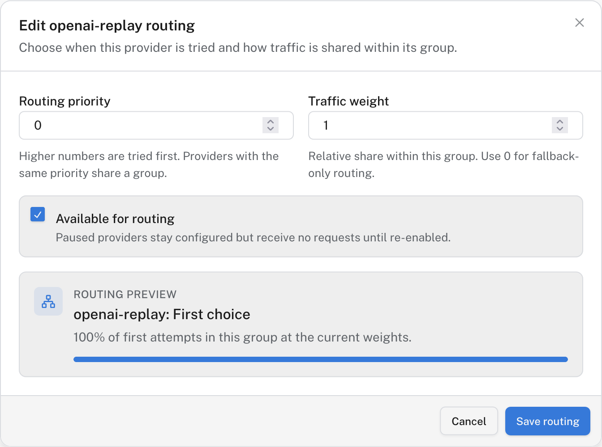

# Route requests across providers

A Gateway endpoint gives your application one route while you change its upstream providers in Logfire. Start with a single provider; add another only when you need traffic sharing or a fallback. You need organization-admin access to edit endpoints.

Endpoint priorities and weights are included on every Gateway plan. Your plan's [BYOK provider limit](byok-providers.md) still applies when adding providers to use in a route.

[Adding a bring-your-own-key (BYOK) provider](byok-providers.md) normally creates an endpoint with the same route name. You can use that endpoint as-is or create a separate one:

1. Open [**AI Engineering → Gateway → Endpoints**](https://logfire.pydantic.dev/-/redirect/default-org/-/gateway/endpoints), check the selected organization, and click **New endpoint**.
2. Enter a **Route** slug, such as `production-chat`, and an optional description. Click **Create endpoint**.
3. Open the endpoint and select **Routing**. Click **Add provider**, choose a configured provider, and leave **Available for routing** on.
4. For a second provider, choose whether it should share a group or be a fallback. **Routing priority** uses higher numbers first. Providers with the same priority share a group; **Traffic weight** sets their relative share within that group. A weight of `0` makes a provider fallback-only within its group. A lower-priority group is tried after higher-priority providers return retryable errors.

   

   

   *Routing controls for one provider in the first-choice group.*

   

5. Open **Connect** and select the endpoint. Copy the generated snippet: your application's URL uses the endpoint slug, not a provider slug. Send a test request. If Gateway telemetry is enabled, inspect its trace to confirm which provider handled it.

Before combining providers, confirm they support the request format and model identifier your application sends. Failover does not translate an unsupported model or API format into one another. A paused provider stays configured but receives no requests.

## Verify it worked

The endpoint's **Routing** tab shows each provider's priority, weight, and availability. The routing preview in **Add provider** or **Edit routing** shows its expected share of first attempts; it is not a guarantee of exact distribution in a small sample.

## Troubleshooting

- **No providers assigned:** add one on **Routing** before using the endpoint.
- **No active providers:** turn on **Available for routing** for at least one assigned provider and confirm the provider itself is active.
- **Fallback not used:** check the priority order and the error returned by the first provider. Fallback is for retryable failures, not every unsuccessful response.
- **Unexpected model error:** test the model on each provider you put into a shared or fallback path.

Once routing works, [set included spending limits](spending-policies.md). [Data protections](protect-data.md), [optimizations](optimizations.md), and advanced spending policies have separate [plan and Early Access requirements](index.md#plan-availability).
