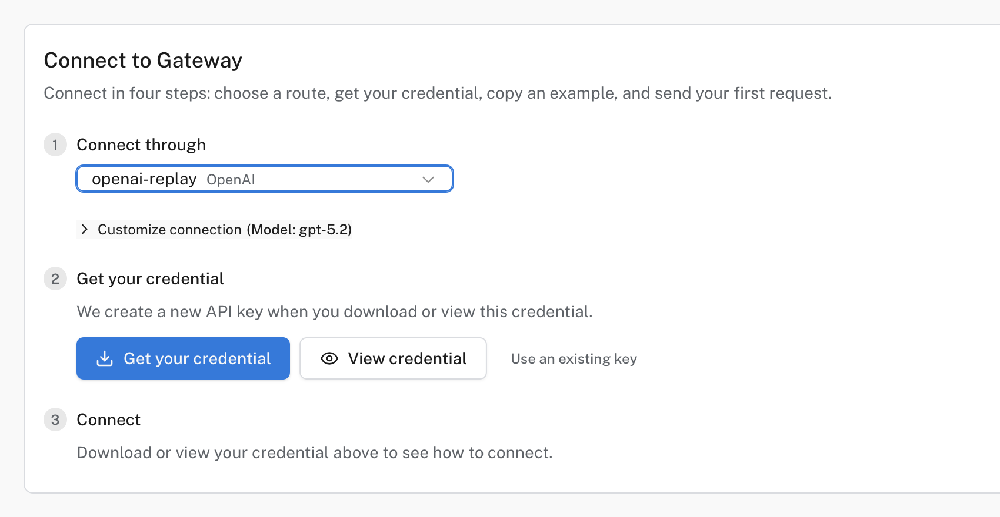

# Send your first AI Gateway request

The Gateway **Connect** tab gives you a working request for your region, provider, model, and project. You can use your existing SDK. You need a Logfire organization with a project.

## Choose a route

1. In Logfire, select your organization and open **AI Engineering → Gateway**.
2. If Gateway is not enabled, ask an organization admin to choose **Enable recommended setup**. This enables Gateway, configures telemetry and recommended protections, and creates a first API key.
3. Open **Connect** and select a provider under **Connect through**. A direct provider is enough for a first request; you can [add an endpoint](endpoints.md) later.

   <div align="center">

   [](../../../images/guide/ai-gateway/connect-route.png)

   *Connect after selecting an OpenAI-compatible provider.*

   </div>

If **Connect** offers no route, ask an organization admin to choose **Add a payment method** to activate built-in providers or **Add your own provider** to [bring your own key](byok-providers.md). If it says **Built-in provider access needs activation**, ask an admin to use **Providers** to activate a built-in provider or add a BYOK provider.

!!! note "Who pays for model calls?"
    Built-in calls draw from a Logfire prepaid balance. Activation may ask for a payment method and set up auto-recharge; eligible promotional credit may allow activation without one. Review the amounts and terms in the UI. With your own provider, that provider bills you directly and no Logfire payment method is needed for the route.

If you only want to observe calls sent directly to a model provider, [instrument your application](../../../integrations/llms/index.md) instead. The Gateway sits in the request path and forwards each call to the provider.

## Get a credential and send a request

1. Click **Get your credential** to download the file, or **View credential** to copy it. Connect can create a key for the current project or use an existing one. For another project, open that project's **API Keys** page first.
2. Under **Connect**, copy the prompt for your AI coding agent or a snippet for your SDK. Use **Customize connection** if you need another model. The snippet supplies your region's URL and selected route.
3. Keep the **Gateway API key** in a local environment variable or secret manager, not source control. It is different from an upstream BYOK provider key. A snippet generated after you reveal a key may contain its plaintext value; do not commit or share it. The coding-agent prompt uses a local credential file rather than putting the key in chat.
4. Run the snippet or, for a chat model, use **Try in playground**. The first request may incur upstream model charges or draw from your built-in prepaid balance.

For an OpenAI-compatible route in the US region, the chat-completions URL has this shape:

```text
https://gateway-us.pydantic.dev/proxy/<route>/chat/completions
```

For an EU organization, use `https://gateway-eu.pydantic.dev/proxy` instead. Do not substitute a URL from another region; **Connect** supplies the correct one. Routes can be provider slugs or endpoint slugs. The URL path and SDK depend on the provider's API format, so use the generated snippet rather than assuming every provider speaks OpenAI's API.

## Verify it worked

For a key created in this Connect session, the page shows **Waiting for your first Gateway request** until that key is used. You can also open **Gateway → Overview** for usage and, if telemetry is enabled, open the selected Logfire project to inspect the trace. Gateway telemetry can include request and response content; review your [protections](protect-data.md) and telemetry settings before sending sensitive production data.

## Troubleshooting

- **No providers available:** ask an organization admin to activate a built-in provider or [add your own](byok-providers.md). A provider assigned to an endpoint must also be active.
- **401 or 403:** check that you used a Gateway API key for the intended project, not your upstream provider key, and that the key has not expired.
- **Model not listed:** choose a model the selected provider serves, or enter its model identifier where the UI allows it. Model availability and pricing can differ by provider.
- **No pricing data:** a BYOK provider with **Require pricing data** enabled rejects unpriced requests. Add a price in provider settings, choose a priced model, or change that setting if you accept requests without a known price. This setting is separate from whether the upstream provider charges you.
- **No trace:** check that Gateway telemetry is enabled for the project in **Gateway → Settings**. A successful request does not imply telemetry was configured.

Next, [add an endpoint](endpoints.md) for failover, [protect request data](protect-data.md), or [set a spending policy](spending-policies.md).
