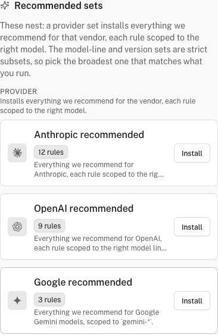

# Optimize Gateway requests

An **optimization** adds an instruction to matching Gateway requests. It can encourage shorter replies, change tool-use behavior, or apply another prompt rule without editing each application. Optimizations affect model input and may change output, cost, and behavior, so test them on a non-production route first.

!!! note "Early Access: Growth, Enterprise, or self-hosted"
    To enable **AI Gateway optimizations**, open **Settings → Early access**. Access to these settings requires membership in a Growth or Enterprise organization, or a self-hosted deployment. Early-access choices apply to your account in this browser. Optimizations are not needed to connect a provider or send Gateway requests.

You need organization-admin access to create optimizations and change their targeting.

## Install a recommended optimization

1. Open **AI Engineering → Gateway → Optimizations** and click **New optimization**. From an endpoint with no optimizations, **Create optimization** opens the same catalog.

   

   

   *Provider-specific sets in the New optimization catalog.*

   

2. On **New optimization**, choose a **Recommended set** for your provider or model, or an individual rule. Check the set's scope before installing: for example, the Google recommended set is for **Google Vertex AI**, not every route that serves a Gemini model. Provider sets contain model-scoped rules; a model-line or version set is a narrower subset. Install the broadest set that matches what you actually run, rather than stacking overlapping sets without a reason.
3. In the install panel, review the rules, continue to endpoint selection, choose the endpoints that should use them, and confirm. A rule with no endpoint binding does not run.
4. Open the rule and review its **Targeting**. Narrow it to a model or agent where appropriate.

To write your own rule, choose **Custom rule** on **New optimization**, give it a name and **Instruction**, then set its targeting. **Advanced settings** include a trigger pattern, message roles, priority, failure mode, and an **Observe** or **Transform** action. **Observe** is useful for testing match behavior without modifying the request; **Transform** injects the instruction into matching requests.

## Verify it worked

Send the same small test prompt through an endpoint with and without the optimization. Confirm its binding under **Endpoints → your endpoint → Optimizations**. If Gateway telemetry is enabled, inspect the request's trace and the optimization's usage to confirm a match. A difference in the model's prose alone is not proof of which rule ran.

## Troubleshooting

If the optimization appears but does not change the request, first check its action: **Observe** records a match but does not inject the instruction; choose **Transform** when you want to modify requests. Then check that the rule is enabled, bound to the endpoint, and that model, agent, message role, and optional trigger pattern all match. If a model provider rejects the transformed prompt, disable the rule and test it in a narrower scope before re-enabling it.

Use [Guardrails](protect-data.md) for sensitive-data detection and blocking. Optimizations change instructions; they are not a data-loss-prevention control.
