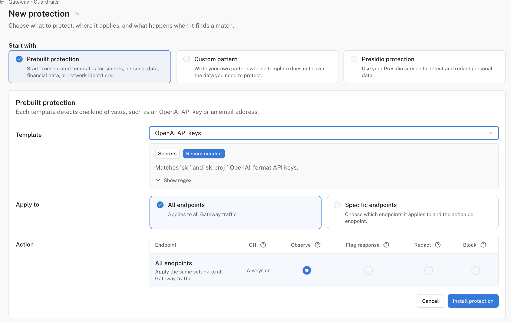

# Protect Gateway requests

Gateway **Guardrails** can detect sensitive values before a request reaches a model provider. Choose what to detect, where the protection applies, and whether to observe, flag, redact, or block matches. Calls that bypass Gateway are not inspected.

Start with a prebuilt secret or personal-data template. Test it with non-sensitive sample text before enforcing it broadly.

!!! note "Plan availability"
    To manage Guardrails, enable **AI Gateway guardrails** under [**Settings → Early access**](https://logfire.pydantic.dev/settings/early-access). Access to these settings requires membership in a Growth or Enterprise organization, or a self-hosted deployment. The choice applies to your account in this browser, not automatically to every member.

    Prebuilt and custom-pattern protections do not require an additional plan upgrade for **Flag response**, **Redact**, or **Block** during Early Access. Supported actions vary by template. **Presidio protections** separately require **Enterprise Cloud or self-hosted Logfire**.

## Install a prebuilt protection

You need organization-admin access to configure protections.

1. Open [**AI Engineering → Gateway → Guardrails → Protections**](https://logfire.pydantic.dev/-/redirect/default-org/-/gateway/guardrails/protections), check the selected organization, and choose **New protection**. From an endpoint with no guardrails, **Create guardrail** takes you to the same flow.
2. Under **Start with**, choose **Prebuilt protection**. Select a **Template**, such as an API-key or email-address detector.

   

   

   *A prebuilt API-key detector in Observe mode across all endpoints.*

   

3. Under **Apply to**, select **All endpoints** or **Specific endpoints**. If you choose specific endpoints, select the action for each one; **Off** means this protection does not run there.
4. Under **Action**, choose what should happen on a match:

   | Action | Result |
   |--------|--------|
   | **Observe** | Record the match in telemetry; forward the request unchanged. |
   | **Flag response** | Forward unchanged and mark the response as flagged. |
   | **Redact** | Replace the matched value before forwarding. |
   | **Block** | Reject the request before it reaches the provider. |

5. Click **Install protection**. Return to **Guardrails** to confirm its target and action. On **Endpoints → your endpoint → Guardrails**, check that it applies to the route you will call.

**Enable recommended setup** may already have installed recommended protections. Review their actions and targeting before sending real user data. A protection in **Observe** or **Flag response** mode does not stop a secret reaching the upstream provider.

## Use a custom detector

If no prebuilt template covers your data, **Custom pattern** accepts a regular expression and offers sample previews.

For **Presidio protection** on Enterprise Cloud or self-hosted Logfire, first run a Presidio service reachable from your Gateway. Hosted Logfire requires a public HTTPS domain; `localhost`, private IPs, and HTTP are rejected. Self-hosted Logfire can use a private endpoint reachable from the Gateway deployment, but use HTTPS for production. Private HTTP is suitable only for trusted development networks without bearer authentication and with synthetic test data: prompt content is unencrypted in transit.

1. In **New protection**, select **Presidio protection**, then click **New connection** beside **Connection**.
2. Enter a name, the service-root base URL (not `/analyze`), and, if needed, a bearer token. Click **Test and enable** to verify the Presidio endpoints before using the connection.
3. Choose the **Entity type** to detect. Under **Advanced**, you can set a confidence threshold and decide whether to allow or block requests if Presidio is unavailable.

Start with a narrow detector and an **Observe** action, inspect its matches, then move to **Redact** or **Block** where supported. A broad regular expression can alter ordinary prompts or reject legitimate requests. Do not paste real credentials or personal data into the test samples.

## Verify it worked

Send a test request through an endpoint where the protection applies. Use a synthetic sample that should match and another that should not. **Redact** should replace the match, and **Block** should reject the matching request. **Observe** and **Flag response** leave the prompt unchanged; enable Gateway telemetry to inspect those matches in the project's trace. For **Flag response**, inspect response headers if your client does not display them.

A flagged response includes the `x-pydantic-gateway-guardrails-flagged` header.

## Watch the DLP tutorial

{{ video("092ff2523f07687e69ae31b088addad0", 30, 56) }}

[Watch the AI Gateway data-loss prevention tutorial](https://customer-nmegqx24430okhaq.cloudflarestream.com/092ff2523f07687e69ae31b088addad0/watch).

## Troubleshooting

If nothing happens, check **Apply to** and the endpoint's **Guardrails** tab, whether the detector matches your input, the chosen action, and whether a Presidio connection is enabled. Protections aimed at one endpoint do not automatically cover another.

Next, [set spending limits](spending-policies.md) or [add an optimization](optimizations.md).
