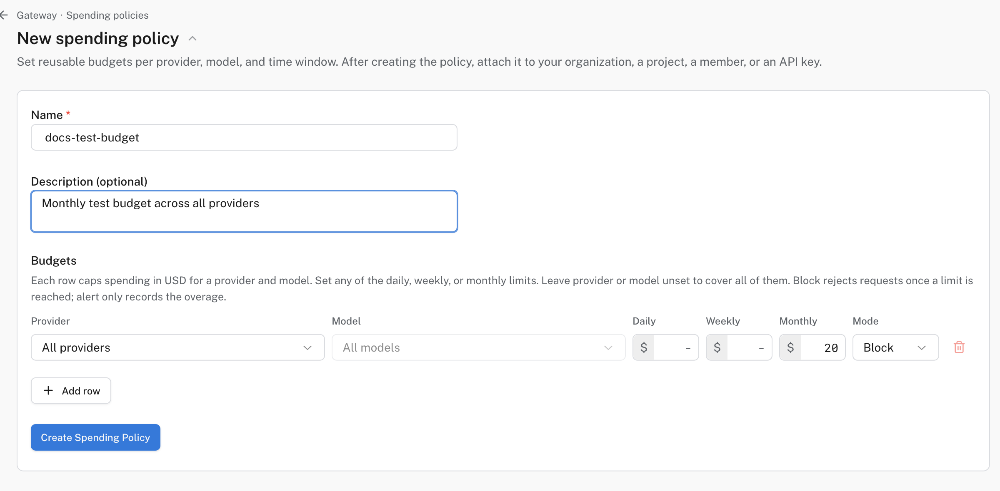
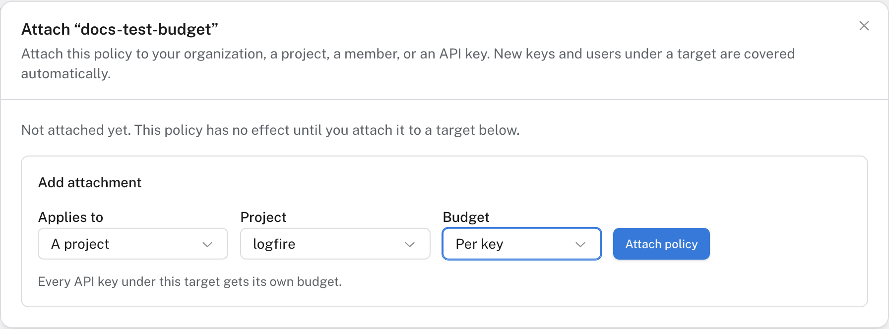

# Control Gateway spending

A **spending policy** is a reusable budget with rules for a provider, model, and time window. It does nothing until you **attach** it to an organization, project, member, or API key. Use **Block** to reject requests after a limit is reached, or **Alert only** to record an overage without stopping requests.

Gateway also offers per-key limits and a prepaid balance for built-in providers. These are separate controls: a policy attachment does not replace upstream provider quotas or the built-in balance.

**AI Gateway spending policies** is experimental. On Growth, Enterprise, or self-hosted Logfire, open **Settings → Early access**, choose **Show experimental features**, and turn it on. If the **Spending Policies** tab is absent, use the generally available per-key limits under **API Keys** instead. Early-access choices apply to your account in this browser.

## Create and attach a policy

You need organization-admin access to manage spending policies.

1. Open **AI Engineering → Gateway → Spending Policies** and click **New Spending Policy**. **Spending** shows usage charts; it is a separate tab.
2. Give the policy a name. Under **Budgets**, choose a **Provider** and **Model**, or leave them at **All providers** and **All models**.
3. Enter at least one **Daily**, **Weekly**, or **Monthly** dollar limit. Choose **Block** or **Alert only**. Add another row only when a different provider or model needs a different limit.

   

   

   *A $20 monthly budget in Block mode, before attaching the policy.*

   

4. Click **Create Spending Policy**. In the policy list, click **Attach**. Choose **Whole organization**, **A project**, **A member**, or **An API key** under **Applies to**.
5. Choose whether the target shares one budget or gets a separate budget **Per key** or **Per user**, where available. Review the description of the chosen split, then click **Attach policy**. A shared organization budget is different from the same dollar limit granted independently to every key.

   

   

   *This project attachment gives each key its own budget. A shared budget would pool their spending instead.*

   

New keys and members under an attached target can inherit its policy. Review any exceptions you configure for an organization or project attachment.

## Verify it worked

Back on **Spending policies**, confirm the **Attached to** value. Send a small test request, then inspect **Spending** usage for the relevant project, member, or key. For a blocking rule, test with a deliberately low limit in a non-production environment and confirm that subsequent requests are rejected; restore the intended limit afterward.

## Troubleshooting

- **Policy has no effect:** confirm it is attached to the right target and that the provider, model, time window, and budget split match the request.
- **Requests still succeed over budget:** check whether the rule is **Alert only** rather than **Block**, and which target's budget the request uses.
- **Requests stop before the policy limit:** check per-key limits, other attached policies, upstream quotas, and (for built-in providers) the prepaid balance.

To set up the first route and credential, return to [your first Gateway request](first-request.md).
