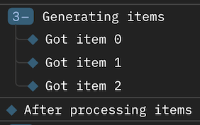
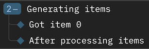

# Generators

The body of a `with logfire.span` statement or a function decorated with `@logfire.instrument` should not contain the `yield` keyword, except in functions decorated with `@contextlib.contextmanager` or `@contextlib.asynccontextmanager`. To see the problem, consider this example:

```python
import logfire

logfire.configure()


def generate_items():
    with logfire.span('Generating items'):
        for i in range(3):
            yield i


# Or equivalently:
@logfire.instrument('Generating items')
def generate_items():
    for i in range(3):
        yield i


def main():
    items = generate_items()
    for item in items:
        logfire.info(f'Got item {item}')
        # break
    logfire.info('After processing items')


main()
```

If you run this, everything seems fine:



The `Got item` log lines are inside the `Generating items` span, and the `After processing items` log is outside it, as expected.

But if you uncomment the `break` line, you'll see that the `After processing items` log line is also inside the `Generating items` span:



This is because the `generate_items` generator is left suspended at the `yield` statement, and the `with logfire.span('Generating items'):` block is still active, so the `After processing items` log sees that span as its parent. This is confusing, and can happen anytime that iteration over a generator is interrupted, including by exceptions.

If you run the same code with async generators:

```python
import asyncio

import logfire

logfire.configure()


async def generate_items():
    with logfire.span('Generating items'):
        for i in range(3):
            yield i


async def main():
    items = generate_items()
    async for item in items:
        logfire.info(f'Got item {item}')
        break
    logfire.info('After processing items')


asyncio.run(main())
```

You'll see the same problem, as well as an exception like this in the logs:

```
Failed to detach context
Traceback (most recent call last):
  File "async_generator_example.py", line 11, in generate_items
    yield i
asyncio.exceptions.CancelledError

During handling of the above exception, another exception occurred:

Traceback (most recent call last):
  File "opentelemetry/context/__init__.py", line 154, in detach
    _RUNTIME_CONTEXT.detach(token)
  File "opentelemetry/context/contextvars_context.py", line 50, in detach
    self._current_context.reset(token)
ValueError: <Token var=<ContextVar name='current_context' default={} at 0x10afa3f60> at 0x10de034c0> was created in a different Context
```

This is why generator functions are not traced by [`logfire.install_auto_tracing()`][logfire.Logfire.install_auto_tracing].

## What you can do

### Move the span outside the generator

If you're looping over a generator, wrapping the loop in a span is safe, e.g:

```python
import logfire

logfire.configure()


def generate_items():
    for i in range(3):
        yield i


def main():
    items = generate_items()
    with logfire.span('Generating items'):
        for item in items:
            logfire.info(f'Got item {item}')
            break
    logfire.info('After processing items')


main()
```

This is fine because the `with logfire.span` block doesn't contain the `yield` directly in its body.

### Use a generator as a context manager

`yield` is OK when used to implement a context manager, e.g:

```python
from contextlib import contextmanager

import logfire

logfire.configure()


@contextmanager
def my_context():
    with logfire.span('Context manager span'):
        yield


try:
    with my_context():
        logfire.info('Inside context manager')
        raise ValueError()
except Exception:
    logfire.exception('Error!')
logfire.info('After context manager')
```

This is fine because even if there's an exception inside the context manager, the `with` statement will ensure that the `my_context` generator is promptly closed, and the span will be closed with it. This is in contrast to using a generator as an iterator, where the loop can be interrupted more easily.

### Create a context manager that closes the generator

`with closing(generator)` can be used to ensure that the generator and thus the span within is closed even if the loop is interrupted, e.g:

```python
from contextlib import closing

import logfire

logfire.configure()


def generate_items():
    with logfire.span('Generating items'):
        for i in range(3):
            yield i


def main():
    with closing(generate_items()) as items:
        for item in items:
            logfire.info(f'Got item {item}')
            break
    logfire.info('After processing items')


main()
```

However this means that users of `generate_items` must always remember to use `with closing`. To ensure that they have no choice but to do so, you can make `generate_items` a context manager itself:

```python
from contextlib import closing, contextmanager

import logfire

logfire.configure()


@contextmanager
def generate_items():
    def generator():
        with logfire.span('Generating items'):
            for i in range(3):
                yield i

    with closing(generator()) as items:
        yield items


def main():
    with generate_items() as items:
        for item in items:
            logfire.info(f'Got item {item}')
            break
    logfire.info('After processing items')


main()
```

## Using `@logfire.instrument`

Since `@logfire.instrument` wraps the function body in a span, the problems and solutions explained above also apply. Therefore it should only be used on a generator function if the `@contextlib.contextmanager` or `@contextlib.asynccontextmanager` decorator is applied afterwards, i.e. above in the list of decorators. Then you can pass `allow_generator=True` to prevent a warning. For example:

```python
from contextlib import contextmanager

import logfire

logfire.configure()


@contextmanager  # note the order
@logfire.instrument('Context manager span', allow_generator=True)
def my_context():
    yield


try:
    with my_context():
        logfire.info('Inside context manager')
        raise ValueError()
except Exception:
    logfire.exception('Error!')
logfire.info('After context manager')
```

If you want to instrument a generator that's used for iteration rather than a context manager, see the sections above.

!!! warning
    In addition to the problems described at the start of this page:

    1. Using `@logfire.instrument` on an *async* generator function means that values cannot be sent into the generator.
    2. The `record_return` parameter of `@logfire.instrument` is ignored for generator functions.
