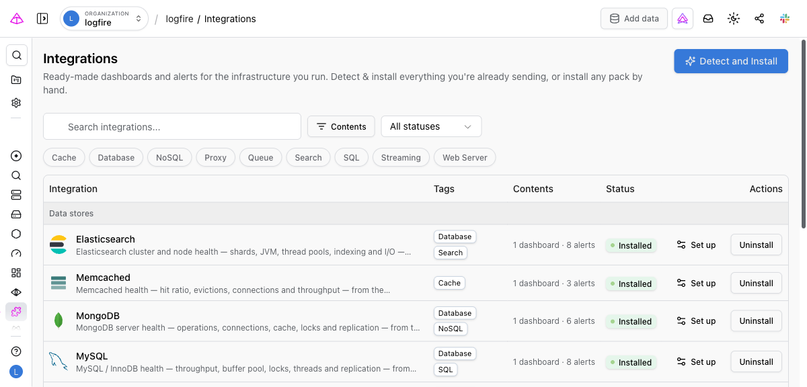

# Integrations

Integrations are ready-made observability bundles for the infrastructure you run — Redis, PostgreSQL, MySQL, MongoDB, Elasticsearch, Memcached, RabbitMQ, Kafka, NGINX, and Apache. Each one packages a standard **dashboard** and a set of **alerts**, built on the metrics the OpenTelemetry Collector already scrapes from these services.

Instead of building a Redis dashboard from a blank canvas — figuring out which OTel attributes the receiver emits, writing the SQL for throughput and hit ratio, laying out panels, then repeating it for the next service — you point the Collector at Redis, open the catalog, and click **Detect and Install**.

## What an integration delivers

- **A standard dashboard** — a curated set of panels for the service (for Redis: memory vs maxmemory, command throughput, keyspace hit ratio, evictions, connected clients, replication). It renders from a single canonical definition Logfire maintains, so installing simply enables it for your project — there is no per-project copy to drift or maintain.
- **Alerts** — a set of health alerts grounded in vendor guidance (for Redis: memory near maxmemory, evictions, low keyspace hit ratio, rejected connections, fragmentation). Installing creates them as **live, active alerts** in your project. They start evaluating immediately, but won't page anyone until you attach a notification channel. Every pack also ships a *not reporting metrics* alert that fires if the service stops sending telemetry.
- **Setup instructions** — the exact OpenTelemetry Collector receiver config to scrape the service, ready to copy.
- **Detection** — a check that confirms the service's telemetry is already flowing into your project, so you only install what's relevant.

## Installing an integration

1. **Send telemetry.** Point your OpenTelemetry Collector at the service using its receiver. Each integration's **Set up** tab has the exact config to copy; on self-hosted Logfire, swap in your own ingest endpoint.
2. **Open the catalog.** In the project sidebar, under **Observe**, click **Integrations**.
3. **Install.** Either:
    - Click **Detect and Install** at the top of the catalog to detect every service whose telemetry is already flowing and install all of them in one click, or
    - Open a specific integration and click **Install content** to install just that one.
4. **Get notified (optional).** The alerts are created active but without a notification channel. Open the integration's **Alerts** tab — or your project's [Alerts](../../../guides/web-ui/alerts.md) page — and attach a notification channel and schedule to start receiving pages.

Uninstalling reverses both steps: it disables the standard dashboard for your project and deletes the alerts the integration created.

## The catalog

The catalog lists every available integration with its **status** for your project:

- **Available** — no telemetry from this service has been seen yet.
- **Detected** — the service's metrics are flowing; it's ready to install.
- **Installed** — the dashboard is enabled and the alerts are live.

Filter by contents (has dashboards / has alerts), by status, or by tag (Database, Cache, Queue, …), or search by name.

!!! note "Detection is on demand"
    Detection runs when you click **Detect and Install** — there is no background scan. An integration is *detected* when the matching metrics (for example, `redis.*`) have arrived in your project recently.

## From the AI assistant

The catalog is also available over the [Logfire MCP server](../../../how-to-guides/mcp-server.md), so an AI assistant or SRE agent can set up observability for you: `integration_list` shows the catalog with per-project status, and `integration_install` installs a pack. This is what an agent reaches for when it needs standard dashboards and alerts in place before it can investigate an issue.

## Available integrations

| Integration | Type |
|---|---|
| Redis | Cache / data store |
| Memcached | Cache |
| PostgreSQL | Database |
| MySQL | Database |
| MongoDB | Database |
| Elasticsearch | Search / database |
| RabbitMQ | Message queue |
| Kafka | Streaming |
| NGINX | Web server |
| Apache | Web server |

More integrations are added over time — each one is a data-only definition, so the catalog grows without per-service code.
