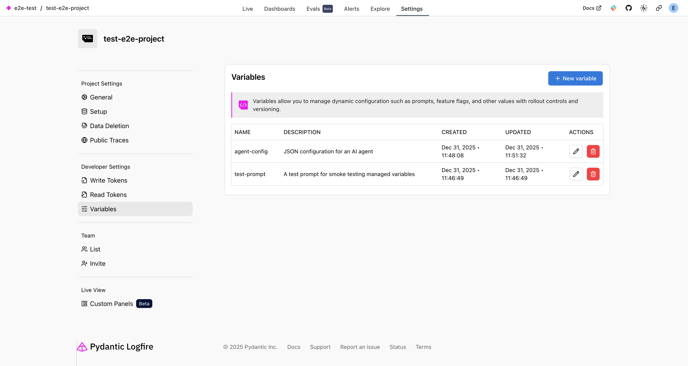
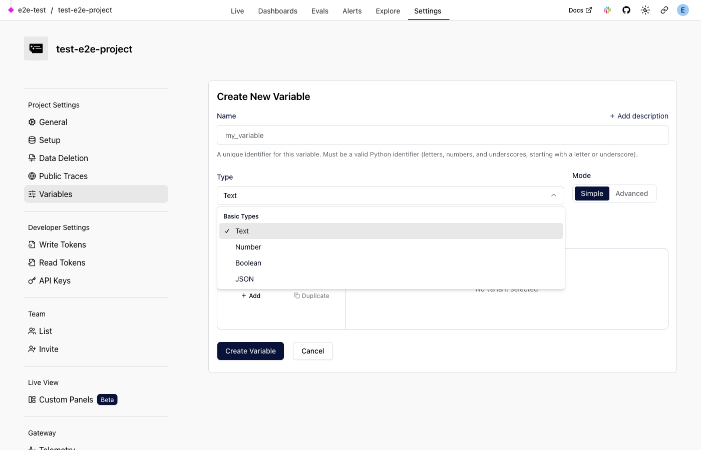
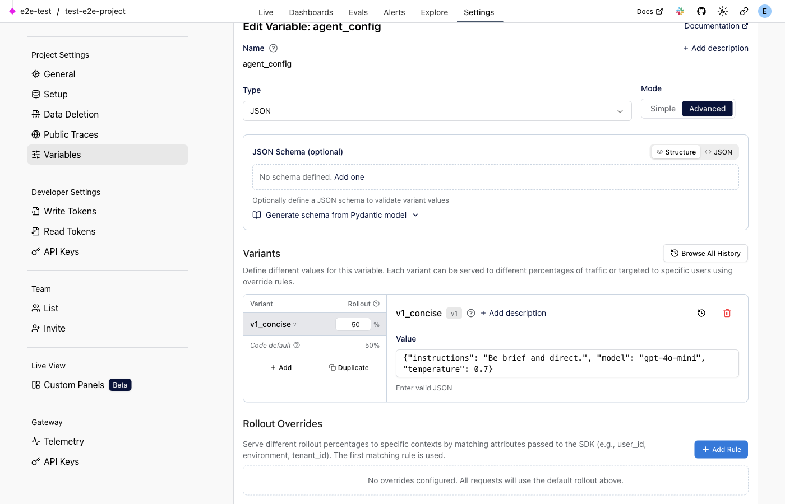

# Managed Variables

!!! warning "Early Access"
    The Logfire web UI functionality for managed variables is currently behind a feature flag and not yet generally available. This includes everything related to `RemoteVariablesConfig` — creating and managing variables in the UI, configuring variants and rollouts remotely, and syncing configuration from the server. You can still use managed variables locally with `VariablesConfig` without the feature flag. If you'd like access to the remote functionality, please reach out to us on [Slack][slack] for instructions on how to enable it.

Managed variables let you define and reference configuration in your code, but control the runtime values from the Logfire UI without redeploying.

Define a variable once with a sensible default, deploy your application, then iterate on the values in production. You can target specific populations (opted-in beta users, internal developers, enterprise customers, etc.) using flexible targeting rules that integrate with your existing OpenTelemetry attributes.

Changes take effect quickly, and every variable resolution is visible in your traces. This trace-level visibility means you can correlate application behavior directly with configuration variants, enabling A/B testing, automated prompt optimization, and online evaluations using the same observability data you're already sending to Logfire.

## What Are Managed Variables?

Managed variables are a way to externalize runtime configuration from your code. While they're especially powerful for AI applications (where prompt iteration is frequently critical), they work for any configuration you want to change without redeploying:

- **Any type**: Use primitives (strings, bools, ints) or structured types (dataclasses, Pydantic models, etc.)
- **Observability-integrated**: Every variable resolution creates a span, and using the context manager automatically sets baggage so downstream operations are tagged with which variant was used
- **Variants and rollouts**: Define multiple values (variants) for a variable and control what percentage of requests get each variant
- **Targeting**: Route specific users or segments to specific variants based on attributes

## Structured Configuration

While you can use simple primitive types as variables, the real power comes from using **structured types**—Pydantic models that group related configuration together:

```python
from pydantic import BaseModel

import logfire

logfire.configure()


class AgentConfig(BaseModel):
    """Configuration for an AI agent."""

    instructions: str
    model: str
    temperature: float
    max_tokens: int


# Create a managed variable with this structured type
agent_config = logfire.var(
    name='agent_config',
    type=AgentConfig,
    default=AgentConfig(
        instructions='You are a helpful assistant.',
        model='openai:gpt-4o-mini',
        temperature=0.7,
        max_tokens=500,
    ),
)
```

**Why group configuration together instead of using separate variables?**

- **Coherent variants**: A variant isn't just "instructions v2", it's a complete configuration where all the pieces work well together. The temperature that works with a detailed prompt might not work as well with a concise one.
- **Atomic changes**: When you roll out a new variant, all settings change together. No risk of mismatched configurations.
- **Holistic A/B testing**: Compare "config v1" vs "config v2" as complete packages, not individual parameters in isolation.
- **Simpler management**: One variable to manage in the UI instead of many.

!!! tip "When to use primitives"
    Simple standalone settings like feature flags (`debug_mode: bool`), rate limits (`max_requests: int`), or even just agent instructions work great as primitive variables. Use structured types when you have multiple settings you want to vary together.

## Why This Is So Useful For AI Applications

In AI applications, prompts and model configurations are often critical to application behavior. Some changes are minor tweaks that don't significantly affect outputs, while others can have substantial positive or negative consequences. The traditional iteration process looks like:

1. Edit the code
2. Open a PR and get it reviewed
3. Merge and deploy
4. Wait to see the effect in production

This process is problematic for AI configuration because:

- **Production data is essential**: Useful AI agents often need access to production data and real user interactions. Testing locally or in staging environments rarely captures the full range of inputs your application will encounter.
- **Representative testing is hard**: Even a fast deployment cycle adds significant friction when you're iterating on prompts. What works in a test environment may behave differently with real user queries.
- **Risk affects all users**: Without targeting controls, every change affects your entire user base immediately.

With managed variables, you can iterate safely in production:

- **Iteration speed**: Edit prompts in the Logfire UI and see the effect in real traces immediately
- **A/B testing**: Run multiple prompt/model/temperature combinations simultaneously and compare their performance in your traces
- **Gradual rollouts**: Start a new configuration at 5% of traffic, watch the metrics, then gradually increase
- **Emergency rollback**: If a configuration is causing problems, revert to the previous variant in seconds, with no deploy required

## How It Works

Here's the typical workflow using the `AgentConfig` example from above:

1. **Define the variable in code** with your current configuration as the default
2. **Deploy your application**: it starts using the default immediately
3. **Create the variable in the Logfire UI** with your initial value
4. **Add variants**: create additional variants like `v2_detailed` with different configurations
5. **Set up a rollout**: start with 10% of traffic going to the new variant
6. **Monitor in real-time**: filter traces by variant to compare response quality, latency, and token usage
7. **Adjust based on data**: if v2 performs better, gradually increase to 50%, then 100%
8. **Iterate**: create new variants, adjust rollouts, all without code changes

## Managing Variables in the Logfire UI

The Logfire web UI provides a complete interface for managing your variables without any code changes. You can find it under **Settings > Variables** in your project. The page includes two tabs:

- **Variables**: create, edit, and delete managed variables
- **Variable Types**: define reusable JSON schemas for custom types



### Creating a Variable

To create a new variable, click **New variable** and fill in:

- **Name**: A valid Python identifier (e.g., `agent_config`, `feature_flag`)
- **Description**: Optional text explaining what the variable controls
- **Type**: Choose from:
    - **Text**: Plain text values, ideal for prompts and messages
    - **Number**: Numeric values for thresholds, limits, etc.
    - **Boolean**: True/false flags for feature toggles
    - **JSON**: Complex structured data matching your Pydantic models
    - **Custom Types**: Reusable schemas created under the **Variable Types** tab

For **JSON** variables, you can optionally provide a **JSON Schema** to validate variant values.
For **Custom Types**, the schema is derived from the type and shown read-only; edit the type in the **Variable Types** tab.



### Working with Variants

Each variable can have multiple **variants**—different values that can be served to different users or traffic segments.

To add variants:

1. Click **Add** in the Variants section
2. Enter a unique key for the variant (e.g., `premium`, `experimental`, `v2_detailed`)
3. Provide an optional description
4. Enter the value (the format depends on your value type)

!!! tip "Using the example value"
    When you push a variable from code using `logfire.variables.push()`, the code's default value is stored as an "example". This example appears pre-filled when you create a new variant in the UI, making it easy to start from a working configuration and modify it.

Each variant tracks its version history, accessible via the **View history** button. You can also browse all variant history using **Browse All History** to see changes over time or restore previous versions.

!!! note "Variant keys are immutable"
    Variant keys must be valid Python identifiers. Once created, variant keys cannot be renamed—create a new variant and delete the old one instead.

!!! note "No variants = code default"
    If a variable has no variants configured, your application uses the code default value. This is the expected state immediately after `logfire.variables.push()`. You create variants in the UI when you want to serve different values to different users or run experiments.

### Configuring Rollouts

The **Default Rollout** section controls what percentage of requests receive each variant. The weights must sum to 1.0 or less:

- Set `default` to `0.5` and `premium` to `0.5` for a 50/50 A/B test
- Set `default` to `0.9` and `experimental` to `0.1` for a 10% canary deployment
- If weights sum to less than 1.0, the remaining percentage uses your code's default value

The UI offers **Simple** and **Advanced** modes:

- **Simple**: pick a single active variant or use code default
- **Advanced**: set weighted rollouts, add overrides, and manage aliases

### Targeting with Override Rules

**Rollout Overrides** let you route specific users or segments to specific variants based on attributes. Rules are evaluated in order, and the first matching rule determines the rollout.

To add a targeting rule:

1. Click **Add Rule** in the Rollout Overrides section
2. Add one or more conditions (all conditions must match):
    - Choose an attribute name (e.g., `plan`, `region`, `is_beta_user`)
    - Select an operator (`equals`, `does not equal`, `is in`, `is not in`, `matches regex`, etc.)
    - Enter the value to match
3. Configure the rollout percentages when this rule matches

For example, to give enterprise customers the premium variant:

- Condition: `plan` equals `enterprise`
- Rollout: `premium` = 100%



!!! important "Variable names must match"
    The variable name in the UI must exactly match the `name` parameter in your `logfire.var()` call. If they don't match, your application will use the code default instead of the remote configuration.

## Quick Start

### Define a Variable

Use `logfire.var()` to define a managed variable. Here's an example using a structured configuration:

```python
from pydantic import BaseModel

import logfire

logfire.configure()


class AgentConfig(BaseModel):
    """Configuration for a customer support agent."""

    instructions: str
    model: str
    temperature: float
    max_tokens: int


# Define the variable with a sensible default
agent_config = logfire.var(
    name='support_agent_config',
    type=AgentConfig,
    default=AgentConfig(
        instructions='You are a helpful customer support agent. Be friendly and concise.',
        model='openai:gpt-4o-mini',
        temperature=0.7,
        max_tokens=500,
    ),
)
```

### Use the Variable

The recommended pattern is to use the variable's `.get()` method as a context manager. This automatically:

- Creates a span for the variable resolution
- Sets baggage with the variable name and selected variant

When using the Logfire SDK, baggage values are automatically added as attributes to all downstream spans. This means any spans created inside the context manager will be tagged with which variant was used, making it easy to filter and compare behavior by variant in the Logfire UI.

```python skip="true"
from pydantic_ai import Agent


async def handle_support_ticket(user_id: str, message: str) -> str:
    """Handle a customer support request."""
    # Get the configuration - same user always gets the same variant
    with agent_config.get(targeting_key=user_id) as config:
        # Inside this context, baggage is set:
        # logfire.variables.support_agent_config = <variant_name>

        agent = Agent(
            config.value.model,
            system_prompt=config.value.instructions,
        )
        result = await agent.run(
            message,
            model_settings={
                'temperature': config.value.temperature,
                'max_tokens': config.value.max_tokens,
            },
        )
        return result.output
```

The `targeting_key` ensures deterministic variant selection: the same user always gets the same variant, which is essential for application behavior consistency when A/B testing.

In practice, depending on your application structure, you may want to use `tenant_id` or another identifier for `targeting_key` instead of `user_id`. If no `targeting_key` is provided and there's an active trace, the `trace_id` is used automatically to ensure consistent behavior within a single request.

### Variable Parameters

| Parameter | Description                                                             |
|-----------|-------------------------------------------------------------------------|
| `name` | Unique identifier for the variable                                      |
| `type` | Expected type for validation; can be a primitive type or Pydantic model |
| `default` | Default value when no configuration is found (can also be a function)   |

## A/B Testing Configurations

Here's a complete example showing how to A/B test two complete agent configurations:

```python skip="true"
from pydantic import BaseModel
from pydantic_ai import Agent

import logfire
from logfire.variables.config import (
    Rollout,
    VariableConfig,
    VariablesConfig,
    Variant,
)

logfire.configure()


class AgentConfig(BaseModel):
    """Configuration for a customer support agent."""

    instructions: str
    model: str
    temperature: float
    max_tokens: int


# For local development/testing, you can define variants in code
# In production, you'd typically configure these in the Logfire UI
# and configure logfire to retrieve and sync with the remotely-managed config.
variables_config = VariablesConfig(
    variables={
        'support_agent_config': VariableConfig(
            name='support_agent_config',
            variants={
                'v1_concise': Variant(
                    key='v1_concise',
                    serialized_value="""{
                        "instructions": "You are a helpful support agent. Be brief and direct.",
                        "model": "openai:gpt-4o-mini",
                        "temperature": 0.7,
                        "max_tokens": 300
                    }""",
                    description='Concise responses with faster model',
                ),
                'v2_detailed': Variant(
                    key='v2_detailed',
                    serialized_value="""{
                        "instructions": "You are an expert support agent. Provide thorough explanations with examples. Always acknowledge the customer's concern before providing assistance.",
                        "model": "openai:gpt-4o",
                        "temperature": 0.3,
                        "max_tokens": 800
                    }""",
                    description='Detailed responses with more capable model',
                ),
            },
            # 50/50 A/B test
            rollout=Rollout(variants={'v1_concise': 0.5, 'v2_detailed': 0.5}),
            overrides=[],
            json_schema={
                'type': 'object',
                'properties': {
                    'instructions': {'type': 'string'},
                    'model': {'type': 'string'},
                    'temperature': {'type': 'number'},
                    'max_tokens': {'type': 'integer'},
                },
            },
        ),
    }
)

logfire.configure(
    variables=logfire.VariablesOptions(config=variables_config),
)

# Define the variable
agent_config = logfire.var(
    name='support_agent_config',
    type=AgentConfig,
    default=AgentConfig(
        instructions='You are a helpful assistant.',
        model='openai:gpt-4o-mini',
        temperature=0.7,
        max_tokens=500,
    ),
)


async def handle_ticket(user_id: str, message: str) -> str:
    """Handle a support ticket with A/B tested configuration."""
    with agent_config.get(targeting_key=user_id) as config:
        # The variant (v1_concise or v2_detailed) is now in baggage
        # All spans created below, including those from the call to agent.run, will be tagged with the variant

        agent = Agent(config.value.model, system_prompt=config.value.instructions)
        result = await agent.run(
            message,
            model_settings={
                'temperature': config.value.temperature,
                'max_tokens': config.value.max_tokens,
            },
        )
        return result.output
```

**Analyzing the A/B test in Logfire:**

After running traffic through both variants, you can:

1. Filter traces by the variant baggage to see only requests that used a specific variant
2. Compare metrics like response latency, token usage, and error rates between variants
3. Look at actual responses to qualitatively assess which variant performs better
4. Make data-driven decisions about which configuration to roll out to 100%

## Targeting Users and Segments

### Targeting Key

The `targeting_key` parameter ensures deterministic variant selection. The same key always produces the same variant, which is useful for:

- **Consistent user experience**: You typically want users to see consistent configuration behavior within a session, or even across sessions. You may also want all users within a single tenant to receive the same variant.
- **Debugging**: By controlling the `targeting_key`, you can deterministically get the same configuration variant that a user received. Note that this reproduces the *configuration*, not the exact behavior; if your application includes stochastic elements like LLM calls, outputs will still vary.

```python skip="true"
# User-based targeting
with agent_config.get(targeting_key=user_id) as config:
    ...

# Request-based targeting (if no targeting_key provided and there's an active trace,
# the trace ID is used automatically)
with agent_config.get() as config:
    ...
```

### Setting Targeting Key via Context

Instead of passing `targeting_key` to every `.get()` call, you can set it once at a higher level using `targeting_context`. This is useful when you want to set the targeting key early in your request lifecycle (e.g., in middleware) and have it apply to all variable resolutions within that context:

```python
from logfire.variables import targeting_context

async def handle_request(user_id: str, message: str) -> str:
    # Set targeting key once for all variables in this context
    with targeting_context(user_id):
        # All variable resolutions here use user_id as the targeting key
        with agent_config.get() as config:
            ...
        with another_variable.get() as other:
            ...
```

**Variable-specific targeting:**

Different variables may need different targeting strategies. For example, you might want to target by `user_id` for personalization features but by `organization_id` for billing-related features. You can specify which variables a targeting context applies to:

```python skip="true"
from logfire.variables import targeting_context

# Define variables
personalization_config = logfire.var(name='personalization', type=PersonalizationConfig, default=...)
billing_config = logfire.var(name='billing', type=BillingConfig, default=...)

async def handle_request(user_id: str, org_id: str) -> None:
    # Set different targeting keys for different variables
    with targeting_context(org_id, variables=[billing_config]):
        with targeting_context(user_id, variables=[personalization_config]):
            # billing_config uses org_id as targeting key
            # personalization_config uses user_id as targeting key
            with billing_config.get() as billing:
                ...
            with personalization_config.get() as personalization:
                ...
```

**Combining default and variable-specific targeting:**

You can set a default targeting key for all variables while overriding it for specific ones. Variable-specific targeting always takes precedence over the default, regardless of nesting order:

```python skip="true"
from logfire.variables import targeting_context

# Set default targeting for all variables, but use org_id for billing
with targeting_context(user_id):  # default for all variables
    with targeting_context(org_id, variables=[billing_config]):  # specific override
        # billing_config uses org_id
        # all other variables use user_id
        ...

# Order doesn't matter - specific always wins
with targeting_context(org_id, variables=[billing_config]):
    with targeting_context(user_id):
        # Same result: billing_config uses org_id, others use user_id
        ...
```

**Priority order:**

When resolving the targeting key for a variable, the following priority order is used:

1. **Call-site explicit**: `variable.get(targeting_key='explicit')` - always wins
2. **Variable-specific context**: Set via `targeting_context(key, variables=[var])`
3. **Default context**: Set via `targeting_context(key)` without specifying variables
4. **Trace ID fallback**: If there's an active trace and no targeting key is set, the trace ID is used

### Attributes for Conditional Rules

Pass attributes to enable condition-based targeting:

```python skip="true"
with agent_config.get(
    targeting_key=user_id,
    attributes={
        'plan': 'enterprise',
        'region': 'us-east',
        'is_beta_user': True,
    },
) as config:
    ...
```

These attributes can be used in override rules to route specific segments to specific variants:

```python skip="true"
from logfire.variables.config import (
    Rollout,
    RolloutOverride,
    ValueEquals,
    VariableConfig,
    VariablesConfig,
    Variant,
)

variables_config = VariablesConfig(
    variables={
        'support_agent_config': VariableConfig(
            name='support_agent_config',
            variants={
                'standard': Variant(
                    key='standard',
                    serialized_value='{"instructions": "Be helpful and concise.", ...}',
                ),
                'premium': Variant(
                    key='premium',
                    serialized_value='{"instructions": "Provide detailed, thorough responses...", ...}',
                ),
            },
            # Default: everyone gets 'standard'
            rollout=Rollout(variants={'standard': 1.0}),
            overrides=[
                # Enterprise plan users always get the premium variant
                RolloutOverride(
                    conditions=[ValueEquals(attribute='plan', value='enterprise')],
                    rollout=Rollout(variants={'premium': 1.0}),
                ),
            ],
            json_schema={'type': 'object'},
        ),
    }
)

# Now when you call get() with attributes:
with agent_config.get(
    targeting_key=user_id,
    attributes={'plan': 'enterprise'},  # Matches the override condition
) as config:
    # config.variant will be 'premium' because of the override
    ...

with agent_config.get(
    targeting_key=user_id,
    attributes={'plan': 'free'},  # Does not match override
) as config:
    # config.variant will be 'standard' (the default rollout)
    ...
```

### Automatic Context Enrichment

By default, Logfire automatically includes additional context when resolving variables:

- **Resource attributes**: OpenTelemetry resource attributes (service name, version, environment)
- **Baggage**: Values set via `logfire.set_baggage()`

This means your targeting rules can match against service identity or request-scoped baggage without explicitly passing them.

**Example: Plan-based targeting with baggage**

If your application sets the user's plan as baggage early in the request lifecycle, you can use it for targeting without passing it explicitly to every variable resolution:

```python skip="true"
# In your middleware or request handler, set the plan once
with logfire.set_baggage(plan='enterprise'):
    # ... later in your application code ...
    with agent_config.get(targeting_key=user_id) as config:
        # The variable resolution automatically sees plan='enterprise'
        # If you have an override targeting enterprise users, it will match
        ...
```

This is useful when you want different configurations based on user plan. For example, enterprise users might get a prompt variant that references tools only available to them.

**Example: Environment-based targeting with resource attributes**

Resource attributes like `deployment.environment` are automatically included, allowing you to use different configurations in different environments without code changes:

- Use a more experimental prompt on staging to test changes before production
- Enable verbose logging in development but not in production
- Route all staging traffic to a "debug" variant that includes extra context

To disable automatic context enrichment:

```python skip="true"
logfire.configure(
    variables=logfire.VariablesOptions(
        include_resource_attributes_in_context=False,
        include_baggage_in_context=False,
    ),
)
```

## Remote Variables

When connected to Logfire, variables are managed through the Logfire UI. This is the recommended setup for production.

To enable remote variables, you need to explicitly opt in using `VariablesOptions`:

```python skip="true"
import logfire
from logfire.variables.config import RemoteVariablesConfig

# Enable remote variables
logfire.configure(
    variables=logfire.VariablesOptions(
        config=RemoteVariablesConfig(),
    ),
)

# Define your variables
agent_config = logfire.var(
    name='support_agent_config',
    type=AgentConfig,
    default=AgentConfig(...),
)
```

!!! note "API Key Required"
    Remote variables require an API key with the `project:read_variables` scope. This is different from the write token (`LOGFIRE_TOKEN`) used to send traces and logs. Set the API key via the `LOGFIRE_API_KEY` environment variable or pass it directly to `RemoteVariablesConfig(api_key=...)`.

**How remote variables work:**

1. Your application connects to Logfire using your API key
2. Variable configurations are fetched from the Logfire API
3. A background thread polls for updates (default: every 30 seconds)
4. If available, the SDK listens for Server-Sent Events (SSE) on `GET /v1/variable-updates/` and triggers an immediate refresh
5. When you change a variant or rollout in the UI, running applications pick up the change automatically via SSE or the next poll

**Configuration options:**

```python skip="true"
from datetime import timedelta

from logfire.variables.config import RemoteVariablesConfig

logfire.configure(
    variables=logfire.VariablesOptions(
        config=RemoteVariablesConfig(
            # Block until first fetch completes (default: True)
            # Set to False if you want the app to start immediately using defaults
            block_before_first_resolve=True,
            # How often to poll for updates (default: 30 seconds)
            polling_interval=timedelta(seconds=30),
        ),
    ),
)
```

### OpenFeature (OFREP) Endpoints

Logfire exposes managed variables via the OpenFeature Remote Evaluation Protocol (OFREP). These endpoints evaluate variables as feature flags using a targeting context.

**Endpoints (API base URL + paths):**

```text
POST /v1/ofrep/v1/evaluate/flags/{key}
POST /v1/ofrep/v1/evaluate/flags
```

**Request body (single or bulk):**

```json
{
  "context": {
    "targetingKey": "user-123",
    "plan": "enterprise",
    "region": "us-east"
  }
}
```

- `targetingKey` is required and is used for deterministic rollout selection.
- Any additional fields in `context` become attributes for override rules.

**Caching (bulk endpoint):**

- The bulk endpoint returns an `ETag` header.
- If the client sends `If-None-Match` with the same value, the server returns `304 Not Modified`.

These endpoints require an API key with the `project:read_variables` scope.

### Pushing Variables from Code

Instead of manually creating variables in the Logfire UI, you can push your variable definitions directly from your code using `logfire.variables.push()`.

The primary benefit of pushing from code is **automatic JSON schema generation**. When you use a Pydantic model as your variable type, `logfire.variables.push()` automatically generates the JSON schema from your model definition. This means the Logfire UI will validate variant values against your schema, catching type errors before they reach production. Creating these schemas manually in the UI would be tedious and error-prone, especially for complex nested models.

```python skip="true"
from pydantic import BaseModel

import logfire
from logfire.variables.config import RemoteVariablesConfig

logfire.configure(
    variables=logfire.VariablesOptions(
        config=RemoteVariablesConfig(),
    ),
)


class AgentConfig(BaseModel):
    """Configuration for an AI agent."""

    instructions: str
    model: str
    temperature: float
    max_tokens: int


# Define your variables
agent_config = logfire.var(
    name='agent_config',
    type=AgentConfig,
    default=AgentConfig(
        instructions='You are a helpful assistant.',
        model='openai:gpt-4o-mini',
        temperature=0.7,
        max_tokens=500,
    ),
)

# Push all registered variables to the remote provider
if __name__ == '__main__':
    logfire.variables.push()
```

When you run this script, it will:

1. Compare your local variable definitions with what exists in Logfire
2. Show you a diff of what will be created or updated
3. Prompt for confirmation before applying changes

!!! note "No variants created by push"
    When `logfire.variables.push()` creates a new variable, it does **not** create any variants. Instead, it stores your code's default value as an "example" that can be used as a template when creating variants in the Logfire UI. Until you create variants, your application will use the code default.

**Example output:**

```
=== Variables to CREATE ===
  + agent_config
    Example value: {"instructions":"You are a helpful assistant.","model":"openai:gpt-4o-mini","temperature":0.7,"max_tokens":500}

Apply these changes? [y/N] y

Applying changes...
Successfully applied changes.
```

**Options:**

| Parameter | Description |
|-----------|-------------|
| `variables` | List of specific variables to push. If not provided, all registered variables are pushed. |
| `dry_run` | If `True`, shows what would change without actually applying changes. |
| `yes` | If `True`, skips the confirmation prompt. |
| `strict` | If `True`, fails if any existing variants in Logfire are incompatible with your new schema. |

**Pushing specific variables:**

```python skip="true"
feature_flag = logfire.var(name='feature_enabled', type=bool, default=False)
max_retries = logfire.var(name='max_retries', type=int, default=3)

# Push only the feature flag
logfire.variables.push([feature_flag])

# Dry run to see what would change
logfire.variables.push(dry_run=True)

# Skip confirmation prompt (useful in CI/CD)
logfire.variables.push(yes=True)
```

!!! note "Schema Updates"
    When you push a variable that already exists in Logfire, `logfire.variables.push()` will update the JSON schema if it has changed but will preserve existing variants and rollout configurations. If existing variant values are incompatible with the new schema, you'll see a warning (or an error if using `strict=True`).

!!! note "Write scope required"
    `logfire.variables.push()` and `logfire.variables.push_types()` require an API key with the `project:write_variables` scope.

### Pushing Variable Types

When you have multiple variables that share the same type (e.g., several variables all using the same `AgentConfig` Pydantic model), you can push the type definition itself as a reusable schema. This is done with `logfire.variables.push_types()`.

**Why push variable types?**

- **Schema reuse**: Define a schema once and reference it from multiple variables
- **Centralized management**: Update the schema in one place when your type definition changes
- **Documentation**: Types serve as documentation for the expected structure of variable values

```python skip="true"
from pydantic import BaseModel

import logfire
from logfire.variables.config import RemoteVariablesConfig

logfire.configure(
    variables=logfire.VariablesOptions(
        config=RemoteVariablesConfig(),
    ),
)


class FeatureConfig(BaseModel):
    """Configuration for a feature flag with additional settings."""

    enabled: bool = False
    max_retries: int = 3
    timeout_seconds: float = 30.0


class UserSettings(BaseModel):
    """User preference settings."""

    theme: str = 'light'
    notifications_enabled: bool = True


if __name__ == '__main__':
    # Push type definitions using their class names
    logfire.variables.push_types([FeatureConfig, UserSettings])
```

**Explicit naming:**

By default, types are named using their `__name__` attribute (e.g., `FeatureConfig`). You can provide explicit names using tuples:

```python skip="true"
logfire.variables.push_types([
    (FeatureConfig, 'my-feature-config'),
    (UserSettings, 'my-user-settings'),
])
```

**Options:**

| Parameter | Description |
|-----------|-------------|
| `types` | List of types to push. Items can be a type (uses `__name__`) or a tuple of `(type, name)` for explicit naming. |
| `dry_run` | If `True`, shows what would change without actually applying changes. |
| `yes` | If `True`, skips the confirmation prompt. |

**Example output:**

```
Variable Types Push Summary
========================================

New types (2):
  + FeatureConfig
  + UserSettings

Apply these changes? [y/N] y

Applying changes...

Done! Variable types synced successfully.
```

When updating existing types, the output shows which types have schema changes:

```
Variable Types Push Summary
========================================

Schema updates (1):
  ~ FeatureConfig

Unchanged (1):
  = UserSettings
```

### Validating Variables

You can validate that your remote variable configurations match your local type definitions using `logfire.variables.validate()`:

```python skip="true"
from logfire.variables import ValidationReport

# Validate all registered variables
report: ValidationReport = logfire.variables.validate()

if report.has_errors:
    print('Validation errors found:')
    print(report.format())
else:
    print('All variables are valid!')

# Check specific issues
if report.variables_not_on_server:
    print(f'Variables missing from server: {report.variables_not_on_server}')
```

The `ValidationReport` provides detailed information about validation results:

| Property | Description |
|----------|-------------|
| `has_errors` | `True` if any validation errors were found |
| `errors` | List of variant validation errors with details |
| `variables_checked` | Number of variables that were validated |
| `variables_not_on_server` | Names of local variables not found on the server |
| `description_differences` | Variables where local and server descriptions differ |
| `format()` | Returns a human-readable string of the validation results |

This is useful in CI/CD pipelines to catch configuration drift where someone may have edited a variant value in the UI that no longer matches your expected type.

### Config Push Workflow (Programmatic)

For more control over your variable configurations, you can work with config data directly. This workflow allows you to:

- Generate a template config from your code
- Edit the config locally (add variants, rollouts, overrides)
- Push the complete config to Logfire
- Pull existing configs for backup or migration

**Generating a config template:**

```python skip="true"
import json

import logfire
from logfire.variables import VariablesConfig

# Define your variables
agent_config = logfire.var(name='agent_config', type=AgentConfig, default=AgentConfig(...))
feature_flag = logfire.var(name='feature_enabled', type=bool, default=False)

# Build a config with name, schema, and example for each variable
config = logfire.variables.build_config()

# Save to a JSON file
with open('variables.json', 'w', encoding='utf-8') as f:
    f.write(config.model_dump_json(indent=2))
```

The generated file will look like:

```json
{
  "variables": {
    "agent_config": {
      "name": "agent_config",
      "variants": {},
      "rollout": {"variants": {}},
      "overrides": [],
      "json_schema": {
        "type": "object",
        "properties": {
          "instructions": {"type": "string"},
          "model": {"type": "string"},
          "temperature": {"type": "number"},
          "max_tokens": {"type": "integer"}
        }
      },
      "example": "{\"instructions\":\"You are a helpful assistant.\",\"model\":\"openai:gpt-4o-mini\",\"temperature\":0.7,\"max_tokens\":500}"
    },
    "feature_enabled": {
      "name": "feature_enabled",
      "variants": {},
      "rollout": {"variants": {}},
      "overrides": [],
      "json_schema": {"type": "boolean"},
      "example": "false"
    }
  }
}
```

**Editing and pushing:**

Edit the JSON file to add variants and rollouts:

```json
{
  "variables": {
    "agent_config": {
      "name": "agent_config",
      "variants": {
        "concise": {
          "key": "concise",
          "serialized_value": "{\"instructions\":\"Be brief.\",\"model\":\"openai:gpt-4o-mini\",\"temperature\":0.7,\"max_tokens\":300}"
        },
        "detailed": {
          "key": "detailed",
          "serialized_value": "{\"instructions\":\"Provide thorough explanations.\",\"model\":\"openai:gpt-4o\",\"temperature\":0.3,\"max_tokens\":1000}"
        }
      },
      "rollout": {"variants": {"concise": 0.8, "detailed": 0.2}},
      "overrides": [],
      "json_schema": {"type": "object"}
    }
  }
}
```

Then push to Logfire:

```python skip="true"
from logfire.variables import VariablesConfig

# Read the edited config
with open('variables.json', 'r', encoding='utf-8') as f:
    config = VariablesConfig.model_validate_json(f.read())

# Sync to the server
logfire.variables.push_config(config)
```

**Push modes:**

| Mode | Description |
|------|-------------|
| `'merge'` (default) | Only create/update variables in the config. Other variables on the server are unchanged. |
| `'replace'` | Make the server match the config exactly. Variables not in the config will be deleted. |

```python skip="true"
# Partial push - only update variables in the config
logfire.variables.push_config(config, mode='merge')

# Full push - delete server variables not in config
logfire.variables.push_config(config, mode='replace')

# Preview changes without applying
logfire.variables.push_config(config, dry_run=True)
```

**Pulling existing config:**

```python skip="true"
# Fetch current config from server
server_config = logfire.variables.pull_config()

# Save for backup or migration
with open('backup.json', 'w', encoding='utf-8') as f:
    f.write(server_config.model_dump_json(indent=2))

# Merge with local changes
merged = server_config.merge(local_config)
```

**VariablesConfig methods:**

| Method | Description |
|--------|-------------|
| `config.merge(other)` | Merge with another config (other takes precedence) |
| `VariablesConfig.from_variables(vars)` | Create minimal config from Variable instances |

## Local Variables

For development, testing, or self-hosted deployments, you can configure variables locally using `VariablesConfig`:

```python
import logfire
from logfire.variables.config import (
    Rollout,
    RolloutOverride,
    ValueEquals,
    VariableConfig,
    VariablesConfig,
    Variant,
)

variables_config = VariablesConfig(
    variables={
        'support_agent_config': VariableConfig(
            name='support_agent_config',
            variants={
                'default': Variant(
                    key='default',
                    serialized_value='{"instructions": "...", "model": "...", "temperature": 0.7, "max_tokens": 500}',
                ),
                'premium': Variant(
                    key='premium',
                    serialized_value='{"instructions": "...", "model": "...", "temperature": 0.3, "max_tokens": 1000}',
                ),
            },
            # Default: everyone gets 'default'
            rollout=Rollout(variants={'default': 1.0}),
            overrides=[
                # Enterprise users get 'premium'
                RolloutOverride(
                    conditions=[ValueEquals(attribute='plan', value='enterprise')],
                    rollout=Rollout(variants={'premium': 1.0}),
                ),
            ],
            json_schema={'type': 'object'},
        ),
    }
)

logfire.configure(
    variables=logfire.VariablesOptions(config=variables_config),
)
```

**When to use local variables:**

- **Development**: Test different configurations without connecting to Logfire
- **Testing**: Use fixed configurations in your test suite
- **Self-hosted**: Full control over variable configuration without external dependencies
- **Optimization harnesses**: Build automated optimization loops that monitor performance metrics and programmatically update variable values

The local provider exposes methods to create, update, and delete variables and variants programmatically. This makes it possible to build optimization harnesses that:

1. Run your application with different configurations
2. Collect performance metrics from traces
3. Use the metrics to decide on new configurations to try
4. Update variable values via the local provider's API
5. Repeat until optimal configuration is found

This workflow is particularly useful for automated prompt optimization, where you want to systematically explore different prompt variations and measure their effectiveness.

## Configuration Reference

### Variants and Rollouts

**VariableConfig** - Full configuration for a variable:

| Field | Description |
|-------|-------------|
| `name` | Variable name (must match the name in `logfire.var()`) |
| `variants` | Dict of variant key to `Variant` objects |
| `rollout` | Default `Rollout` specifying variant weights |
| `overrides` | List of `RolloutOverride` for conditional targeting |
| `json_schema` | JSON Schema for validation (optional) |
| `description` | Human-readable description (optional) |
| `aliases` | Alternative names that resolve to this variable (optional, for migrations) |
| `example` | JSON-serialized example value, used as template in UI (optional) |

**Variant** - A single variant value:

| Field | Description |
|-------|-------------|
| `key` | Unique identifier for this variant |
| `serialized_value` | JSON-serialized value |
| `description` | Human-readable description (optional) |

**Rollout** - Variant selection weights:

| Field | Description |
|-------|-------------|
| `variants` | Dict of variant key to weight (0.0-1.0). Weights should sum to 1.0 or less. |

If weights sum to less than 1.0, there's a chance no variant is selected and the code default is used.

### VariableTypeConfig

**VariableTypeConfig** - Configuration for a reusable type definition:

| Field | Description |
|-------|-------------|
| `name` | Unique name identifying this type |
| `json_schema` | JSON Schema describing the type structure |
| `description` | Human-readable description (optional) |
| `source_hint` | Hint about where this type is defined in code, e.g., `'myapp.config.FeatureConfig'` (optional) |

### Condition Types

Overrides use conditions to match against attributes:

| Condition | Description |
|-----------|-------------|
| `ValueEquals` | Attribute equals a specific value |
| `ValueDoesNotEqual` | Attribute does not equal a specific value |
| `ValueIsIn` | Attribute is in a list of values |
| `ValueIsNotIn` | Attribute is not in a list of values |
| `ValueMatchesRegex` | Attribute matches a regex pattern |
| `ValueDoesNotMatchRegex` | Attribute does not match a regex pattern |
| `KeyIsPresent` | Attribute key exists |
| `KeyIsNotPresent` | Attribute key does not exist |

### Override Example

```python
from logfire.variables.config import (
    KeyIsPresent,
    Rollout,
    RolloutOverride,
    ValueEquals,
    ValueIsIn,
)

overrides = [
    # Beta users in US/UK get the experimental variant
    RolloutOverride(
        conditions=[
            ValueEquals(attribute='is_beta', value=True),
            ValueIsIn(attribute='country', values=['US', 'UK']),
        ],
        rollout=Rollout(variants={'experimental': 1.0}),
    ),
    # Anyone with a custom config attribute gets the custom variant
    RolloutOverride(
        conditions=[KeyIsPresent(attribute='custom_config')],
        rollout=Rollout(variants={'custom': 1.0}),
    ),
]
```

Conditions within an override are AND-ed together. Overrides are evaluated in order; the first matching override's rollout is used.

## Advanced Usage

### Contextual Overrides

Use `variable.override()` to temporarily override a variable's value within a context. This is useful for testing:

```python
def test_premium_config_handling():
    """Test that premium configuration works correctly."""
    premium_config = AgentConfig(
        instructions='Premium instructions...',
        model='openai:gpt-4o',
        temperature=0.3,
        max_tokens=1000,
    )

    with agent_config.override(premium_config):
        # Inside this context, agent_config.get() returns premium_config
        with agent_config.get() as config:
            assert config.value.model == 'openai:gpt-4o'

    # Back to normal after context exits
```

### Dynamic Override Functions

Override with a function that computes the value based on context:

```python skip="true"
from collections.abc import Mapping
from typing import Any


def get_config_for_context(
    targeting_key: str | None, attributes: Mapping[str, Any] | None
) -> AgentConfig:
    """Compute configuration based on context."""
    if attributes and attributes.get('mode') == 'creative':
        return AgentConfig(
            instructions='Be creative and expressive...',
            model='openai:gpt-4o',
            temperature=1.0,
            max_tokens=1000,
        )
    return AgentConfig(
        instructions='Be precise and factual...',
        model='openai:gpt-4o-mini',
        temperature=0.2,
        max_tokens=500,
    )


with agent_config.override(get_config_for_context):
    # Configuration will be computed based on the attributes passed to get()
    with agent_config.get(attributes={'mode': 'creative'}) as config:
        assert config.value.temperature == 1.0
```

### Refreshing Variables

Variables are automatically refreshed in the background when using the remote provider. You can also manually trigger a refresh:

```python skip="true"
# Synchronous refresh
agent_config.refresh_sync(force=True)

# Async refresh
await agent_config.refresh(force=True)
```

The `force=True` parameter bypasses the polling interval check and fetches the latest configuration immediately.

### Migrating Variable Names

Variable names serve as the identifier used to reference the variable in your code. You can rename a variable in the UI or API, but any deployed code still using the old name will fall back to its code default. For zero-downtime migrations, use **aliases**.

Aliases allow a variable to be found by alternative names. When your code requests a variable by name, if that name isn't found directly, the system checks if it matches any alias of an existing variable and returns that variable's value instead.

**Migration workflow:**

1. **Create the new variable** with your desired name and copy the configuration (variants, rollouts, overrides) from the old variable
2. **Add the old name as an alias** on the new variable
3. **Update your code** to use the new variable name
4. **Deploy gradually**: Applications using the old name will still work because the alias resolves to the new variable
5. **Delete the old variable** once all code has been updated and deployed
6. **Remove the alias** (optional) once you're confident no code uses the old name

**Example:**

Suppose you have a variable named `agent_config` and want to rename it to `support_agent_config`:

1. Create `support_agent_config` with the same variants and rollout configuration
2. Add `agent_config` as an alias on `support_agent_config`
3. Old code using `logfire.var(name='agent_config', ...)` continues to work
4. Update your code to use `name='support_agent_config'`
5. After deployment, delete the old `agent_config` variable
6. Optionally remove `agent_config` from the aliases list

This approach ensures zero-downtime migrations—existing deployed applications continue to receive the correct configuration while you update and redeploy.

**In the UI:**

You can manage aliases in the **Aliases** section at the bottom of the variable create/edit form. Add the old variable name(s) that should resolve to this variable.

**In code (local config):**

```python skip="true"
from logfire.variables.config import VariableConfig, VariablesConfig

config = VariablesConfig(
    variables={
        'support_agent_config': VariableConfig(
            name='support_agent_config',
            variants={...},
            rollout=Rollout(variants={...}),
            overrides=[],
            # Old name resolves to this variable
            aliases=['agent_config'],
        ),
    }
)
```

[slack]: https://logfire.pydantic.dev/docs/join-slack/
