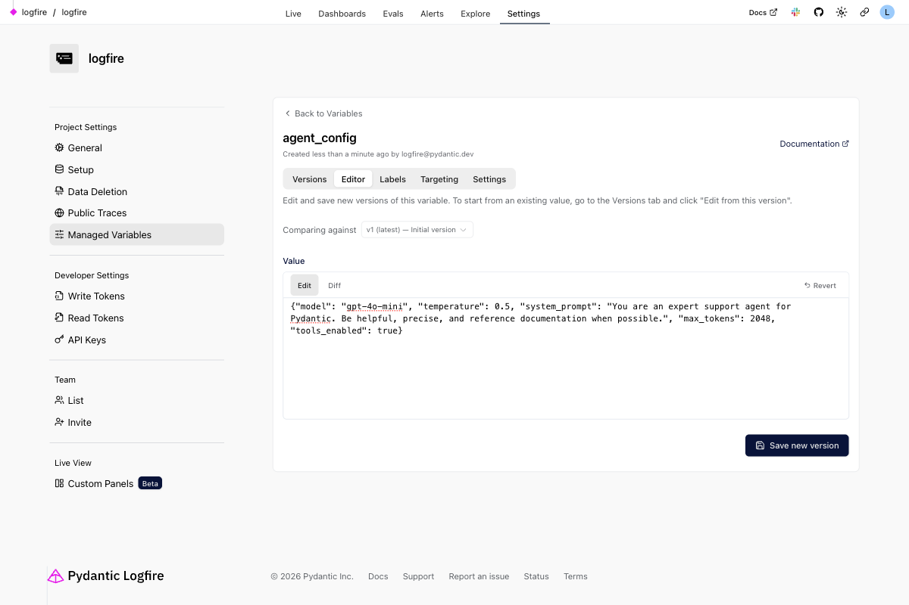
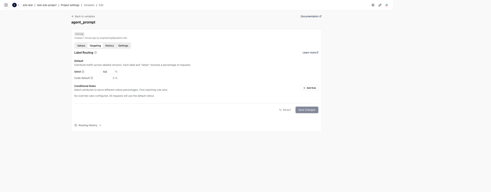

# Managing Variables in the Logfire UI

The Logfire web UI provides a complete interface for managing your variables without any code changes. You can find it under **Settings > Variables** in your project. The page includes two tabs:

- **Variables**: browse, create, and manage your managed variables
- **Types**: define reusable JSON schemas for custom variable types

Clicking a variable opens its **detail page**, which has five tabs: **Versions**, **Editor**, **Labels**, **Targeting**, and **Settings**.

## Creating a Variable

To create a new variable, click **New variable** to open the create page and fill in:

- **Name**: A valid Python identifier (e.g., `agent_config`, `feature_flag`)
- **Description**: Optional text explaining what the variable controls
- **Type**: Choose from:
    - **Text**: Plain text values, ideal for prompts and messages
    - **Number**: Numeric values for thresholds, limits, etc.
    - **Boolean**: True/false flags for feature toggles
    - **JSON**: Complex structured data matching your Pydantic models
    - **Custom Types**: Reusable schemas created under the **Types** tab

For **JSON** variables, you can optionally provide a **JSON Schema** to validate version values in the UI.
For **Custom Types**, the schema is derived from the type and shown read-only; edit the type in the **Types** tab.

## Working with Versions

Each variable has a **linear version history** — an append-only sequence of immutable value snapshots. Versions are numbered sequentially (1, 2, 3, ...) and once created, a version's value never changes.

The variable detail page provides two tabs for working with versions:

**Editor tab** — where you create new versions:

1. Edit the value in the editor (the format depends on your value type)
2. Use the **Edit/Diff** toggle to switch between editing and viewing changes against a reference version
3. Select a different reference version from the **Comparing against** dropdown to compare against older versions
4. Click **Revert** to discard your edits and restore the reference version's value
5. Click **Save new version** and optionally add a description (like a commit message explaining what changed)

**Versions tab** — where you browse version history:

- Each version card shows its number, creation time, author, assigned labels, and description
- Expand a version to see its full value
- Use the action buttons on each version to **edit from that version** (loads its value into the Editor tab) or **assign a label** directly
- Filter versions by label using the dropdown at the top

!!! tip "Using the example value"
    When you push a variable from code using `logfire.variables_push()`, the code's default value is stored as an "example". This example appears pre-filled when you create a new version in the UI, making it easy to start from a working configuration and modify it.

## Working with Labels

**Labels** are mutable pointers to specific versions. They work like Docker tags or git branch names — you can move them to point at any version at any time.

Common label patterns:

- **`production`** / **`staging`** / **`canary`**: Environment-based labels for gradual rollouts
- **`control`** / **`treatment`**: A/B testing labels
- **`stable`** / **`experimental`**: Risk-based labels

The **Labels tab** on the variable detail page lets you:

1. **Create** new labels with a name, target version, and optional description
2. **Move** labels to different versions using the edit button
3. **Delete** labels that are no longer needed
4. **View label history** (toggle the history icon) to see when labels were moved between versions and by whom

!!! note "No labels = code default"
    If a variable has no labels configured in its rollout, your application serves the code default (the `default` value passed to `logfire.var()`). To serve the latest version instead, add `latest` as a label in your rollout.

## Configuring Rollouts

The **Targeting tab > Default Rollout** section controls what percentage of requests receive each labeled version. The weights are entered as percentages (0–100%) and must sum to 100% or less:

- Set `production` to `90` and `canary` to `10` for a 10% canary deployment
- Set `control` to `50` and `treatment` to `50` for a 50/50 A/B test
- You can explicitly assign a percentage to **latest** alongside labels — for example, `control` at `50` and latest at `10` sends 10% of traffic to the latest version, 50% to the control label, and the remaining 40% falls back to the code default
- If weights sum to less than 100% and no explicit latest weight is set, the remaining percentage uses the **code default**
- If no labels are in the rollout (empty) and no latest weight is set, all traffic uses the code default

## Targeting with Override Rules

The **Targeting tab > Override Rules** section lets you route specific users or segments to specific labels based on attributes. Rules are evaluated in order, and the first matching rule determines the rollout.

To add a targeting rule:

1. Click **Add Rule** in the Override Rules section
2. Give the rule a name and optional description
3. Add one or more conditions (all conditions must match):
    - Choose an attribute name (e.g., `plan`, `region`, `is_beta_user`)
    - Select an operator (`equals`, `does not equal`, `is in`, `is not in`, `matches regex`, etc.)
    - Enter the value to match and its type (`str`, `int`, `float`, `bool`)
4. Configure the rollout percentages (by label) when this rule matches

For example, to give enterprise customers the production experience:

- Condition: `plan` equals `enterprise`
- Rollout: `production` = 100%

!!! important "Variable names must match"
    The variable name in the UI must exactly match the `name` parameter in your `logfire.var()` call. If they don't match, your application will use the code default instead of the remote configuration.
