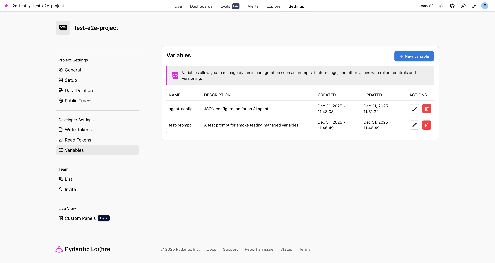
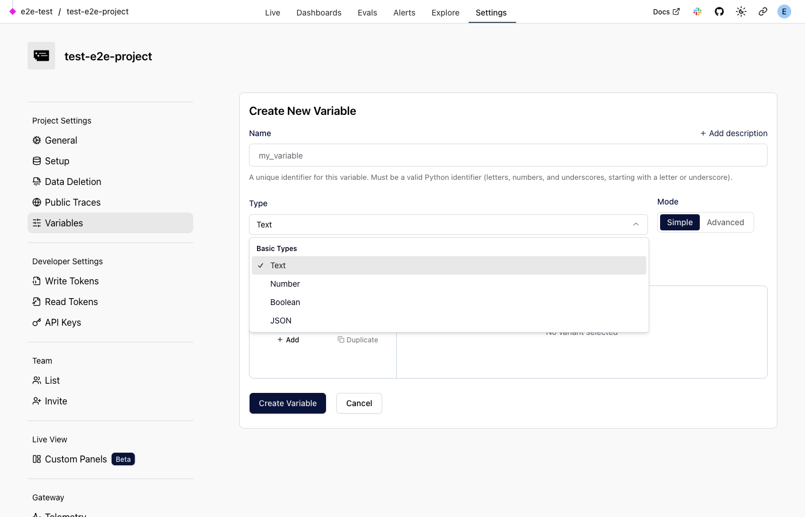
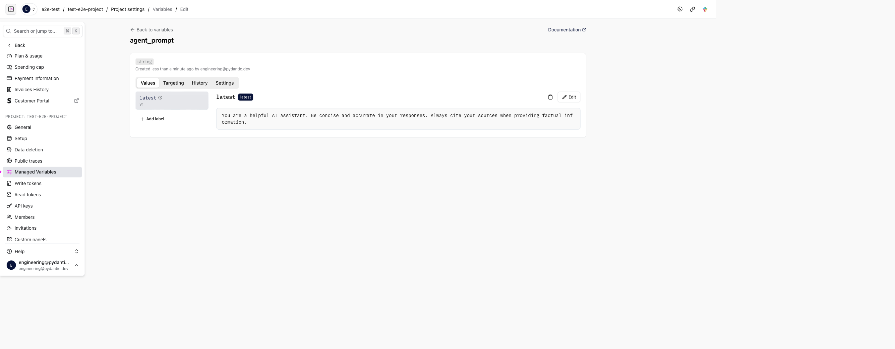
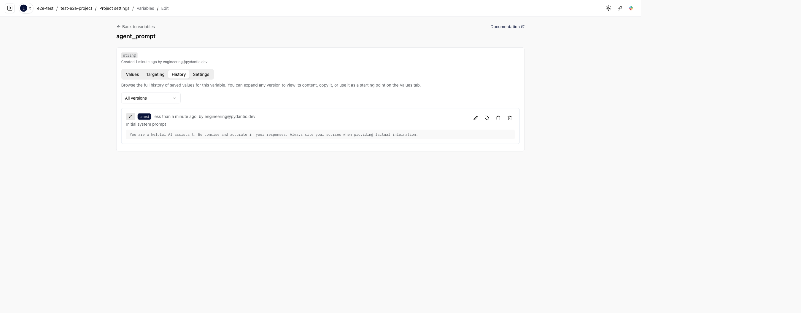
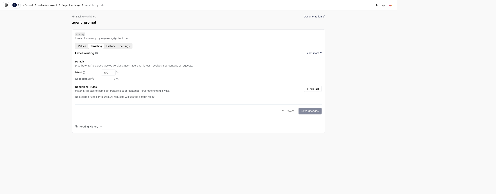

# Managing Variables in the Logfire UI

The Logfire web UI provides a complete interface for managing your variables without any code changes. You can find it under **Runtime > Managed Variables** in your project. The page includes two tabs:

- **Variables**: browse, create, and manage your managed variables
- **Types**: define reusable JSON schemas for custom variable types

Clicking a variable opens its **detail page**, which has **Values**, **Targeting**, **Optimize**, and **History** tabs. Users with write access also see **Settings**.

## Creating a Variable

To create a new variable, click **New variable** to open the create page and fill in:

- **Name**: A valid Python identifier (e.g., `agent_config`, `feature_flag`)
- **Description**: Optional text explaining what the variable controls
- **Type**: Choose from:
    - **Text**: Plain text values, ideal for prompts and messages
    - **Number**: Numeric values for thresholds, limits, etc.
    - **Boolean**: True/false flags for feature toggles
    - **JSON**: Complex structured data matching your Pydantic models
    - **Custom Types**: Reusable schemas created under the **Types** tab

For **JSON** variables, you can optionally provide a **JSON Schema** to validate version values in the UI.
For **Custom Types**, the schema is derived from the type and shown read-only; edit the type in the **Types** tab.

## Working with Values and Labels

The **Values tab** is the primary interface for viewing and editing your variable's content. It combines label management with value editing in a single view.

The left sidebar shows the automatic `latest` entry plus all labels (both active and inactive), while the right panel displays the value for the selected entry. Each label in the sidebar shows its name and what it points to (e.g., a version number, another label, `latest`, or **Code default**).

- Select `latest` or a label in the sidebar to view its current value
- Click the **copy** button to copy the displayed value to your clipboard
- Click the **compare** button to diff the selected label's value against another label — useful for reviewing differences between production and staging prompts, for example
- Click **Edit** to modify the value, then **Save new version** to create a new version. When `latest` is selected, the new version becomes the latest version. When a label is selected, the new version is assigned to that label.
- Click **Add label** to create new labels pointing to a specific version, another label, `latest`, or **Code default**

`latest` is always present and points to the most recently created version. A new variable has no versions yet, so `latest` has no value until you create the first version.

**Labels** are mutable pointers to specific versions or targets. They work like Docker tags or git branch names — you can move them to point at any version, another label, `latest`, or **Code default** at any time.

Common label patterns:

- **`production`** / **`staging`** / **`canary`**: Environment-based labels for gradual rollouts
- **`control`** / **`treatment`**: A/B testing labels
- **`stable`** / **`experimental`**: Risk-based labels

!!! note "Code default"
    **Code default** is the `default` value passed to `logfire.var()` in your application. Use it when you want some traffic to ignore remote versions and keep using the value from code.

## Browsing Version History

Each variable has a **linear version history** — an append-only sequence of immutable value snapshots. Versions are numbered sequentially (1, 2, 3, ...) and once created, a version's value never changes.

The **History tab** lets you browse all saved versions:

- Each version card shows its number, creation time, author, assigned labels, and description
- Expand a version to see its full value
- Use the action buttons on each version to **edit from that version** (loads its value into the Values tab), **assign a label**, **copy the value**, **compare** against another version, or **delete** the version
- Filter versions by label using the dropdown at the top

!!! tip "Using the example value"
    When you push a variable from code using `logfire.variables_push()`, the code's default value is stored as an "example". This example appears pre-filled when you create a new version in the UI, making it easy to start from a working configuration and modify it.

## Configuring Label Routing

The **Targeting tab > Default** section controls what percentage of requests receive each label, `latest`, or **Code default**. The editable weights are entered as percentages (0-100%) and must sum to 100% or less. **Code default** is the remaining percentage after label and `latest` weights are allocated.

- Set `production` to `90` and `canary` to `10` for a 10% canary deployment
- Set `control` to `50` and `treatment` to `50` for a 50/50 A/B test
- Set `latest` to `10` and `control` to `50` to send 10% of traffic to the most recently created version, 50% to the control label, and the remaining 40% to **Code default**
- New variables start with `latest` at `100`, so all traffic uses the newest version once one exists

## Targeting with Conditional Rules

The **Targeting tab > Conditional Rules** section lets you route specific users or segments to specific labels based on attributes. Rules are evaluated in order, and the first matching rule determines the routing.

To add a targeting rule:

1. Click **Add Rule** in the Conditional Rules section
2. Give the rule a name and optional description
3. Add one or more conditions (all conditions must match):
    - Choose an attribute name (e.g., `plan`, `region`, `is_beta_user`)
    - Select an operator (`equals`, `does not equal`, `is in`, `is not in`, `matches regex`, etc.)
    - Enter the value to match and its type (`str`, `int`, `float`, `bool`)
4. Configure the routing percentages (by label) when this rule matches

For example, to give enterprise customers the production experience:

- Condition: `plan` equals `enterprise`
- Routing: `production` = 100%

!!! important "Variable names must match"
    The variable name in the UI must exactly match the `name` parameter in your `logfire.var()` call. If they don't match, your application will use **Code default** instead of the remote configuration.
