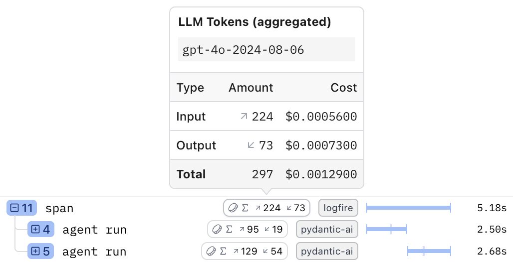

# Aggregating Metrics in Spans

Logfire lets you aggregate counter and histogram metrics within the current active span and its ancestors. This is particularly useful for calculating totals for things like LLM token usage or costs on higher-level operations, making it easier and more efficient to query this data without processing individual child spans.

This guide will walk you through how to enable this feature and use it with both custom metrics and automated instrumentation.

!!! note
    This is an experimental feature. The API and data format may change in future releases. We welcome your feedback to help us prioritize improvements and stability.

    This only works for metrics recorded within the same process. It does not aggregate metrics across distributed traces.

## Enabling Metric Aggregation

<!-- TODO add pydantic-ai version -->

This feature is _always_ enabled for any metric named `operation.cost`, which in particular is recorded by [Pydantic AI](https://ai.pydantic.dev/) when [instrumented](../../integrations/llms/pydanticai.md) for LLM costs.

To enable this feature for all metrics, you need to configure Logfire with the `collect_in_spans` option in [`MetricsOptions`][logfire.MetricsOptions]. This should be done once when your application starts.

```py
import logfire

logfire.configure(metrics=logfire.MetricsOptions(collect_in_spans=True))
```

Once enabled, any counters or histograms recorded within a span will be aggregated into a `logfire.metrics` attribute on that span.

## Example: A Custom Counter

Let's start with a simple example of tracking some cumulative amount.

First, we define a metric counter. Then, within a span, we add to it multiple times.

```py
import logfire

logfire.configure(metrics=logfire.MetricsOptions(collect_in_spans=True))

counter = logfire.metric_counter('my_amount')

with logfire.span('doing stuff'):
    counter.add(1)
    counter.add(2)
```

The `doing stuff` span will now contain a `logfire.metrics` attribute that holds the aggregated total of the `my_amount` counter, i.e. `3`.
Running the following query in the Explore view:

```sql
SELECT attributes->>'logfire.metrics'->>'my_amount'->>'total' AS total_amount
FROM records
WHERE span_name = 'doing stuff'
```

will return one row with `total_amount` equal to `3`.

## Example: LLM Token Usage and Costs with Pydantic AI

Generative AI instrumentations like [Pydantic AI](../../integrations/llms/pydanticai.md) or [OpenAI](../../integrations/llms/openai.md) that follow OpenTelemetry conventions will record a metric called `gen_ai.client.token.usage`. You can use metric aggregation to get a total of tokens used in a higher-level operation that may involve multiple LLM calls. Pydantic AI specifically also records an `operation.cost` metric, which is always aggregated.

Here’s an example:

```py
from pydantic_ai import Agent
import logfire

logfire.configure(metrics=logfire.MetricsOptions(collect_in_spans=True))
logfire.instrument_pydantic_ai()

agent = Agent('gpt-4o')

@agent.tool_plain
async def get_random_number() -> int:
    return 4

with logfire.span('span'):
    agent.run_sync('Give me one random number')
    agent.run_sync('Generate two random numbers')
```

The calls to `agent.run_sync` create child spans named `agent run`. The outer `span` aggregates the token metrics from these children, as shown in the Live View:



### Understanding the Span Data

The outer `'span'` now has a `logfire.metrics` attribute containing the aggregated token data from the two `agent.run_sync` calls. The JSON structure looks like this:

```json
{
  "gen_ai.client.token.usage": {
    "details": [
      {
        "attributes": {
          "gen_ai.operation.name": "chat",
          "gen_ai.request.model": "gpt-4o",
          "gen_ai.response.model": "gpt-4o-2024-08-06",
          "gen_ai.system": "openai",
          "gen_ai.token.type": "input"
        },
        "total": 224
      },
      {
        "attributes": {
          "gen_ai.operation.name": "chat",
          "gen_ai.request.model": "gpt-4o",
          "gen_ai.response.model": "gpt-4o-2024-08-06",
          "gen_ai.system": "openai",
          "gen_ai.token.type": "output"
        },
        "total": 73
      }
    ],
    "total": 297
  },
  "operation.cost": {
    "details": [
      {
        "attributes": {
          "gen_ai.operation.name": "chat",
          "gen_ai.request.model": "gpt-4o",
          "gen_ai.response.model": "gpt-4o-2024-08-06",
          "gen_ai.system": "openai",
          "gen_ai.token.type": "input"
        },
        "total": 0.00056
      },
      {
        "attributes": {
          "gen_ai.operation.name": "chat",
          "gen_ai.request.model": "gpt-4o",
          "gen_ai.response.model": "gpt-4o-2024-08-06",
          "gen_ai.system": "openai",
          "gen_ai.token.type": "output"
        },
        "total": 0.00073
      }
    ],
    "total": 0.00129
  }
}
```

Note:

1. Each `total` value (both at the top level and inside `details`) in the JSON matches a value in the token badge in the UI.
2. Each of these metrics (but not metrics in general) has separate entries for `input` and `output` in the `details`, each with its own total. In general, each combination of values of `attributes` has its own entry in `details`. Here, the only differing attribute is `gen_ai.token.type`.

The general structure of `logfire.metrics` is:

```json
{
  "<metric_name>": {
    "details": [
      {
        "attributes": { ... },
        "total": <number>
      },
      ...
    ],
    "total": <number>
  },
  ...
}
```

### Querying Nested Token Data

To query these nested details, you need a more complex SQL query to "un-nest" the JSON data into a flat, table-like structure.

```sql
WITH
    with_span_metric_name AS (SELECT unnest(json_keys(attributes->>'logfire.metrics')::text[]) AS span_metric_name, * FROM records),
    with_span_metric AS (SELECT attributes->>'logfire.metrics'->>span_metric_name AS span_metric, * FROM with_span_metric_name),
    with_span_metric_detail AS (SELECT span_metric->>'details'->>unnest(generate_series((json_length(span_metric->>'details') - 1)::int)) AS span_metric_detail, * FROM with_span_metric)
SELECT
    span_name,
    span_metric_name,
    span_metric_detail->>'total' AS total,
    span_metric_detail->>'attributes'->>'gen_ai.token.type' AS token_type
FROM with_span_metric_detail
WHERE span_metric_name = 'gen_ai.client.token.usage'
```

**How this query works:**

*   The `WITH` clauses progressively expand the nested JSON in the `logfire.metrics` attribute.
*   `with_span_metric_name` unnests the metric names (e.g. `gen_ai.client.token.usage` and `operation.cost`).
*   `with_span_metric` extracts the JSON object for each metric.
*   `with_span_metric_detail` unnests the `details` array, creating a separate row for each item (one for `input` and one for `output` in our example).

You can copy the `WITH` clauses as a reusable prefix for any query that needs to analyze aggregated metrics. The final `SELECT` statement then easily extracts the totals.

The result of this query will look like this, showing token counts and costs broken down by span and type:

| span_name | span_metric_name               | total | token_type |
|-----------|--------------------------------|-------|------------|
| span      | gen_ai.client.token.usage      | 224   | input      |
| span      | gen_ai.client.token.usage      | 73    | output     |
| span      | operation.cost                 | 0.00056 | input      |
| span      | operation.cost                 | 0.00073 | output     |
| agent run | gen_ai.client.token.usage      | 95    | input      |
| agent run | gen_ai.client.token.usage      | 19    | output     |
| agent run | operation.cost                 | 0.0002375 | input      |
| agent run | operation.cost                 | 0.00019 | output     |
| agent run | gen_ai.client.token.usage      | 129   | input      |
| agent run | gen_ai.client.token.usage      | 54    | output     |
| agent run | operation.cost                 | 0.0003225 | input      |
| agent run | operation.cost                 | 0.00054 | output     |
