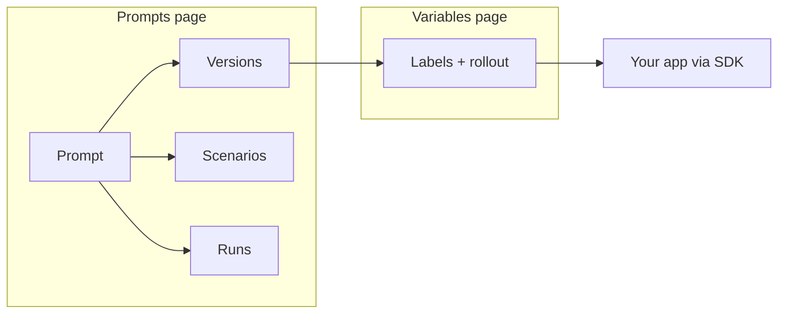

# Prompt Management

Prompt Management gives you a dedicated place to author the prompts that drive your LLM features, iterate on them against realistic inputs, and promote specific versions to production without redeploying your application.

!!! note "A few workflows still cross the Prompts and Variables pages"
    Prompt Management is built on top of Managed Variables, and a few workflows — notably promoting a version to a label and inspecting which version is currently serving — happen on the Managed Variables page for the prompt rather than on the Prompts page. The SDK also does not yet ship a dedicated `logfire.prompt(...)` helper; application code fetches prompts via `logfire.var(...)`. See [Known limitations](./limitations.md) for the full list and the tracking for each item.

## What it is

A prompt in Logfire is a first-class piece of configuration that lives next to — but separately from — your traces. You edit the prompt template in the UI, define scenarios that exercise it (variables, tool calls, multi-turn conversations), and run the combination against a gateway-provided model to see the output. When a version is ready, your application consumes it through the Logfire SDK using the same mechanism as any other managed variable.

Conceptually, a prompt is backed by a row in the Managed Variables table with `kind='prompt'`. You do not have to think about that layering day-to-day — authoring happens on the Prompts page — but it explains the shape of the feature: **authoring** lives in Prompt Management, and **rollout** (labels like `production`, percentage rollouts, targeting rules) reuses the Managed Variables machinery you may already know.

- You **author** the template and its supporting scenarios on the Prompts page.
- You **save versions** as you iterate — each version freezes the template text at that moment.
- You **promote** a version by pointing a label (for example, `production`) at it on the Managed Variables page for that prompt.
- Your **application fetches** the prompt by label through the Logfire SDK and renders the template against its runtime variables.

## When to use prompts vs. the Playground

The [Prompt Playground](../../../guides/web-ui/prompt-playground.md) and Prompt Management solve different problems. A quick decision guide:

| You want to… | Use |
|---|---|
| Explore what a one-off prompt does on a captured agent run | Prompt Playground |
| Tweak an existing agent run's system prompt and re-execute it | Prompt Playground |
| Keep a prompt that your application imports from Logfire | Prompt Management |
| Version a prompt, compare versions, and promote one to production | Prompt Management |
| Run a prompt against a dataset of inputs and inspect per-case output | Prompt Management |
| Give a non-engineer a stable place to iterate on production prompts | Prompt Management |

The Playground is exploratory: its inputs come from a specific trace and its outputs are not persisted as first-class objects. Prompt Management is operational: the prompts, versions, scenarios, and runs are all persistent, queryable, and available to your application at runtime.

## Where to go next

- New to the feature? Start with [Concepts](./concepts.md) for the four objects you will encounter (prompt, version, scenario, run).
- Writing your first template? See [Templates](./templates.md) and the full [Template reference](./template-reference.md).
- Defining tool-calling or multi-turn scenarios? See [Scenarios](./scenarios.md) and [Tools](./tools.md).
- Planning a rollout to production? Review [Known limitations](./limitations.md) first — a few workflows still cross over to the Managed Variables page.
