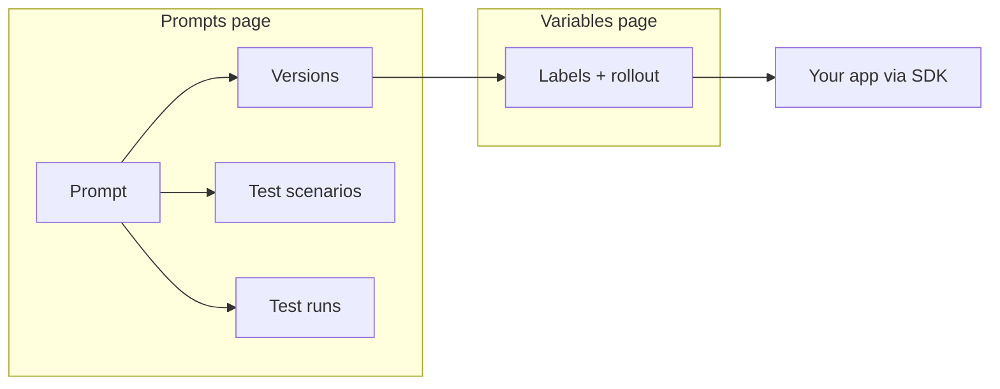

# Prompt Management

Prompt Management gives you a dedicated place to author the prompts that drive your LLM features, save stable versions, test them against representative inputs, and promote specific versions to production without redeploying your application.

## What it is

A prompt in Logfire is a first-class piece of configuration that lives next to — but separately from — your traces. The production contract is straightforward:

- author a prompt template,
- save versions as you iterate,
- test the prompt in the editor against representative inputs, and
- promote a version for your application to consume through the Logfire SDK.

Everything else sits around that contract as testing or inspection support:

- **scenarios** are saved test cases,
- **datasets** let you sweep a scenario over many cases, and
- **runs** are the execution records you inspect after testing.

- You **author** the template and, when needed, supporting test scenarios on the Prompts page.
- You **save versions** as you iterate — each version freezes the template text at that moment.
- You **test** with scenarios, datasets, and runs to see how the prompt behaves before promotion.
- You **promote** a version by pointing a label (for example, `production`) at it on the Managed Variables page for that prompt.
- Your **application fetches** the prompt by label through the Logfire SDK and renders the template against its runtime variables.

## When to use prompts vs. the Playground

The [Prompt Playground](../../../guides/web-ui/prompt-playground.md) and Prompt Management solve different problems. A quick decision guide:

| You want to… | Use |
|---|---|
| Explore what a one-off prompt does on a captured agent run | Prompt Playground |
| Tweak an existing agent run's system prompt and re-execute it | Prompt Playground |
| Keep a prompt that your application imports from Logfire | Prompt Management |
| Version a prompt, compare versions, and promote one to production | Prompt Management |
| Test a prompt against saved representative inputs or a dataset | Prompt Management |
| Give a non-engineer a stable place to iterate on production prompts | Prompt Management |

The Playground is exploratory: its inputs come from a specific trace and its outputs are not persisted as first-class objects. Prompt Management is operational: prompt templates and versions become runtime configuration for your application, while scenarios, datasets, and runs are persistent testing and inspection artifacts around that runtime contract.

## Where to go next

- New to the feature? Start with [Concepts](./concepts.md) for the production contract (`prompt`, `version`) and the supporting testing artifacts around it.
- Writing your first template? See [Templates](./templates.md) and the full [Template reference](./template-reference.md).
- Setting up saved test inputs, tool-calling rehearsal, tool definitions, or dataset runs? See [Test Prompts](./scenarios.md).
- Shipping prompts from Logfire into your application? See [Use Prompts in Your Application](./application.md).
