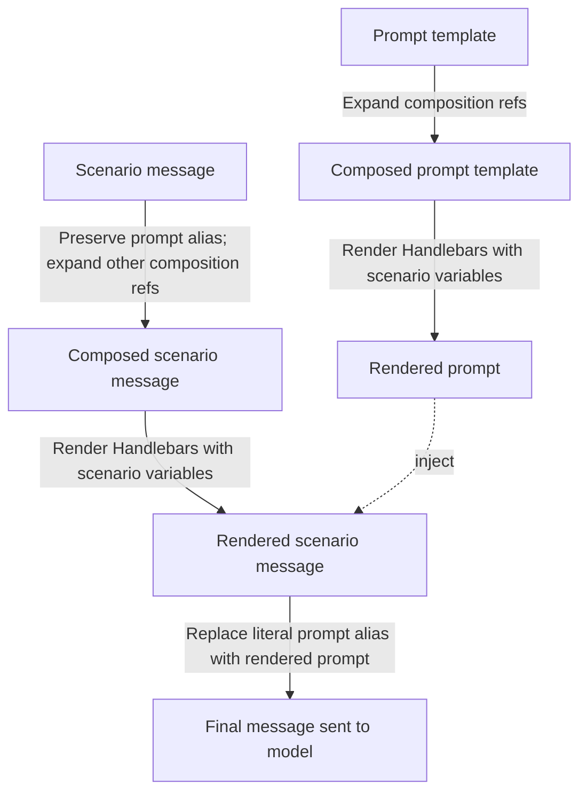

# Template reference

This page is the canonical specification for the template grammar used by Prompt Management.

Most prompt authors only need variable substitution and a few standard Handlebars block helpers. Prompt Management also supports `@{variable_name}@` composition references for reusable fragments. Scenario-specific additions, such as `@{prompt}@`, are collected later on this page.

## Grammar at a glance

The supported grammar is **standard Handlebars** with the default helper set. Prompt Management also adds composition references with `@{variable_name}@` and one convention used only in scenario messages: the `@{prompt}@` alias.

### Mustache expressions

| Form | Meaning |
|---|---|
| `{{name}}` | Insert the value of variable `name` |
| `{{object.field}}` | Insert a nested field — dotted paths resolve against the rendered context |
| `{{object.field.subfield}}` | Arbitrary depth is supported |

HTML escaping is **disabled** for prompt rendering — values are inserted verbatim. There is therefore no practical difference between `{{x}}` and the Handlebars raw form `{{{x}}}` here.

### Block helpers

Prompt Management enables the standard Handlebars block helpers.

| Helper | Purpose |
|---|---|
| `{{#if cond}}…{{else}}…{{/if}}` | Conditional block |
| `{{#unless cond}}…{{/unless}}` | Inverse conditional |
| `{{#each list}}…{{/each}}` | Iterate. `{{this}}`, `@index`, `@first`, `@last` available inside |
| `{{#with obj}}…{{/with}}` | Narrow the context to `obj` for the block |
| `{{lookup obj key}}` | Look up a field by computed key |
| `{{log value}}` | Log to server (no output; useful during debugging) |

## Composition references

Composition references use `@{...}@` delimiters and are expanded before normal
Handlebars rendering.

| Form | Meaning |
|---|---|
| `@{support_safety_rules}@` | Insert the resolved value of a managed variable |
| `@{support_brand_profile.product}@` | Insert a field from a structured managed variable |
| `@{prompt__support_style}@` | Insert another prompt through its backing managed variable |

The composition pass uses managed-variable resolution, so labels, rollouts,
targeting, and aliases apply. Missing or invalid composition references are
reported as validation errors when the prompt is previewed or run.

To render a literal composition reference, escape the opening delimiter:

```handlebars
\@{support_safety_rules}@
```

See the [Prompt composition walkthrough](./composition-walkthrough.md) for a
complete example.

## Rendering order for prompt templates

Prompt templates render in two passes:

1. Expand `@{...}@` composition references against the current managed-variable
   configuration.
2. Render the resulting template against the current `{{...}}` variable set using
   standard Handlebars rules.

## Scenario-only additions

Scenarios reuse the same grammar, but the testing surface adds a few extra rules.

### The `@{prompt}@` alias

`@{prompt}@` is **not** a Handlebars token. It is a literal substring that the renderer replaces with the rendered prompt template *after* Handlebars has finished processing a scenario message.

- Valid only inside scenario messages (text parts, tool-call `args`, tool-return `content`).
- Using `@{prompt}@` inside the prompt template itself raises `RenderingError: Reserved prompt placeholder @{prompt}@ can only be used in scenario messages`.
- `{{prompt}}` is **not** reserved. If you define a scenario variable called `prompt`, it substitutes normally.

### Rendering order inside scenarios



1. The **prompt template** expands composition references, then renders through Handlebars against the scenario's variables, producing the *rendered prompt*.
2. For each **scenario message** (and every templated field within it — text content, tool-call args, tool-return content), Logfire preserves the scenario-only `@{prompt}@` alias, expands other composition references, and renders through Handlebars against the same scenario variables.
3. Finally, every literal occurrence of `@{prompt}@` in the rendered message is replaced with the rendered prompt from step 1.

This order matters: the prompt template never sees `@{prompt}@` as a payload, and scenario messages never see un-rendered Handlebars from the prompt template.

## Variable naming

Scenario variable names come from the variables panel on the scenario editor. Two styles are supported:

- **Plain identifiers** — `customer_name`, `topic`, `max_retries`. Reachable as `{{customer_name}}`.
- **Dotted paths** — `customer.name`, `customer.tier`. On both surfaces, dotted entries are unpacked into a nested object so they are reachable as `{{customer.name}}` and via `{{#with customer}}{{name}}{{/with}}`.

Dotted paths share prefixes: defining `customer.name` and `customer.tier` creates a single `customer` object with two fields. If the same prefix is used both as a plain identifier and as a dotted path (e.g. `customer = "..."` and `customer.name = "..."`), the dotted entries overwrite the plain value.

## Undefined variables

A reference to a variable that is not defined renders as the empty string. No error is raised.

```handlebars
Hello {{does_not_exist}}!
```

Renders as `Hello !` when `does_not_exist` is not defined.

The scenario editor panel lists the variables the template refers to, so missing values are easy to spot before you run.

## Errors

Rendering errors fall into a small set of categories:

| Error | Cause |
|---|---|
| `Reserved prompt placeholder @{prompt}@ can only be used in scenario messages` | The prompt template contains `@{prompt}@`. Move it into a scenario message. |
| `Unclosed block` / parser errors | The template is malformed Handlebars — typically an unbalanced `{{#if}} … {{/if}}` or `{{#each}} … {{/each}}`. |
| `Missing helper` | You referenced a helper that is not in the default set. Only the standard Handlebars helpers are enabled. |

## Compatibility with the SDK

Use `logfire.template_prompt()` when you want the SDK to render prompt templates
with typed runtime inputs. It resolves the prompt, expands `@{...}@`
composition references, renders the remaining `{{...}}` placeholders, and
returns the final prompt text.

If you fetch the prompt with `logfire.prompt()` instead, the SDK returns the
post-composition template string. Your application then renders the remaining
`{{...}}` placeholders locally before passing the result to your model.

If your application renders manually and uses simple substitution, stick to flat
`{{variable}}` references. If you want to use dotted paths or block helpers, use
a renderer that supports the same Handlebars features documented here.

See [Use Prompts in Your Application](./application.md) for the current integration workflow.
